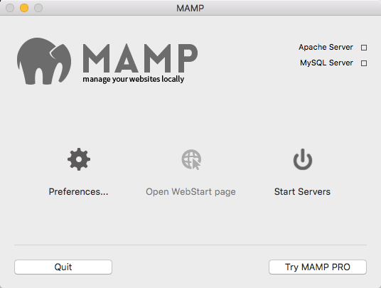
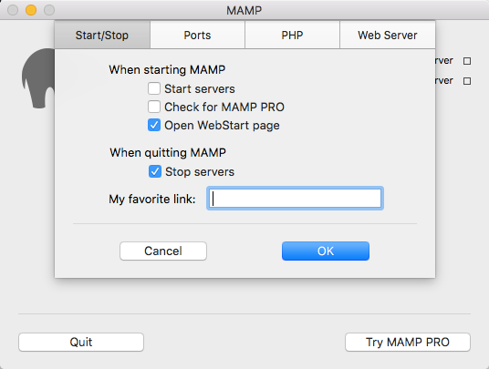
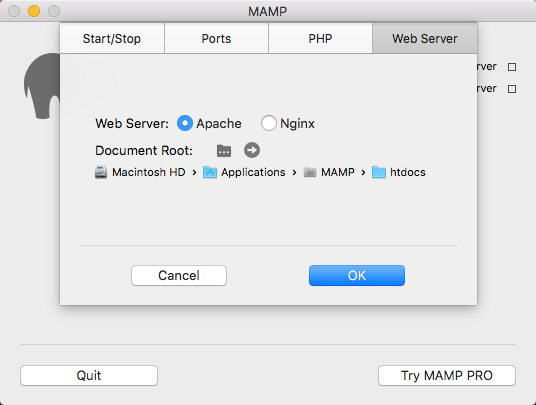
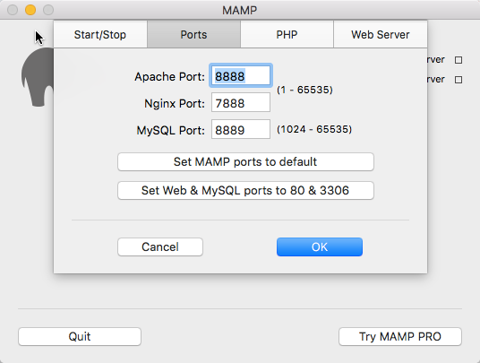

One of the (many) great things about using the open source CMS [Grav](http://getgrav.org) for a [flipped-LMS approach](/posts/2015-10-20-flipped-lms-defined) is that no database is required, which makes running a local copy of Grav on your computer for testing purposes a very straightforward process. This also makes deployment to a Web server a breeze - just a simple folder copy.

===

In this brief article we will look at how to use [MAMP](https://www.mamp.info/en/), a tool to safely run a PHP server on your computer, to view Grav sites locally on your Mac or Windows PC.

**Step-by-step Instructions**

1. If you do not have an existing Grav site on your computer, download a Grav Skeleton at ([https://getgrav.org/downloads/skeletons](https://getgrav.org/downloads/skeletons)) and extract the downloaded archive file

2. Create a folder called 'MAMP Websites' in your 'Documents' folder

3. Copy the _entire_ Grav folder into your 'MAMP Websites' folder

4. Launch MAMP (but do not press the 'Start Servers' button yet)

5. Press the MAMP 'Preferences' button

    
  _Figure 1. MAMP startup screen where the 'Preferences' button is located._

6. Press the 'Web Server' tab in the 'Preferences' dialog

    
  _Figure 2. MAMP preferences dialog, with the 'Web Server' tab on the far top-right._

7. Change the 'Document Root' MAMP preferences setting from the default value 'htdocs' within the MAMP application folder to the 'MAMP Websites' folder that you previously created within 'Documents' by pressing the select folder button (a folder containing three dots), choosing the folder, and then pressing the 'OK' button

    
  _Figure 3. MAMP Web server tab, with the select folder button represented by a folder containing three dots._

8. Press the MAMP 'Start Servers' button (as shown in Figure 1)

With MAMP installed and running you can now view your Grav site(s) locally. Launch your Web Browser,  enter the URL [http://localhost:8888](http://localhost:8888) and then choose the displayed Grav folder name. That's it! If you downloaded a Grav Skeleton with the Admin Panel pre-installed you will be prompted to create your administrator account.

**Additional MAMP Setup Options**

If you would prefer, you only need to enter ‘http://localhost’ in your Web Browser to access your MAMP htdocs directory listing, then do the following:

1. Launch the MAMP application - if MAMP is already running, press the 'Stop Servers' button

2. Press the MAMP 'Preferences' button (see Figure 1)

3. Press the 'Ports' tab in the 'Preferences' dialog

    
  _Figure 4. MAMP ports panel tab._

4. Change the value in the 'Appache Port' field from the default value '8888' to '80' (no quotes)

5. Press the 'OK' button  

If you are curious about how a local copy of Grav can be used with GitHub/GitHub Desktop for super-easy deployments while fully supporting student collaboration, check out the article [Using Grav with GitHub Desktop (and Deploy)](../2015-12-11-using-grav-with-github).
