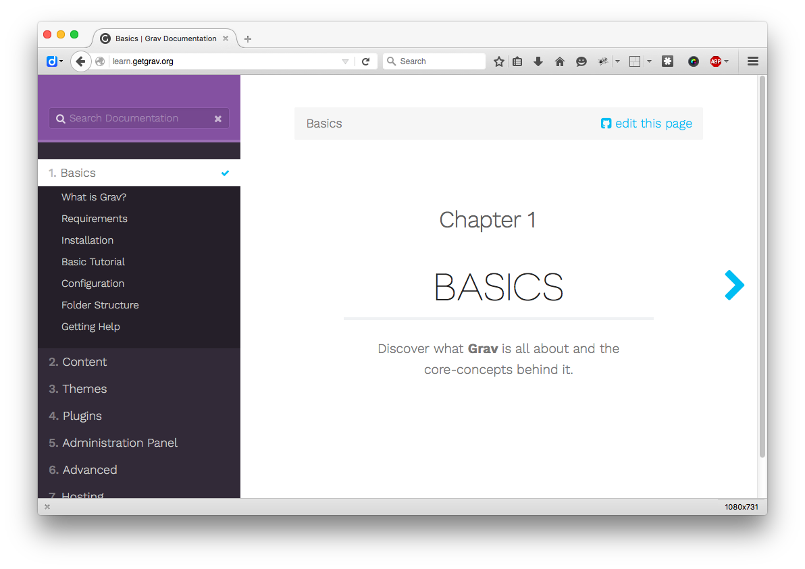
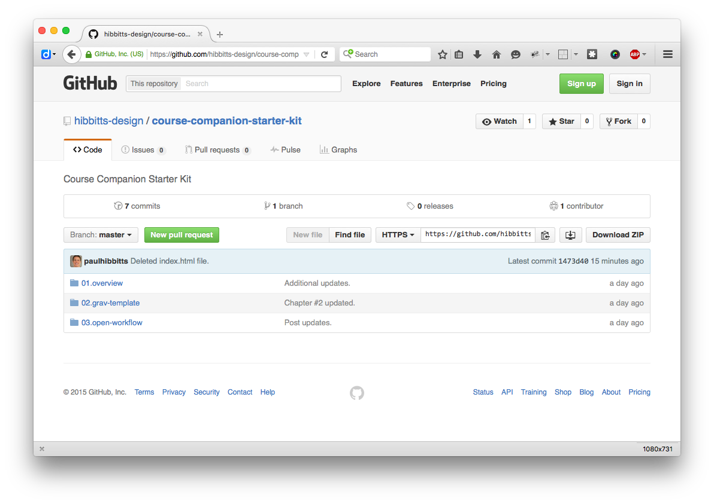
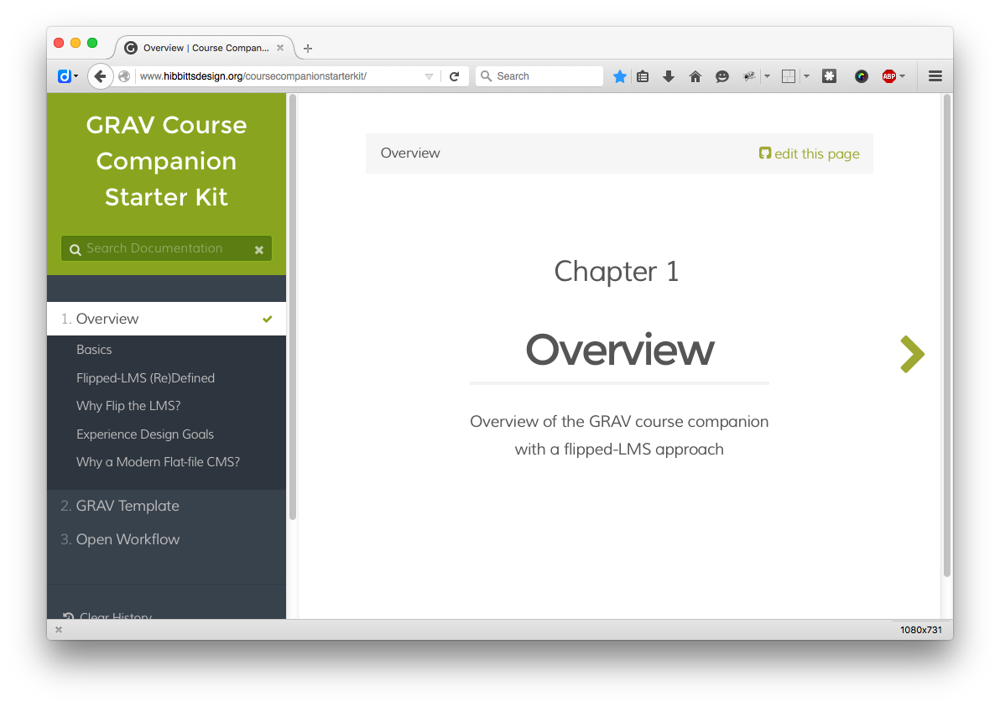
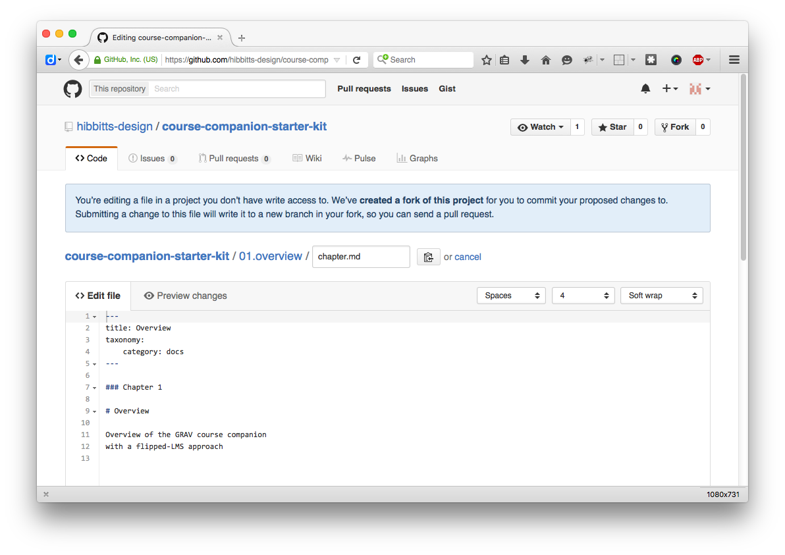
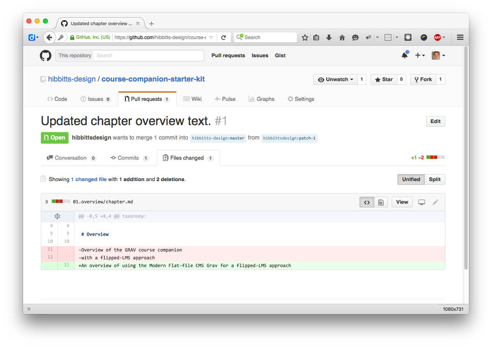
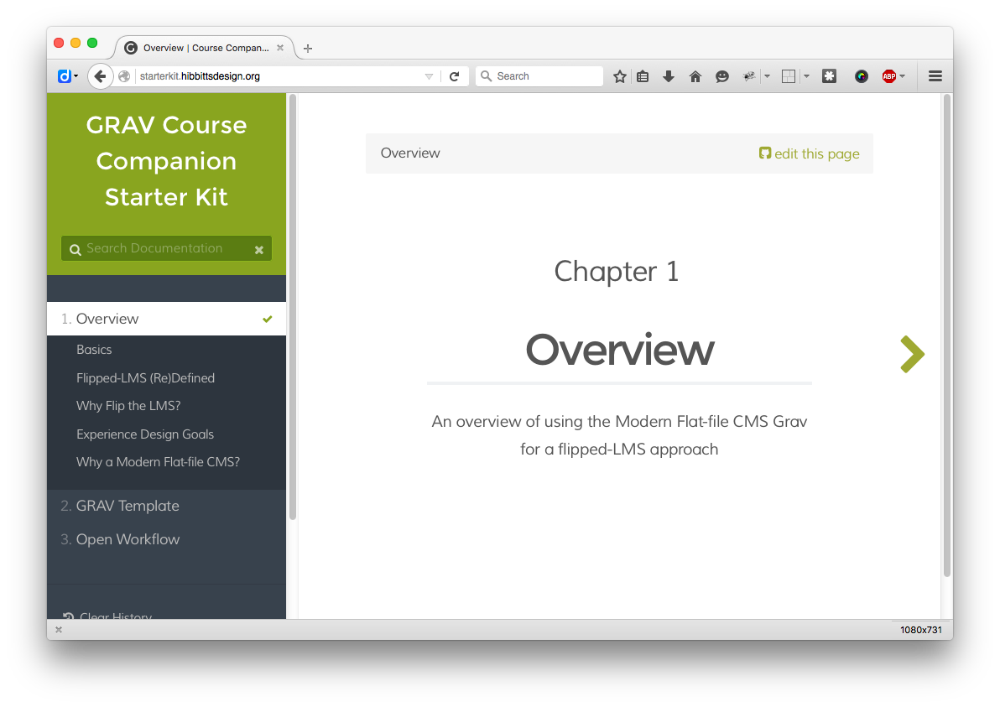

Recently, I've been exploring ways to use the modern flat-file CMS [Grav](http://getgrav.org/) as a simple open publishing tool. Grav is a natural candidate for this usage, as all content is stored as individual files which can be stored on a variety of open and collaborative editing environments (e.g. [GitHub](https://github.com/)).

===

! This article will be substantially updated once the pre-release [Git Sync plugin](../2016-12-22-touchdown-seamless-2-way-syncing-arrives-for-grav) for Grav is officially released (expected in February).

Here is a snapshot of the approach that has produced the best results for me so far:

* An instance of Grav running on a Web server, using a slightly modified version of the [Learn2](http://getgrav.org/downloads/themes) theme. The Learn2 theme is pre-configured with support for content to be stored/maintained on GitHub, although any Grav theme could also be customized to support this ability. The [Admin Panel](http://getgrav.org/blog/beta-admin-plugin-available) plugin has also been installed, providing the ability to perform easily any needed Grav system updates.

    
  _Figure 1. Grav Learn2 Theme._

    
  _Figure 2. Grav Admin Panel Dashboard._

* A GitHub repository containing _only_ the "Pages" folder of the Grav instance. This results in having only content files (using Markdown) being presented in the repository, bringing a high-level of visibility to the content files of your site for users who wish to interact directly with the GitHub repository. You can view the GitHub repository of my example "Pages" site folder at [https://github.com/hibbitts-design/grav-course-hub-starter-kit](https://github.com/hibbitts-design/grav-course-hub-starter-kit)  

    
  _Figure 3. Example GitHub repository, containing only the "Pages" folder._

* Using a GetHub Webhook either through a service such as [Deploy](https://www.deployhq.com/), or directly by adding the needed PHP file (see [Grav Development with GitHub - Part 2](https://getgrav.org/blog/developing-with-github-part-2) on [getgrav.org](http://getgrav.org/)), configure a site update to be automatically performed when one or more content files are modified on GitHub.

We now have a simple open publishing system which leverages the power of GitHub! Anytime someone makes a change in the GitHub repository, and you approve of the change, the results will be automatically published to your live site. As well, all of your edits, etc. are available for public viewing and commentary. The content made available on GitHub may also be forked and used for other useful purposes.

It should be noted that you would want to make any significant changes to the chosen Grav theme  _before_ you upload the Grav site to your Web server. You can still make changes to the theme once it is running on your Web server, but doing so would require using a FTP program to edit the needed files or copy the updated files from your computer to the site. Alternatively, you could the place the "User" folder on GitHub (or even the entire Grav instance, as Grav is open source) which would also contain any theme customizations, but doing so would reduce the high-level visibility of your content files achieved when only placing the contents of your "Pages" folder on GitHub.

Here is an overview of the flow of someone making a change to your site content via GitHub:

1. Viewing the Grav site, a viewer can click the provided "Edit this Page" link to propose changes to the page. You can view a live example of this technique at my [Course Hub Starter Kit](http://www.hibbittsdesign.org/coursehubstarterkit/) prototype site.  

    
  _Figure 4. Example site page - Overview, using a modified version of the Learn2 theme with a link to edit the page on GitHub._

2. Once the viewer has logged into GitHub, they can edit the page and then submit a Pull Request (a request for the site administrator to review and approve the submitted changes).
    
  _Figure 5. Editing Overview site page on GitHub, which when completed will result in a Pull Request._

3. The site administrator reviews the submitted Pull Request, and can approve changes immediately or start a discussion with the author of the proposed changes for further modifications, etc.
    
  _Figure 6. Review submitted Pull Request on GitHub, showing GitHub's super-useful file changes preview._

4. Once the change is approved by a site administrator of the GitHub account the changes to the GitHub repository will be automatically pushed to the server, where the updated content is available to be viewed.
    
  _Figure 7. Updated site page - Overview._

I personally also like to use [GitHub Desktop](https://desktop.github.com/) as a point-and-click means to keep a local copy of my GitHub repositories on my local machine so I can use any markdown-enabled application for editing my content files. GitHub Desktop can also sync any changes made to the GitHub repository down to your local machine. You can learn more about my use of GitHub Desktop in my earlier post [My Dream Workflow as an Instructor](../2015-10-20-my-dream-workflow).

_Note: The original title of this post was 'Using Grav as a Simple Open Publishing Tool'._
