As a modern flat-file CMS, [Grav](http:getgrav.org) can take full advantage of today's ecosystem of open and collaborative editing services, such as [GitHub](http://github.com) or [GitLab](http://gitlab.com). In this article we will look at how to easily use Grav with GitHub Desktop (which uses GitHub and Git for source control) and the automatic deployment service [Deploy](http://www.deployhq.com) to result in a very efficient, open and collaborative workflow. No scripting or command line interactions will be required, I promise.

===

!! This guide is now outdated. View the updated [GitHub & GitHub Desktop](http://learn.hibbittsdesign.org/github-githubdesktop) tutorial on the new  [learn.hibbittsdesign.org](http://learn.hibbittsdesign.org) site.

As an educator, the use of a service such as GitHub to store an online course companion is very appealing as not only does it support an open practice but also enables students to control the very learning environment that they are using. I first described this workflow in my earlier article [My Dream Workflow as an Instructor](../my-dream-workflow-as-an-instructor).

Before you start this tutorial I suggest you first get your Grav site up and running locally using [MAMP](https://www.mamp.info/en/), as outlined in [Running Grav Locally with MAMP](../running-grav-locally-with-mamp). By utilizing MAMP you will then have a complete, local version of your course companion site running on your computer that can be easily updated and then deployed to your Webserver.

This tutorial should take about 15 minutes, and once completed you will have an efficient, open, and collaborative workflow for yourself and _your students_!

**Step-by-step instructions**

1. If you do not done so already, [sign up for a GitHub account](https://github.com/join).

2. Download the [GitHub Desktop](https://desktop.github.com/) client for your computer (Mac or PC), and once it is installed launch the application and proceed with the setup process to enter your GitHub account credentials.

  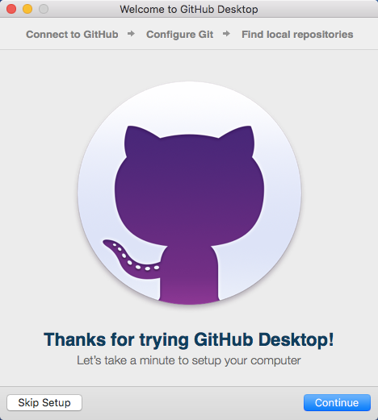  
  _Figure 1. GitHub Desktop setup welcome._

  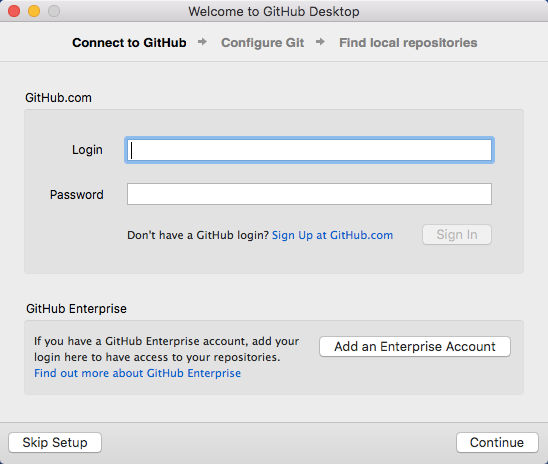  
  _Figure 2. GitHub Desktop connect to GitHub._

3. Assuming you already have a Grav site present on your computer (and preferably one that is already viewable via MAMP), you next need to create a GitHub Repository of your site. It is recommended that if this is the first time you are using GitHub with Grav that you add the entire Grav site to GitHub, but other approaches are possible such as only storing the "user" folder (see the provided additional resources at the end of this article for more options).

  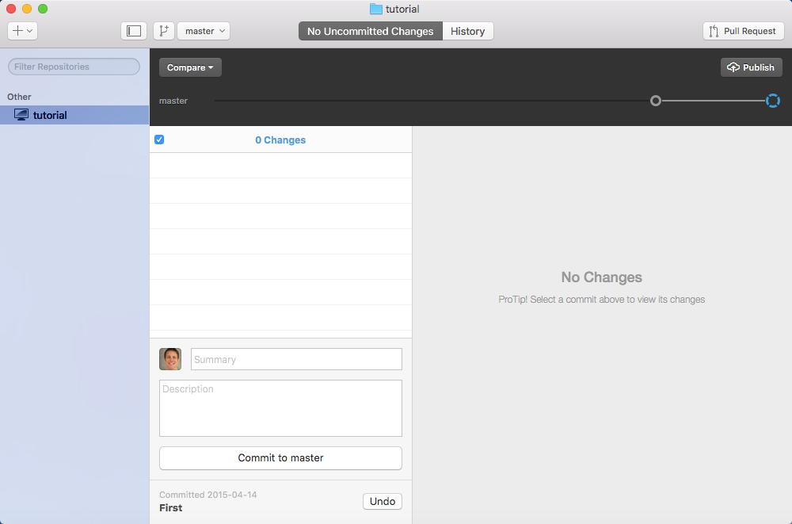  
  _Figure 3. GitHub Desktop main window, displaying the included tutorial._

  Press the "Add a Repository" button (upper-right plus(+) sign in the main window) in the GitHub Desktop client, select the "Add" tab within the displayed dialog box, and then press the "Choose..." button to select the folder containing your _entire_ Grav site.

  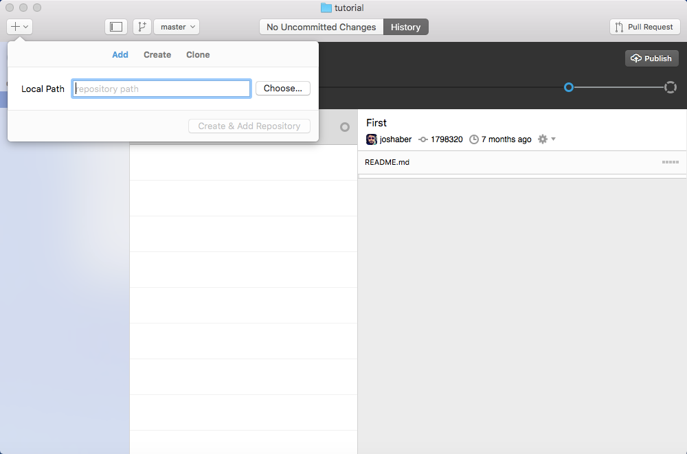  
  _Figure 4. GitHub Desktop add Repository dialog._

  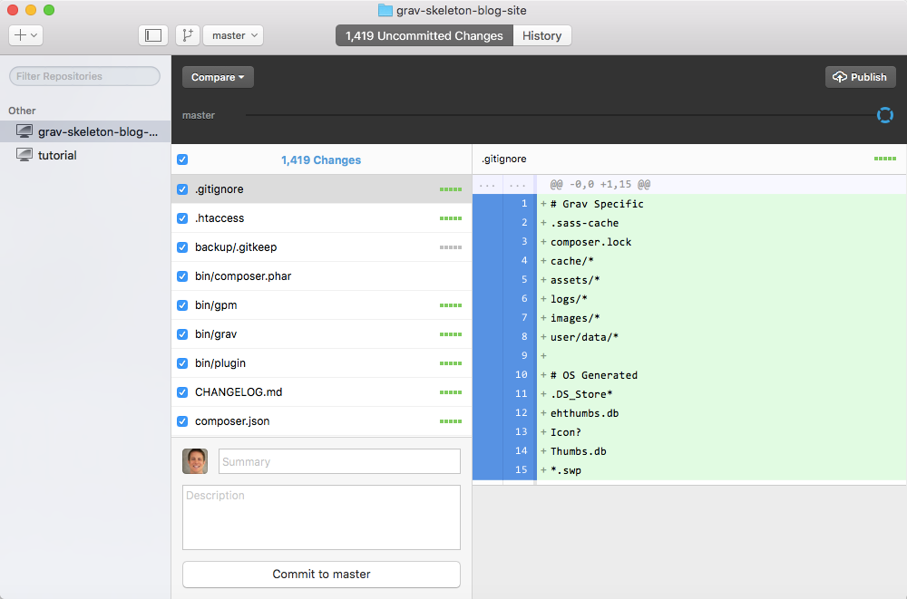  
  _Figure 5. GitHub Desktop local Repository added._

4. You are now ready for the first commit to your new GitHub repository. Whenever you make a commit you will need to include a brief text summary - as this is your first commit enter the text "First commit." into the "Summary" text box (above the "Description" text field), and then press the button "Commit to master".

  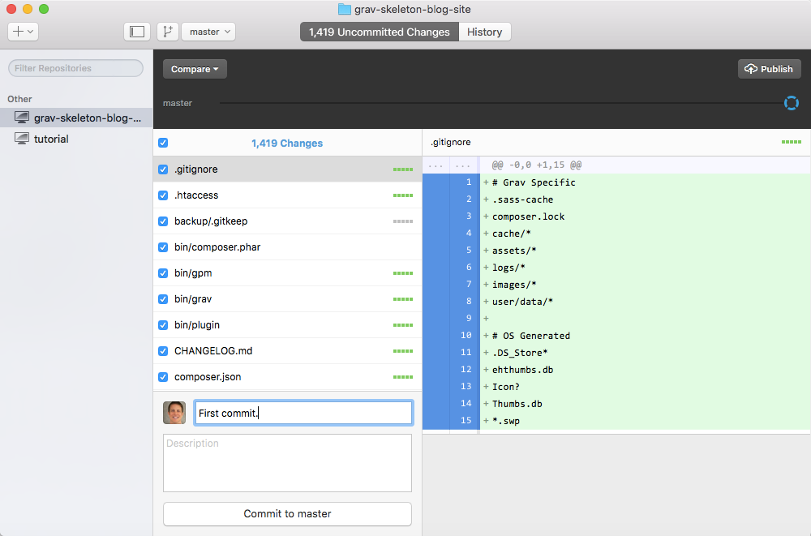  
  _Figure 6.  GitHub Desktop first commit._

5. Since this is your first commit to your repository, the "Publish" button (upper-left of main window) will need to be also pressed to actually perform the actual file updates. Once the "Publish" button is pressed enter a short description for your new GitHub repository and then select which GitHub account you want to publish to (if you have multiple accounts).

  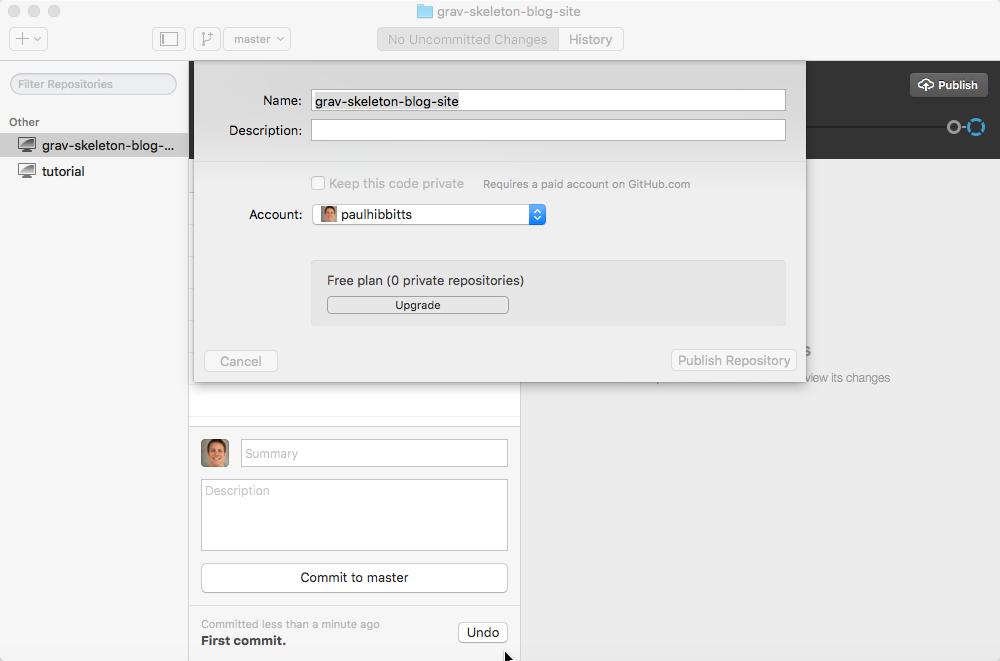  
  _Figure 7. GitHub Desktop - repository details dialog box._

  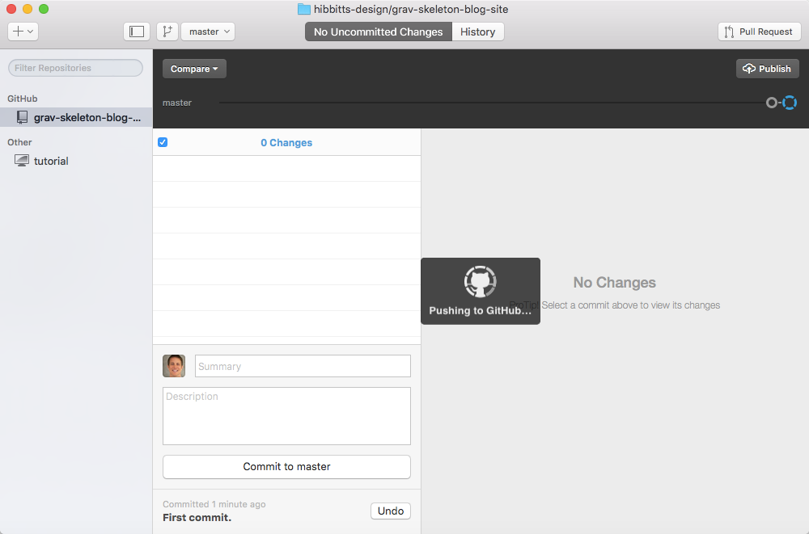  
  _Figure 8. GitHub Desktop publishing the repository._

  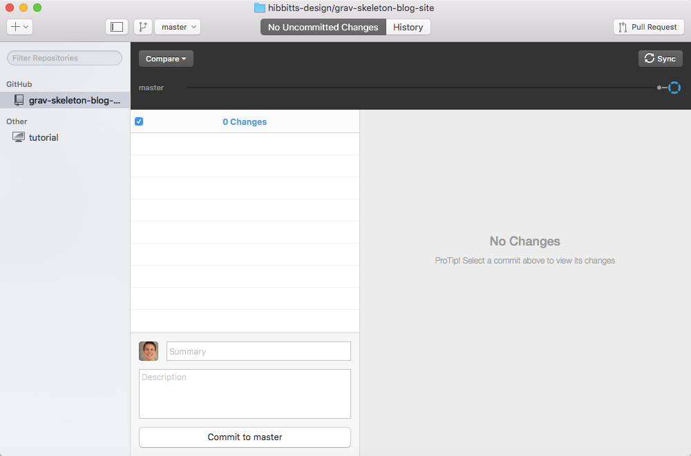  
  _Figure 9. GitHub Desktop repository published._

6. Once this process is complete you should now be able to view your Grav site files stored on GitHub - please do this now to ensure that everything went as expected. If you have any issues during this process you may find more detailed GitHub Desktop client support information at [https://help.github.com/desktop/](https://help.github.com/desktop/).

  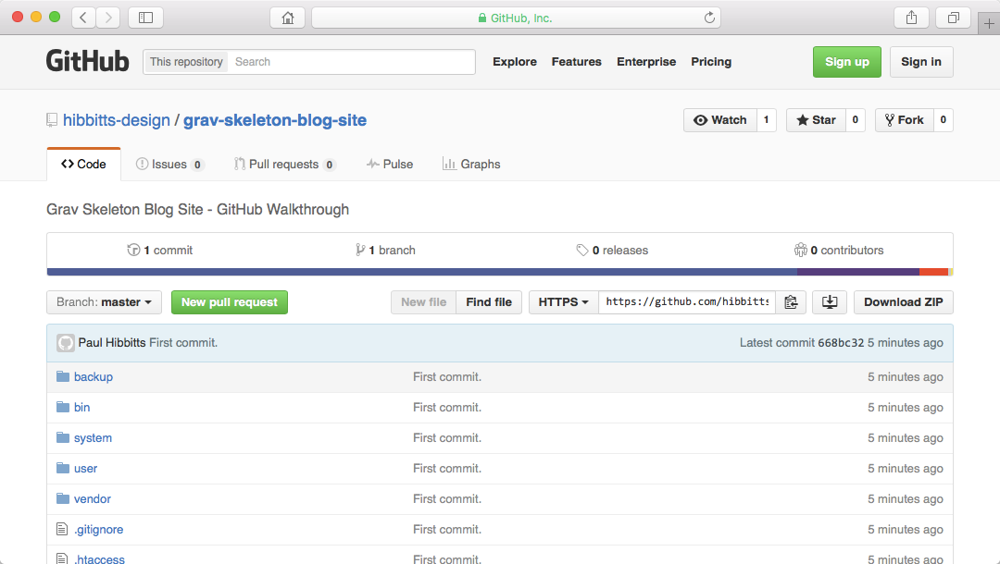  
  _Figure 10. GitHub repository of your Grav site._

7. The final step in this process is to trigger an automatic deployment of any changed GitHub files to your Webserver. I recommend you use a Web service that provides this functionality - such as [Deploy](http://www.deployhq.com) or [Buddy](https://buddy.works/). You can learn how to set up Deploy for use with GitHub in the Deploy support article [How do I Start an Automatic Deployment from GitHub?](https://support.deployhq.com/articles/deployments/how-do-i-start-an-automatic-deployment-from-github) and how to set up Buddy for use with GitHub in the Buddy support articles [How to integrate Buddy with GitHub?](https://buddy.works/knowledge/version-control/how-integrate-buddy-with-github) and [How to upload files to FTP/SFTP?](https://buddy.works/knowledge/deployments/how-deploy-files-to-ftp) .

Congratulations! With the above steps completed you now have a Grav site which you can run and test locally (using MAMP), and with _only one click_ in the GitHub Desktop application have any changed local site files updated in your GitHub repository and then have them automatically pushed to your Webserver hosting your Grav site (via either Deploy or Buddy). In my experience, I can make an update to my Grav site and sync changes to GitHub for automatic deployment to my Webserver in as little as 30 seconds.

  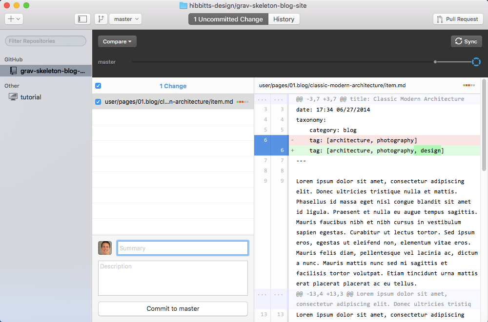  
  _Figure 19. GitHub Desktop main window. When any changes are detected they will be displayed on this screen and can be pushed to GitHub when the "Commit and Sync master" button is pressed._

Students can also now make suggested changes to your Grav site via GitHub or GitHub repository file links provided in your Grav site (see the bottom of this example page at [http://paulhibbitts.net/cmpt-363-153//resources](http://paulhibbitts.net/cmpt-363-153//resources)). GitHub will provide an excellent view of proposed changes, which you can immediately accept or start a further discussion about these possible changes with the student submitting them.

You can press the GitHub Desktop client "Sync" button (which replaces the "Publish" button you previously used) in the GitHub Desktop client to also download any changes made to the online GitHub repository down to your own computer.

Interested in learning even more about using Grav with GitHub? Check out these two super-informative posts on the Grav Blog:
* [Grav Development with GitHub - Part 1](http://getgrav.org/blog/developing-with-github-part-1)
* [Grav Development with GitHub - Part 2](http://getgrav.org/blog/developing-with-github-part-2)
