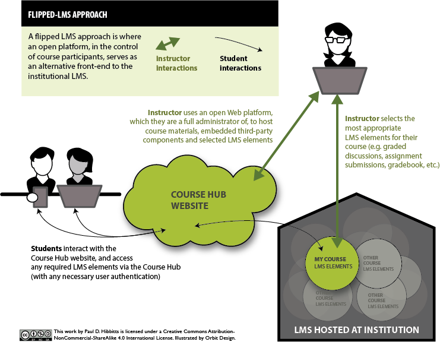
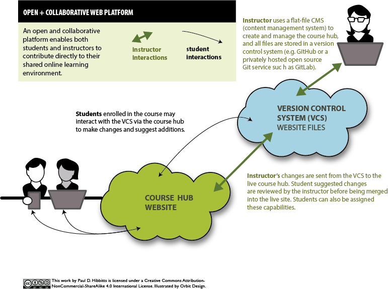
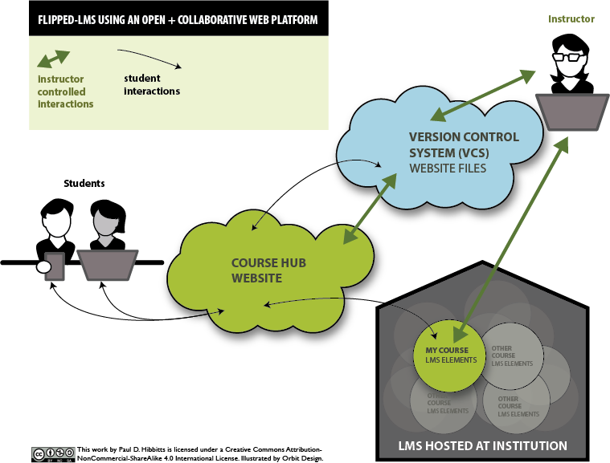
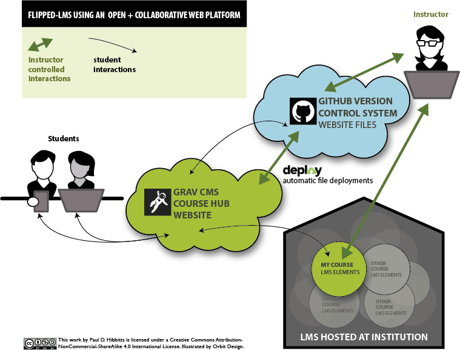

**What is a flipped LMS?**  
A flipped LMS approach is where an _open_ platform, in the _control_ of course participants, serves as an _alternative front-end_ to the institutional LMS

  
_Figure 1. Flipped-LMS approach._

**Why flip the LMS?**  
<i class="fa fa-check-square-o"></i> To support pedagogical goals unmet by current LMS/platform  
<i class="fa fa-check-square-o"></i> To deliver a better student (and facilitator) experience  
<i class="fa fa-check-square-o"></i> To increase capability of access, sharing and collaboration  

===

**What to “Flip” Your LMS With?**  
Ideally an open and _collaborative_ platform, as shown below:  

  
_Figure 2. Open + collaborative Web platform._
  
  
_Figure 3. Flipped-LMS approach using an open + collaborative Web platform._  
 
For example, the modern flat-file CMS [Grav](http://getgrav.org) along with [GitHub](http://github.com) and an automatic deployment service such as [Deploy](http://deployhq.com) can be used quite effectively by tech-savvy educators as an open and collaborative platform to support a flipped-LMS approach:  
 
  

_Figure 4. Flipped-LMS approach using Grav CMS, GitHub, and Deploy._

**When flipping your LMS what are some key experience design goals?**  
Student experience design goals:  
<i class="fa fa-check-square-o"></i> Engaging  
<i class="fa fa-check-square-o"></i> Organized  
<i class="fa fa-check-square-o"></i> Relevant  
<i class="fa fa-check-square-o"></i> Convenient  
<i class="fa fa-check-square-o"></i> Enjoyable  
 
Facilitator experience design goals:  
<i class="fa fa-check-square-o"></i> Controllable (i.e. manageable)  
<i class="fa fa-check-square-o"></i> Pliable (i.e. flexible)  
<i class="fa fa-check-square-o"></i> Efficient  
<i class="fa fa-check-square-o"></i> Enjoyable (hey, instructors are people too...)        
Want to get started with flipping your own LMS? Since this article was written I've built an open source project using the Grav CMS to help other tech-savvy instructors - explore the [on-line demo](http://demo.hibbittsdesign.org/grav-course-hub/) and then head over to [Grav Course Hub Getting Started Guide](../2016-02-12-grav-course-hub-getting-started-guide) to get going.
