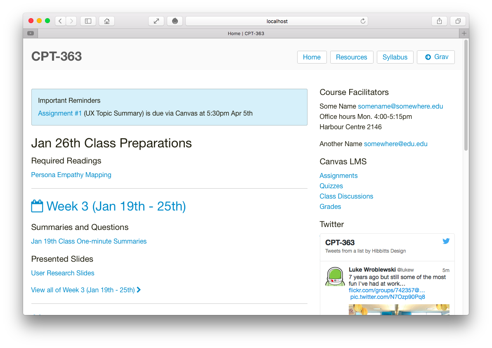

_This article is now outdated. Please refer to the [Grav Course Companion Getting Started Guide](../2016-02-12-grav-course-companion-getting-started-guide)._

To kick off 2016 in style, I've just released an early prototype + documentation for my Grav CMS Course Companion skeleton package, based on the [Bones Vanilla theme](https://github.com/smartgravity/grav-theme-bones-vanilla).

  
_Figure 1. Bones Vanilla Course Companion Prototype for Grav CMS._

You can explore the prototype at [http://hibbittsdesign.org/prototypes/bones-vanilla-course-companion/](http://hibbittsdesign.org/prototypes/bones-vanilla-course-companion/) and download the complete ready-to-run Grav Skeleton Package (and initial documentation) at [https://github.com/hibbitts-design/grav-skeleton-bones-vanilla-course-companion-prototype](https://github.com/hibbitts-design/grav-skeleton-bones-vanilla-course-companion-prototype).

In addition to the GitHub repository [ReadMe](https://github.com/hibbitts-design/grav-skeleton-bones-vanilla-course-companion-prototype/blob/master/README.md), there are the following step-by-step tutorials:  
* [Running Grav Locally with MAMP](http://hibbittsdesign.org/blog/posts/running-grav-locally-with-mamp)
* [Using Grav with GitHub Desktop (and Deploy)](http://hibbittsdesign.org/blog/posts/using-grav-with-github-and-deploy)

This prototype is also designed to support a [flipped-LMS approach with Grav being used as an open and collaborative platform](http://hibbittsdesign.org/blog/posts/flipped-lms-using-an-open-and-collaborative-platform).
