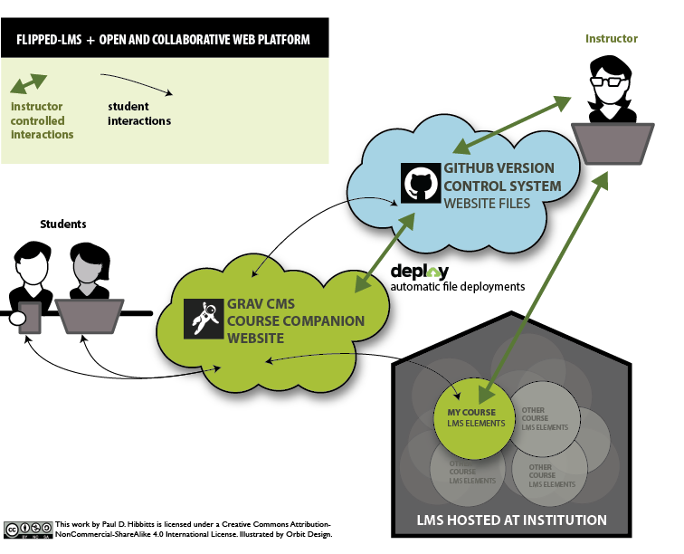

    
_Figure 1. Flipped-LMS approach using Grav CMS, GitHub, and Deploy._

===

Here is what I have in mind so far for a possible ebook or workshop about Grav CMS for instructors:

* What is a Modern Flat-file CMS?
* Getting Grav up and Running
	* Requirements
	* Installation
		* Server Only
		* Desktop + Server
* The Basics of Grav
	* Admin Panel
		* Account Creation
    * Overview
		* Dashboard
		* Configuration
		* Managing Pages
		* Editing Pages
	* Working with Files
		* Overview
		* Pages
    * Folders
	* Page Content
    * Overview
    * Names
    * Headers
		* Markdown
		* Linking Pages
		* Embedding Media
* Flipping your LMS with Grav
	* What is a Flipped-LMS?
  * Why Flip the LMS?
  * Flipped-LMS Approach
	* Experience Design Goals
	* Why Grav?
* An Open and Collaborative Workflow
	* Overview
	* Recommended Toolset
    	* MAMP
    	* Git Service (e.g. GitHub, GitLab, Gogs, etc.)
      * GitHub Desktop
    	* Deploy
	* Example Workflow
	* Setting it all Up
* Course Companion Skeleton Package
	* Highlights
	* Site Structure
	* Pages Types
  * Configuration
* Things to Explore Next...
	* Font awesome icons (included)
	* Built-in media manipulation functionality
	* Modular content using  Page Inject  plugin (included)
	* Additional theme customizations
	* The joys of the Twig templating language
* Wrap-up

Here is a draft workshop description:  
_Do you have unmet pedagogical goals due to the constraints of your current LMS? Do you want to have a better experience for your students and yourself? In this workshop, Paul will introduce Grav, the modern flat-file (no database) CMS and his open source course companion to help other instructors flip their LMS to overcome these challenges. Participants should be comfortable with editing text files, connecting to a Web server, and be familiar with basic Web page elements._

And here is a peek at the in-progress slides:

<iframe src="//slides.com/paulhibbitts/grav-cms-for-educators/embed" width="576" height="420" scrolling="no" frameborder="0" webkitallowfullscreen mozallowfullscreen allowfullscreen></iframe>

Thoughts or comments? You can find me on Twitter at [@hibbittsdesign](https://twitter.com/hibbittsdesign).
