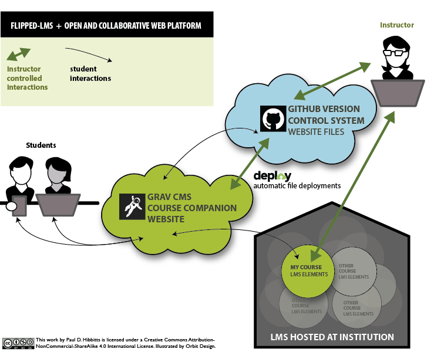

## Grav Quick Install (Web server only)
**Pre-flight Checklist**  
1. Confirm Web server PHP version (PHP 5.5.9 or higher)
1. Web server login credentials (username and password)

**Installation Steps**  
1. Download a Grav Skeleton Package
1. Unzip the package onto your desktop
1. Copy the entire folder to your Web server
1. Point your browser to the Web server folder
1. Create your site administrator account (will automatically be prompted to do so)
1. And you're done!

===

## Grav Recommended Install (Desktop + Web server)

With the flat-file (no database) nature of Grav, there are lots of benefits of installing Grav on your computer and then having your site files mirrored onto a Web server:
* Always have access to your site, regardless of Web server status
* Develop and test changes to your site privately without any downtime of the live site
* Store your site files on a Git service (i.e. GitHub) to better track your development and enable anywhere, anytime editing of your site
* Enable others (i.e. students, fellow instructors, colleagues, etc.) to collaboratively contribute to the site, including both site content _and_ code  

_Figure 1. Grav recommended install using Grav, GitHub, and Deploy to support a flipped-LMS approach._

**Pre-flight Checklist**  
1. Confirm Web server PHP version (PHP 5.5.9 or higher)
1. Web server login credentials (username and password)
1. Download and install MAMP ([https://www.mamp.info/](https://www.mamp.info/))
1. Git server account (e.g. GitHub ([https://github.com/](https://github.com)) or local GitLab or Gogs app, etc.)
1. Download and install GitHub Desktop ([https://desktop.github.com/](https://desktop.github.com/))
1. Automatic deployment service (e.g. Deploy ([https://www.deployhq.com/](https://www.deployhq.com/)), FTPploy([https://ftploy.com/](https://ftploy.com/)), etc.)

**Desktop Installation Steps**  
1. Download the ready-to-run [Course Companion Skeleton Package](../../downloads/grav-skeleton-course-companion-site.zip)
1. Unzip the Grav package onto your desktop
1. Create a folder called 'MAMP Websites' in your 'Documents' folder
1. Copy the _entire_ Grav folder into your 'MAMP Websites' folder
1. Launch MAMP
1. Change the 'Document Root' MAMP preferences setting to the 'MAMP Websites' folder (within 'Documents')
1. Press the MAMP 'Start Servers' button
1. Enter 'localhost:8888' as the URL in your Web Browser
1. Choose the displayed Grav folder name
1. Create your site administrator account when prompted
1. And you're done! (press the <i class="fa fa-arrow-circle-right"></i> icon in the Admin Panel to preview site)

Once you have confirmed that Grav is running locally on your computer, the final step is to create a Git server repository to store your site files and setup an automatic deployment service to push any changed files to your Web server. An example step-by-step walkthrough this process is available in the article [Using Grav with GitHub Desktop (and Deploy)](http://hibbittsdesign.org/blog/posts/using-grav-with-github-and-deploy).
