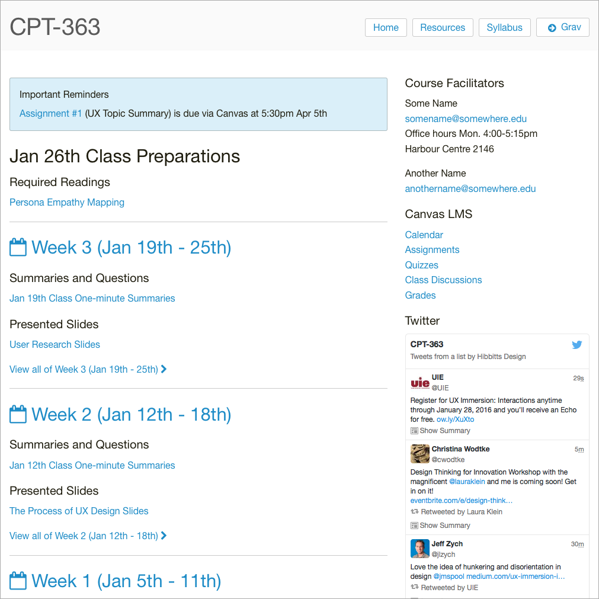

_This article is now outdated. Please refer to the [Grav Course Companion Getting Started Guide](../2016-02-12-grav-course-companion-getting-started-guide)._

I am pleased (well, actually quite stoked) to announce that my ready-to-run [Course Companion](http://demo.hibbittsdesign.org/grav-course-companion-bv/), built with the open source CMS [Grav](http://getgrav.org), is now available for fellow educators to take for a test drive.

===

  
_Figure 1. Grav course companion screenshot.  Explore the early release online at [demo.hibbittsdesign.org/grav-course-companion-bv/](http://demo.hibbittsdesign.org/grav-course-companion-bv/)_

This Course Companion is designed to accompany a face-to-face, blended or fully online university course. It also supports a [flipped-LMS approach](http://hibbittsdesign.org/blog/posts/flipped-lms-using-an-open-and-collaborative-platform) using the modern flat-file CMS Grav as an open and collaborative Web platform.

# Why Flip your LMS with Grav?
* To support pedagogical goals unmet by current LMS/platform
* To increase capability of access, sharing and collaboration
* To deliver a better student (and facilitator) experience

# Why Use a Modern flat-file CMS?
As an open source modern flat-file CMS, Grav offers a distinct set of advantages to Web-savvy educators looking to move beyond their institutional LMS:
* Modern means...
  * Use of current standards (i.e. Markdown, Twig, YAML, etc.)
  * Modular/customizable content chunks (i.e. reuse of content)
  * Further separation of content (i.e. files) from presentation
* Flat-file means...
  * No database means less (or no) IT involvement needed
  * Content stored in text files rather than in a database
  * In many cases, this translates into faster page access times
  * Takes full advantage of the collaborative ecosystem now available (i.e. GitHub, GitLab, etc.)
  * Increased portability, as moving a site now only requires simply copying files to another location

# Course Companion Features
* A complete ready-to-run Grav package (open source)
* Blog-format, with important reminders & preparations areas
* Site pages can be easily added/removed/changed
* Sidebar is a simple markdown file, which can also contain HTML
* URL flag to only display page content (for display within LMS). For example, [http://demo.hibbittsdesign.org/grav-course-companion-bv/blog/week-03/onlydisplaypagecontent:true](http://demo.hibbittsdesign.org/grav-course-companion-bv/blog/week-03/onlydisplaypagecontent:true)
* External links are automatically opened in a new Tab/Window
* Built-in support for entire site to be collaboratively maintained on GitHub
* Since everything is built with Grav it can be _entirely_ customized

# Quick Install (Web server only)
**Pre-flight Checklist**  
1. Confirm Web server PHP version (PHP 5.5.9 or higher)
1. Web server login credentials (username and password)

**Installation Steps**  
1. [Download](../../downloads/grav-skeleton-course-companion-site.zip) the latest release (source code available on [GitHub](https://github.com/hibbitts-design/grav-skeleton-course-companion))
1. Unzip the package onto your desktop
1. Copy the entire Grav Course Companion folder to your Web server
1. Point your browser to the Web server folder
1. Create your site administrator account when prompted
1. And you're done! (press the <i class="fa fa-arrow-circle-right"></i> icon in the Admin Panel to preview site)

# Recommended Install (Desktop + Server)
With the flat-file (no database) nature of Grav, there are lots of benefits of installing Grav on your computer and then having your site files mirrored onto a Web server:
* Always have access to your site, regardless of Web server status
* Develop and test changes to your site privately without any downtime of the live site
* Store your site files on a Git service (i.e. GitHub) to better track your development and enable anywhere, anytime editing of your site
* Enable others (i.e. students, fellow instructors, colleagues, etc.) to collaboratively contribute to the site, including both site content _and_ code  


_Figure 2. Grav recommended install using Grav, GitHub, and Deploy to support a flipped-LMS approach._

**Pre-flight Checklist**  
1. Confirm Web server PHP version (PHP 5.5.9 or higher)
1. Web server login credentials (username and password)
1. Download and install MAMP ([https://www.mamp.info/](https://www.mamp.info/))
1. Git server account (e.g. GitHub ([https://github.com/](https://github.com)) or local GitLab or Gogs app, etc.)
1. Download and install GitHub Desktop ([https://desktop.github.com/](https://desktop.github.com/))
1. Automatic deployment service (e.g. Deploy ([https://www.deployhq.com/](https://www.deployhq.com/)), FTPploy([https://ftploy.com/](https://ftploy.com/)), etc.)

**Desktop Installation Steps**  
1. Download the ready-to-run [Course Companion Skeleton Package](../../downloads/grav-skeleton-course-companion-site.zip)
1. Unzip the Grav package onto your desktop
1. Create a folder called 'MAMP Websites' in your 'Documents' folder
1. Copy the _entire_ Grav folder into your 'MAMP Websites' folder
1. Launch MAMP
1. Change the 'Document Root' MAMP preferences setting to the 'MAMP Websites' folder (within 'Documents')
1. Press the MAMP 'Start Servers' button
1. Enter 'localhost:8888' as the URL in your Web Browser
1. Choose the displayed Grav folder name
1. Create your site administrator account when prompted
1. And you're done! (press the <i class="fa fa-arrow-circle-right"></i> icon in the Admin Panel to preview site)

Once you have confirmed that Grav is running locally on your computer, the final step is to create a Git server repository to store your site files and setup an automatic deployment service to push any changed files to your Web server. An example step-by-step walkthrough this process is available in the article [Using Grav with GitHub Desktop (and Deploy)](http://hibbittsdesign.org/blog/posts/using-grav-with-github-and-deploy).

# Grav for Educators Workshop Slides

If you are new to Grav, you might find these in-progress workshop slides helpful:
<div class="video-responsive video-responsive-4-3"><iframe src="//slides.com/paulhibbitts/grav-cms-for-educators/embed" width="576" height="420" scrolling="no" frameborder="0" webkitallowfullscreen mozallowfullscreen allowfullscreen></iframe></div>

# Course Companion Page Templates
* Blog template (blog.html.twig)
* Important reminders template (important_reminders.html.twig)
* Weekly preparations template (preparations.html.twig)
* Blog item template (blog_item.html.twig)
* Item template (item.html.twig)
* Page template (page.html.twig)
* Sidebar template (sidebar.html.twig)

#Site Structure
```
/user
  - /pages
    - /01.blog | blog.html.twig and blog_item.html.twig
      -/_important-reminders | important_reminders.html.twig
      -/_preparations | preparations.html.twig
      -/week-01 | item.html.twig
      -/week-02 | item.html.twig
      - etc..
    - /02.resources | page.html.twig
      -/page.md
    - /03.syllabus | page.html.twig
      -/page.md
    - /sidebar | sidebar.html.twig
        -/sidebar.md
    - /footer | default.html.twig (Course Companion Bones Vanilla theme element)
        -/default.md
    - /logo | default.html.twig (Course Companion Bones Vanilla theme element)
        -/default.md
    - /mobilemenu | default.html.twig (Course Companion Bones Vanilla theme element)
        -/default.md
```

# Configuration

The 'site.yaml' file located in the '/user/config/' folder contains the following default values:
```
title: CPT-363
metadata:
    description: 'A short description of your course would go here'
displaymenuentries:
    enabled: false        # display of additional menu entries
menu:                     # menu entry for adding external sites/tools
    - text: Grav
      icon: arrow-circle-right
      url: http://getgrav.org/
icon:                     # default font awesome icons for preparation and post entries
    preparations: check-circle
    posts: calendar-o
github:
    location: none         # menu | page | none
    tree: https://github.com/hibbitts-design/grav-skeleton-course-companion-bv/edit/master/
rssbutton:
    display: true
```

| Setting | Child Setting | Description                                                                                                            |
|---------|---------------|------------------------------------------------------------------------------------------------------------------------|
| title   |               | The course number/id, to be displayed at the top of every page.                                                      |
| metadata  |  description | The short description of the course companion site                                       |
| displaymenuentries  |  enabled | Can be set to `true` or `false`. When set to `true`, all defined menu items are added to the navbar.                                       
|
| menu  |  text | Text label for external links to be included on navbar                                       |
| menu  |  icon | Font awesome icon code for external link (optional)                                        |
| menu  |  url | URL for external link
|                                       |
| icon  | preparations    | Change the default font awesome icon for the preparation area on the home page.
|
| icon  | posts          | Change the default font awesome icon for the weekly blog posts (i.e. weekly summaries).            |
| rssbutton  | display       | Can be set to `true` or `false`. When set to `true`, it displays RSS buttons on the sidebar for each page. |
| github  | enabled       | Can be set to `true` or `false`. When set to `true`, it generates the **Edit this page** link to GitHub for each page. |
| github  | tree          | Sets the tree by which your site's content is based. Generally the repo your site's content is pulled from.            |

## Frequently asked questions

_How do you create a new page?_  
The recommended method is to copy an existing page (such as'Resources') using either the Admin Panel or if working directly with files copy the page folder 'resources' and then add the numeric prefix (e.g. '04.'). Once an existing page has been copied then modify as needed.

_What is an 'early release'?_  
As part of a highly iterative development process, early versions of the Course Companion will be made available for evaluation and comment. These releases are believed to be free of major bugs, however they are still works-in-progress.

Questions or comments? You can find me on Twitter at [@hibbittsdesign](https://twitter.com/hibbittsdesign).
