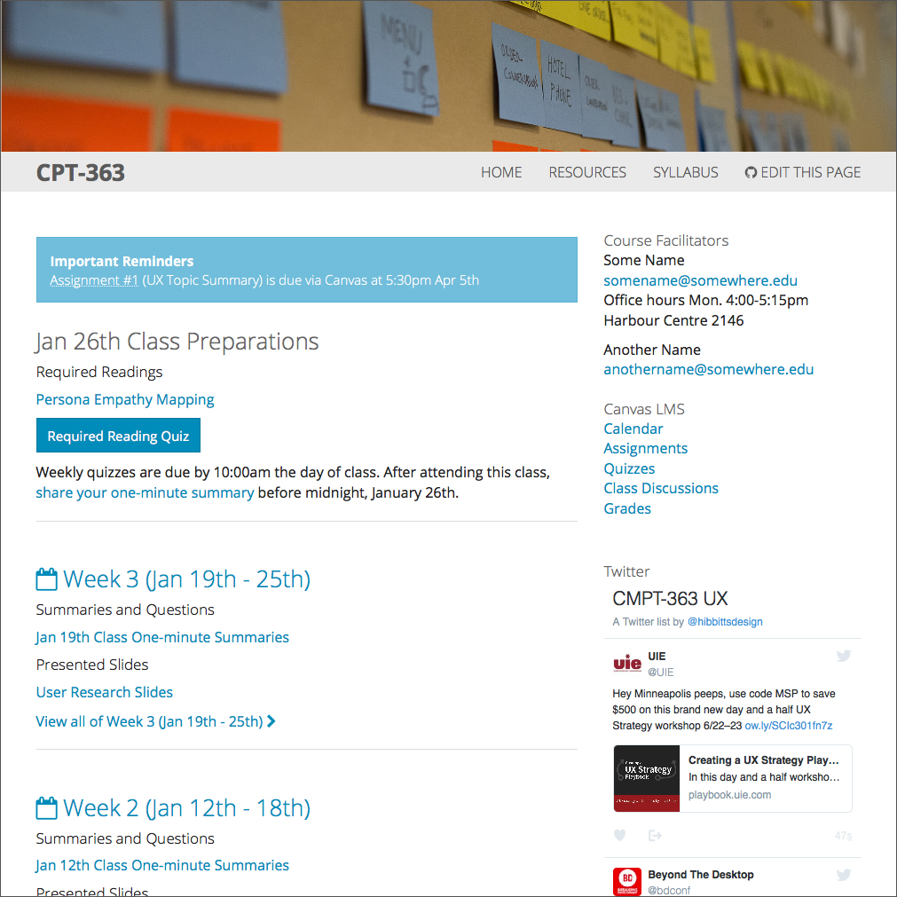
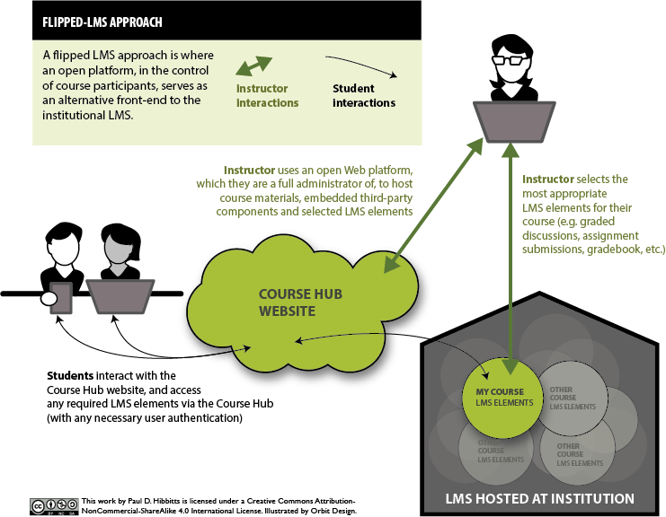

This is a brief guide to help tech-savvy educators ['flip'](../2015-10-20-flipped-lms-defined) their LMS with the modern flat-file (no database) CMS [Grav](http://www.getgrav.org) and my open source [Course Hub ](https://github.com/hibbitts-design/grav-skeleton-course-hub) skeleton package.  

===

!! This guide is now outdated. View the updated [Open Course Hub](http://learn.hibbittsdesign.org/coursehub) documentation on the new  [learn.hibbittsdesign.org](http://learn.hibbittsdesign.org) site.

**Table of Contents**  
[Course Hub Overview](#course-hub-overview)  
[Flipping your LMS with Grav](#flipping-your-lms-with-grav)  
[Installing the Course Hub](#installing-the-course-hub)  
[Working with Grav](#working-with-grav)  
[Using Git and GitHub Desktop](#using-git-and-github-desktop)  
[Setting Up a Course in Grav Course Hub](#setting-up-a-course)  

## Course Hub Overview
The Course Hub skeleton is intended to accompany a face-to-face, blended or fully online university course. It supports a [flipped-LMS approach](../2015-12-18-flipped-lms-using-an-open-and-collaborative-platform) using the modern flat-file (no database) Grav CMS as an open and collaborative Web platform.  

### Course Hub Features
* A complete ready-to-run Grav package ([Source on GitHub](https://github.com/hibbitts-design/grav-skeleton-course-hub))
* Blog-format, with 'featured' (sticky) posts
* [Single course](http://hibbittsdesign.org/demo/grav-course-hub-bootstrap/) per Hub, [multiple courses](http://hibbittsdesign.org/demo/grav-multi-course-blog-hub/) per Hub or even [multiple course sub-sites](http://hibbittsdesign.org/demo/grav-multi-course-pages-hub/) (blog + multiple pages per course) per Hub
* Optional important reminders & class preparations areas
* Hub pages can be easily added/removed/changed
* Uses [Markdown](https://daringfireball.net/projects/markdown/) for streamlined cross-platform content
* Image header area above Hub navigation bar
* Sidebar is a simple markdown file, which can also contain HTML
* URL flag to only display page content (for display within LMS). For example, [http://demo.hibbittsdesign.org/grav-course-hub-bootstrap/home/week-03/onlydisplaypagecontent:true](http://demo.hibbittsdesign.org/grav-course-hub-bootstrap/home/week-03/onlydisplaypagecontent:true)
* External links are automatically opened in a new Tab/Window
* Built-in support for entire Hub to be collaboratively maintained on GitHub or GitLab (for local hosting)
* Since everything is built with Grav it can be _entirely_ customized

### Required Technical Skills
* Code editor usage (e.g. [Atom](https://atom.io/) or [Brackets](http://brackets.io/))
* Markdown or HTML basics
* Understanding folder hierarchies (i.e. relative links)
* Webserver access
* GitHub working knowledge (recommended)

## Flipping your LMS with Grav
### What is a Flipped LMS?
A flipped LMS approach is where an open platform, in the control of course participants,
serves as an alternative front-end to the institutional LMS.

  
_Figure 2. Flipped-LMS approach._

### Why Flip your LMS?
* To support pedagogical goals unmet by current LMS/platform
* To deliver a better student (and facilitator) experience
* To increase capability of access, sharing and collaboration

### Why Use a Modern Flat-file CMS?
As an open source modern flat-file CMS, Grav offers a distinct set of advantages to Web-savvy educators looking to move beyond their institutional LMS:
* Modern means...
  * Use of current standards (i.e. Markdown, Twig, YAML, etc.)
  * Modular/customizable content chunks (i.e. reuse of content)
  * Further separation of content (i.e. files) from presentation
* Flat-file means...
  * No database means less (or no) IT involvement needed
  * Content stored in text files rather than in a database
  * In many cases, this translates into faster page access times
  * Increased portability, as moving a site now only requires simply copying files to another location
  * Takes full advantage of the collaborative ecosystem now available (i.e. GitHub, GitLab, etc.)

Want to learn more about flipping your LMS with an open and collaborative platform such as Grav? Explore more visualizations in the article [Flipped-LMS Approach Using an Open and Collaborative Web Platform](http://hibbittsdesign.org/blog/posts/2015-12-18-flipped-lms-using-an-open-and-collaborative-platform)

## Installing the Course Hub
### Web Only (Quick Install)
**Pre-flight Checklist**  
1. Confirm Webserver PHP version (PHP 5.5.9 or higher)
1. Webserver login credentials (username and password)

**Installation Steps**  
1. Download the ready-to-run [Course Hub Skeleton Package](../../downloads/grav-skeleton-course-hub-site.zip) ([GitHub Repo](https://github.com/hibbitts-design/grav-skeleton-course-hub))  
1. Unzip the package onto your desktop
1. Copy the _entire_ Grav Course Hub folder to your Webserver
1. Point your browser to the Webserver folder
1. Create your site administrator account when prompted
1. And you're done! (press the <i class="fa fa-arrow-circle-right"></i> icon in the Admin Panel to preview site)

### Desktop and Webserver (Recommended Install)
**Pre-flight Checklist**  
1. Confirm Webserver PHP version (PHP 5.5.9 or higher)
1. Download and install MAMP ([https://www.mamp.info/](https://www.mamp.info/))

**Desktop Installation Steps**  
1. Download the ready-to-run [Course Hub Skeleton Package](../../downloads/grav-skeleton-course-hub-site.zip) ([GitHub Repo](https://github.com/hibbitts-design/grav-skeleton-course-hub))
1. Unzip the Grav package onto your desktop
1. Create a folder called 'MAMP Websites' in your 'Documents' folder
1. Copy the _entire_ Grav folder into your 'MAMP Websites' folder
1. Launch MAMP
1. Change the 'Document Root' setting on the MAMP preferences ‘Webserver’ tab to the 'MAMP Websites' folder (within 'Documents')
1. Press the MAMP 'Start Servers' button
1. Enter 'localhost:8888' as the URL in your Web Browser
1. Choose the displayed Grav folder name
1. Create your site administrator account when prompted
1. And you're done! (press the <i class="fa fa-arrow-circle-right"></i> icon in the Admin Panel to preview site)

If you would like a more detailed step-by-step guide to the above desktop installation process, please see the article [Running Grav Locally with MAMP](../2015-11-16-running-grav-locally-with-mamp).

Now that you have a Grav site running on your computer you need to sync those site files to your Webserver. My preferred method is to use a public GitHub (Git) repository (to enable contributions by course participants) and an automatic deployment service, as described in the post [Using Grav with GitHub Desktop](../2015-12-11-using-grav-with-github). If you want to keep your source files to yourself, then using a private [Beanstalk](http://beanstalkapp.com/) repository would be a no-cost option as described in the post [Using GitHub Desktop and Beanstalk with Grav](../2016-02-22-using-github-desktop-and-beanstalk-with-Grav).

If you are interested in storing your Git repository on your own servers, then the open source tool [GitLab](https://about.gitlab.com/) could be an option, as described in the post [Using GitHub Desktop and GitLab with Grav](../2016-04-04-using-github-desktop-and-gitlab-with-Grav).

## Working with Grav
Now that the Grav Course Hub is up and running you are ready to start working with Grav! To learn how Grav is organized, and how to add and edit pages, read the [Grav Basic Tutorial](https://learn.getgrav.org/basics/basic-tutorial).

You can view the all of the official Grav documentation at [learn.grav.org](http://learn.getgrav.org/). If you are looking for additional help check out the [Getting Help](http://learn.getgrav.org/basics/getting-help) section.

### Grav for Educators Workshop Slides

If you are new to Grav, you might find these workshop slides helpful:

## Using Git and GitHub Desktop
* [Git for Designers](http://danielfos.co/notes/git-for-designers)  
* [Getting your project on GitHub](https://guides.github.com/introduction/getting-your-project-on-github/)  
* [Introduction to GitHub](https://github.github.com/on-demand/intro-to-github/)

## Setting up a Course
For details about configuring and further customizing the Grav Course Hub read [Setting Up a Course in the Grav Course Hub](../2016-07-18-setting-up-your-grav-course-hub).

 
Suggestion or corrections to this guide? [<i class="fa fa-github" aria-hidden="true"></i> Edit this Page on GitHub](https://github.com/hibbitts-design/hibbitts-design-org-blog/edit/master/posts/2016-02-12-grav-course-hub-getting-started-guide/post.md)
 
