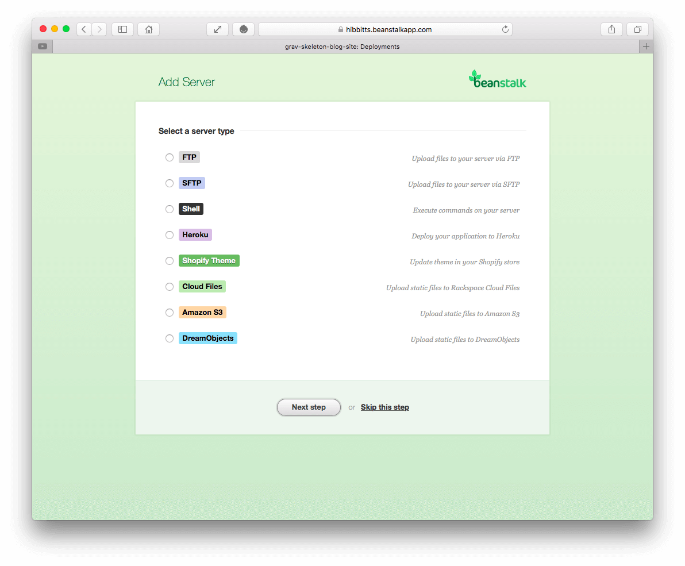

In this article, we will look at how to use Grav with [GitHub Desktop](https://desktop.github.com/) and [Beanstalk](http://beanstalkapp.com) (which has automatic FTP deployment built-in) to provide a highly efficient workflow when updating your Grav site, and source control to boot. While GitHub only offers private repositories for paid plans, Beanstalk offers a free plan to store one single repository privately.

You will be required to enter a few commands into your Mac or PC command line interface (CLI) during this the process, so get comfortable and let's get started.

===

! This article will be substantially updated once the pre-release [Git Sync plugin](../2016-12-22-touchdown-seamless-2-way-syncing-arrives-for-grav) for Grav is officially released (expected in February).

**Step-by-step instructions**

1. Download and unzip a [Grav Skeleton of your choice](https://getgrav.org/downloads/skeletons).

2. Download the [GitHub Desktop](https://desktop.github.com/) client for your computer (Mac or PC), and once it is installed launch the application. Since you will be using Beanstalk, and not GitHub, you can skip the setup process at this time.

    
  _Figure 1. GitHub Desktop setup welcome._

3. Once the GitHub Desktop application is installed, you will need to install it's command line tools. This option can be found in the GitHun Desktop's 'Preferences' dialog on the 'Advanced Panel' - look for the 'Install Command Line Tools' button and then press it.

    
  _Figure 2. GitHub Desktop preferences dialog with the 'install command line tools button._

4. Head over to [Beanstalk](http://beanstalkapp.com/) and sign-up for a free account (one user private project plan with 100MB of storage).

    
  _Figure 3. Beanstalk homepage._

5. Once you have signed up and are signed-in, create a new repository by pressing the "Create a Repository" button.

    
  _Figure 4. Beanstalk welcome page._

6. Next, enter the name of your new repository. Consider the name of the Grav project you will eventually be storing when choosing the name. Once you enter the repository name press the 'Next Step' button.

    
  _Figure 5. Beanstalk new repository._

  You will next need to make the initial commit to your newly created Beanstalk repository. Launch the command line interface for the Mac OS, which is the 'Terminal' app, or if you are on Windows launch the 'Git Shell' app which would have been installed along with GitHub Desktop (within the same application folder).

    
  _Figure 6. Mac OS Terminal application._

7. To streamline the need to navigate directories during this process, I would suggest you place your previously unzipped Grav Skeleton folder to where you wish to eventually maintain it (e.g. in your 'Documents' folder). For this operation you will be using the 'cd' command, which is for change directory. In your CLI enter 'cd', press the space bar, and then drag-and-drop the folder that _contains_ your Grav Skeleton folder (not the actual Grav Skeleton folder) onto the CLI window. With the full path to the folder now after the 'cd' command press the 'Return' key.

    _Figure 7. Mac OS Terminal application with folder dropped after 'cd' command._

  To make sure you are at the correct directory level, you can use the 'ls' command, which is for listing the files stored in a directory. In your CLI, enter 'ls' and press the 'Return' key. You should see the name of your Grav Skeleton folder in this list (e.g. within your 'Documents' folder).

    
  _Figure 8. Mac OS Terminal application with 'ls' command entered._

8. Now you are ready to link your Grav Skeleton folder to your Beanstalk repository by copying the hidden '.Git' folder from the cloned repository to your actual Grav Skeleton folder. Return to your Browser and copy the 'Git repository URL' field which should be displayed on the current Beanstalk site page.

    
  _Figure 9. Beanstalk repository, with Git URL._

9. Return to your CLI window, and type 'git clone', plus a space, and then paste the Git repository URL you have just copied to your clipboard, then a space, and finally the text 'temp'. This command will clone your Beanstalk repository to your computer within a folder called 'temp'. Press the 'Return' key to run the entered command. You may also be prompted to enter your Beanstalk username and password for this step.

    
  _Figure 10. Mac OS Terminal application git clone command line entered._

  After a short period of time a message should be displayed about the status of the Git clone command, such as 'done'.

    
  _Figure 11. Mac OS Terminal application git clone command completed._

10. We now need to make the Grav Skeleton folder the location of the repository on your computer, rather than the empty temp folder we just created. To do this, we enter 'mv temp/.git', plus a space, then the name of your Grav Skeleton folder, plus a space, followed by '/.git'. This operation will by copy the hidden '.Git' folder from the cloned repository to your actual Grav Skeleton folder.

    
  _Figure 12. Mac OS Terminal application move folder command entered._

    
  _Figure 13. Mac OS Terminal application move folder command completed._

  Now that you have your Beanstalk Git repository as your Grav Skeleton folder, you can use GitHub Desktop to easily and quickly send any updates back to the repository on Beanstalk with just a click of the button (no more CLI commands are required!).

11. Return to the GitHub Desktop app, and press the "Add a Repository" button (upper-right plus(+) sign in the main window) in the GitHub Desktop client, then select the "Add" tab within the displayed dialog box, and press the "Choose..." button to select the folder containing your Grav skeleton.

    
  _Figure 14. GitHub Desktop add repository dialog._

    
  _Figure 15. GitHub Desktop local repository added._

12. You are now ready for the first commit to your new GitHub repository. Whenever you make a commit you will need to include a brief text summary - as this is your first commit enter the text "First commit." into the "Summary" text box (above the "Description" text field), and then press the button "Commit to master".

    
  _Figure 16.  GitHub Desktop first commit._

13. Since this is your first commit to your repository, the "Publish" button (upper-left of main window) may need to be also pressed to perform the actual file updates.

14. With the files for your Grav Skeleton now uploaded to Beanstalk, the final step is to enter the FTP credentials for your automatic deployments in Beanstalk. Return to the Beanstalk site, navigate to your repository page, and press the "Deployments" button.

    
  _Figure 17.  Beanstalk Deployments page._

15. Press the 'Create environment & server' button and then name your environment. Choose 'Automatic' deployments (since you will be doing your development work/testing on your local computer and only commit working versions of your site to Beanstalk).

    
  _Figure 18.  Beanstalk Create Environment and Server Page._

16. Choose the type of server you are adding (most likely FTP or SFTP), press "Next Step", enter in the needed server address and credentials on the following screen, and then press "Next Step" again. You can skip the 'Optional Settings' page when it is shown.

    
  _Figure 19.  Beanstalk Add Server._

    
  _Figure 20.  Beanstalk Add FTP Server._

    
  _Figure 21.  Beanstalk server setup complete._

  Congratulations! You now have a Grav site which you can run and test locally (using [MAMP](http://mamp.info)), and with _only one click_ in the GitHub Desktop application have any changed local site files updated in your Beanstalk private repository and have them automatically pushed to your Web server. In my experience, I can make an update to my Grav site and sync changes to Beanstalk for automatic deployment to my Web server in as little as 30 seconds.

  If you are interested in providing a way for other course facilitators and students to collaborate with your Grav site then you should use a GitHub public repository instead of a private Beanstalk one - read the article [Using Grav with GitHub Desktop (and Deploy)](../2015-12-11-using-grav-with-github) for step-by-step instructions.
