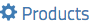
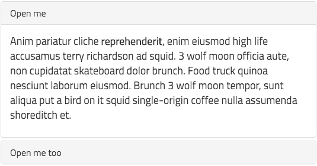

When mapping out the design of the [Grav Course Hub Skeleton](https://github.com/hibbitts-design/grav-skeleton-course-hub), it was important to support the two most popular responsive Web frameworks ([Bootstrap](http://getbootstrap.com/) and [Foundation](http://foundation.zurb.com/)) so that educators could choose the framework best suited to their multi-device presentation needs.

For folks who decide to use the [Course Hub Bootstrap theme](https://getgrav.org/downloads/themes), the recently released [Gravstrap shortcodes plugin](http://diblas.net/plugins/use-bootstrap-components-as-shortcodes-in-grav-cms) by Giansimon Diblas adds a substantial set of useful Bootstrap framework elements available right in Markdown (no HTML required).

===

For example, by using the following Markdown when the Gravstrap shortcodes plugin is installed, you can use the [Gravstrap Link component](http://diblas.net/plugins/use-bootstrap-components-as-shortcodes-in-grav-cms/link-shortcode) to display a [Font Awesome icon](https://fortawesome.github.io/Font-Awesome/icons/) along with a hyperlink:

```
[g-link url="http://example.com" menu="Products" icon="cog"][/g-link]
```
  
_Figure 1. Products link with icon._

Sometimes it's important to make a link highly visible to students, so that's where the [Gravstrap Button component](http://diblas.net/plugins/use-bootstrap-components-as-shortcodes-in-grav-cms/button-shortcode) can come in handy:

```
[g-button button_url="http://google.com" button_type="primary" button_label="Click me"][/g-button]
```
  
_Figure 2. Hyperlink using the Button component._

The [Gravstrap accordion component](http://diblas.net/plugins/use-bootstrap-components-as-shortcodes-in-grav-cms/gravstrap-accordion-shortcode) can be very useful in certain situations, especially in the context of students needing to view a single chunk of content from within a much larger collection.

```
[g-accordion id=accordion1 name=accordion1]
[g-accordion-item id=accordion_item1 header_id=accordion_header1 title="Open me"]

Anim pariatur cliche **reprehenderit**, enim eiusmod high life accusamus terry richardson ad squid. 3 wolf moon officia aute, non cupidatat skateboard dolor brunch. Food truck quinoa nesciunt laborum eiusmod. Brunch 3 wolf moon tempor, sunt aliqua put a bird on it squid single-origin coffee nulla assumenda shoreditch et.

[/g-accordion-item]
[g-accordion-item id=accordion_item2 header_id=accordion_header2 title="Open me too"]

Anim pariatur cliche reprehenderit, enim eiusmod high life accusamus terry richardson ad squid. 3 wolf moon officia aute, non cupidatat skateboard dolor brunch. Food truck quinoa nesciunt laborum eiusmod. Brunch 3 wolf moon tempor, sunt aliqua put a bird on it squid single-origin coffee nulla assumenda shoreditch et.

[/g-accordion-item]
[/g-accordion]]
```
  
_Figure 3. Accordion component, with one panel expanded._

To learn more about what situations an accordion component is best suited to, I recommend reading the article [Accordions Are Not Always the Answer for Complex Content on Desktops](https://www.nngroup.com/articles/accordions-complex-content/).

The above three examples just scratch the surface with what is possible when using the Gravstrap shortcodes plugin along with the Course Hub Bootstrap theme (or any other Grav Bootstrap-based theme for that matter). Explore the full range of available components on Giansimon's [Gravstrap page](http://diblas.net/plugins/use-bootstrap-components-as-shortcodes-in-grav-cms).

Oh, and if you are wondering why interactive examples were not included on this page, the Grav theme this site uses (HPSTR) is not Bootstrap-based - you win some, you lose some.
