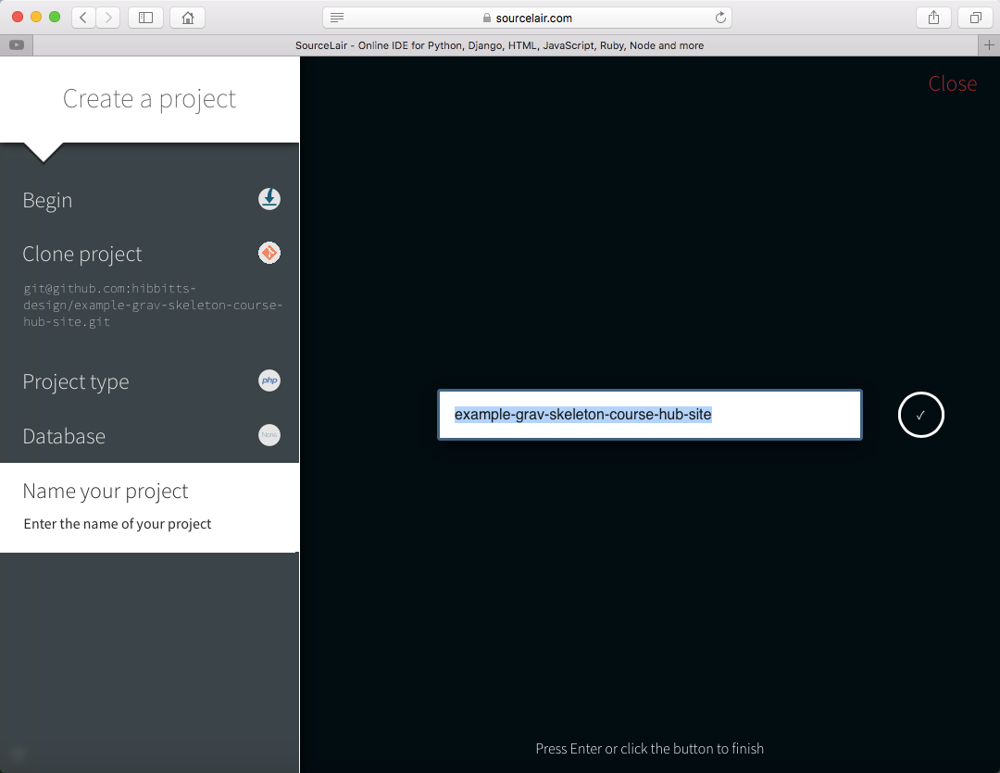
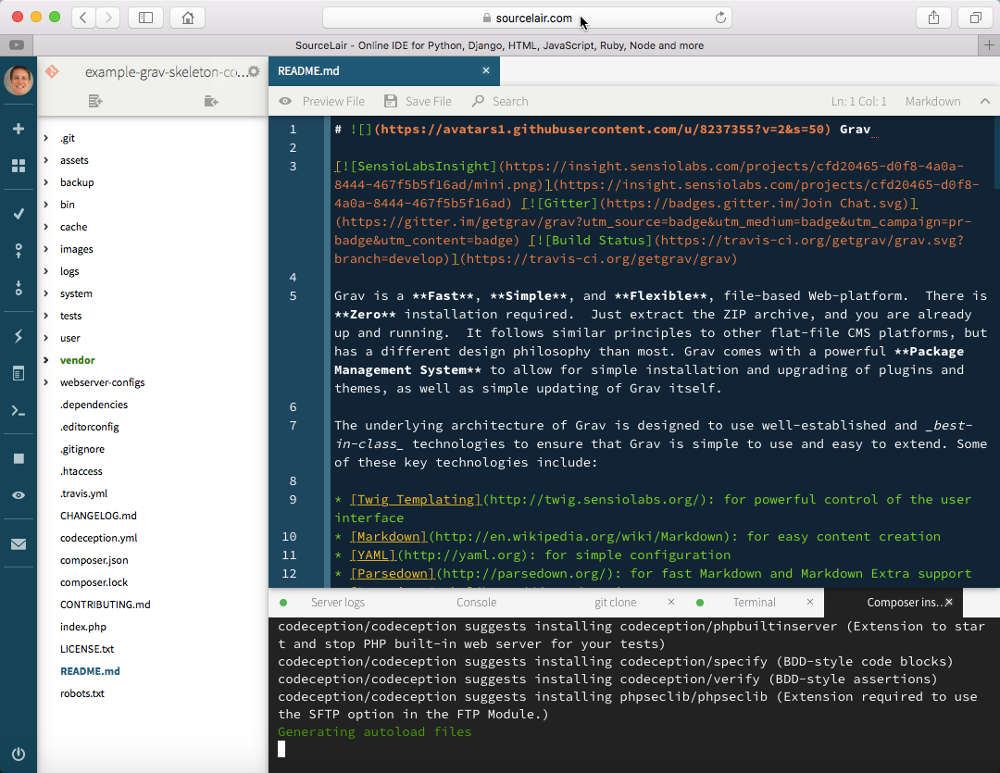

Recently I've been exploring online (aka "cloud") IDE's for use with my various Grav sites and to also recommend for other educators who use Grav with GitHub (as I do). Yesterday I happily discovered [SourceLair](https://www.sourcelair.com/), which provides a straightforward online environment to develop and test a variety of Web project types all within your Browser (or in my case on my Chromebook). Other noteworthy highlights about SourceLair include a full-screen Terminal and a public URL which can share with others to view your in-development work.

===

I've been pretty impressed so far with how SourceLair lets me remotely work on my Grav sites, preview/debug them using the built-in PHP server, and then push the resulting changes to GitHub (which are then automatically deploy using a third-party service such as [Deploy](https://www.deployhq.com/) or with SourceLair's built-in support for  [git-ftp](https://github.com/git-ftp/git-ftp)) - all within my Web Browser! SourceLair also provides university professors and students with access to one free project, along with several paid plans for Web developers - just [contact them](https://www.sourcelair.com/contact) for details.

**Step-by-step instructions**

1. Sign-up for a trial [SourceLair](https://www.sourcelair.com/) account by choosing "Sign up with GitHub" and then provide the requested GitHub credentials and other required account creation information.

    
  _Figure 1. SourceLair sign up page._

2. Once you've signed up for SourceLair press the "Start a project" button on your account welcome page.

    
  _Figure 2. SourceLair welcome page._

3. Press the "Clone a project" button to clone a GitHub project to your SourceLair account.

    
  _Figure 3. SourceLair begin a project page._

4. Choose the GitHub repository you want to clone to SourceLair.

    
  _Figure 4. SourceLair clone project page._

5. Choose "PHP" for the project type.

    
  _Figure 5. SourceLair project type page._

6. As Grav is a flat-file (no database) CMS, choose "None" on the Database page.

    
  _Figure 6. SourceLair database page._

7. Name your SourceLair project (a default name will be provided).

    
  _Figure 7. SourceLair name project page._

  At this point SourceLair will complete the installation of your project. If your GitHub repository only contains your Grav site "User" folder you are all done so you can skip to the bottom of this article. If your GitHub repository is an entire Grav site (i.e. including PHP files, etc.) then one more step is required so that the automatically updated [Composer](https://getcomposer.org/) installs (indicated in the included "composer.json" file) are not included in your initial GitHub commit/push.

    
  _Figure 8. SourceLair initial project display._

8. Press the "Terminal" tab located on the bottom part of the current SourceLair project page.

    
  _Figure 9. SourceLair terminal panel._

9. Enter the following Git command in the Terminal panel and then press the "Return" key.

  ```
  git checkout . && git clean -f -d
  ```

    
  _Figure 10. SourceLair terminal panel with Git command entered._

  I would suggest you test everything out by making a small edit in one of your Grav page files, and then preview the files to be committed to your GitHub repository. To perform a commit in SourceLair using the left-hand toolbar, press the "Commit" (checkmark) button to preview/commit your changes and then the "Push" (up arrow) button to push all of your committed changes.

    
  _Figure 11. SourceLair commit dialog._

  You are now ready to edit your Grav site using SourceLair, and if you have an entire Grav site stored in your GitHub repository you can also preview your site in-progress by pressing the "Preview" (eye) button on the left-hand toolbar.

    
  _Figure 12. SourceLair site preview using the built-in PHP server._

  If you just have your Grav 'User' folder stored in your GitHub repository, you might find SourceLair's built-in Markdown file preview as a helpful alternative to a full site preview.

    
  _Figure 13. SourceLair markdown file preview._

  I hope you find SourceLair as useful as I have, especially when used with GitHub!
