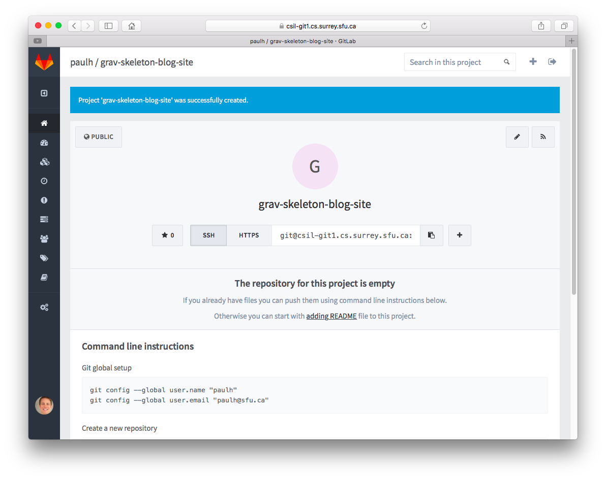
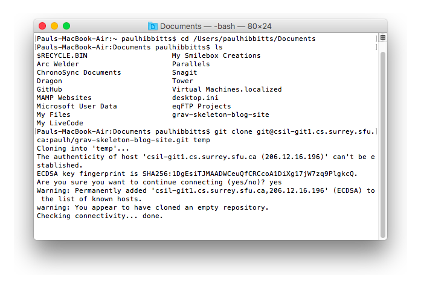

In this article, we will look at how to use Grav with [GitHub Desktop](https://desktop.github.com/) and [GitLab](https://about.gitlab.com/). Unlike GitHub, you can install GitLab onto your own server, which is an attractive option for many higher education institutions. A locally hosted version of GitLab is used in this walkthrough.

===

!! This article is now outdated. View the updated [GitLab & GitHub Desktop](http://learn.hibbittsdesign.org/gitlab-githubdesktop) or [GitLab & GitHub Desktop Beta](http://learn.hibbittsdesign.org/gitlab-githubdesktop-beta) tutorials on the new [learn.hibbittsdesign.org](http://learn.hibbittsdesign.org) site.

Speaking of Higher Ed folks, if this process looks out of your comfort zone then likely someone in your local IT services should be able to help you get things going pretty quickly by just following this tutorial themselves.

You will be required to enter a few commands into your Mac or PC command line interface (CLI) during this the process, so warm up those typing fingers and let's get going.

**Step-by-step instructions**

1. Download and unzip a [Grav Skeleton of your choice](https://getgrav.org/downloads/skeletons).

2. Download the [GitHub Desktop](https://desktop.github.com/) client for your computer (Mac or PC), and once it is installed launch the application. Since you will be using GitLab, and not GitHub, you can skip the setup process at this time.

    
  _Figure 1. GitHub Desktop setup welcome._

3. Once the GitHub Desktop application is installed, you will need to install it's command line tools. This option can be found in the GitHun Desktop's 'Preferences' dialog on the 'Advanced Panel' - look for the 'Install Command Line Tools' button and then press it.

    
  _Figure 2. GitHub Desktop preferences dialog with the 'install command line tools button._

4. Using your Web Browser head over to your local GitLab install, sign in and then create a new repository by pressing the "New Project" button.

    
  _Figure 3. GitLab welcome message._

5. Next, enter the name of your new project (repository). Consider the name of the Grav project you will eventually be storing when choosing the name. Once you enter the project name press the 'Create Project' button.

    
  _Figure 4. GitLab new project._

  You will next need to make the initial commit to your newly created GitLab project. Launch the command line interface for the Mac OS, which is the 'Terminal' app, or if you are on Windows launch the 'Git Shell' app which would have been installed along with GitHub Desktop (within the same application folder).

    
  _Figure 5. Mac OS Terminal application._

7. To streamline the need to navigate directories during this process, I would suggest you place your previously unzipped Grav Skeleton folder to where you wish to eventually maintain it (e.g. in your 'Documents' folder). For this operation you will be using the 'cd' command, which is for change directory. In your CLI enter 'cd', press the space bar, and then drag-and-drop the folder that _contains_ your Grav Skeleton folder (not the actual Grav Skeleton folder) onto the CLI window. With the full path to the folder now after the 'cd' command press the 'Return' key.

    _Figure 6. Mac OS Terminal application with folder dropped after 'cd' command._

  To make sure you are at the correct directory level, you can use the 'ls' command, which is for listing the files stored in a directory. In your CLI, enter 'ls' and press the 'Return' key. You should see the name of your Grav Skeleton folder in this list (e.g. within your 'Documents' folder).

    
  _Figure 7. Mac OS Terminal application with 'ls' command entered._

8. Now you are ready to link your Grav Skeleton folder to your GitLab repository by copying the hidden '.Git' folder from the cloned repository to your actual Grav Skeleton folder. Return to your Browser, scroll down until you see the 'Create a new repository' information area, and copy the first line of text in that box (e.g. 'git clone git@csil-git1.cs.surrey.sfu.ca:paulh/grav-skeleton-blog-site.git').

    
  _Figure 8. GitLab project, top of page._

    
  _Figure 9. GitLab project, bottom of page._

9. Return to your CLI window, paste the text you just copied (the first line of text in the 'Create a new repository' information area), press the spacebar and then enter the text 'temp'. This command will clone your GitLab repository to your computer within a folder called 'temp'. Press the 'Return' key to run the entered command. You may also be prompted to enter your GitLab username and password for this step.

    
  _Figure 10. Mac OS Terminal application git clone command line entered._

  After a short period of time a message should be displayed about the status of the Git clone command, such as 'done'.

    
  _Figure 11. Mac OS Terminal application git clone command completed._

10. We now need to make the Grav Skeleton folder the location of the repository on your computer, rather than the empty temp folder we just created. To do this, we enter 'mv temp/.git', plus a space, then the name of your Grav Skeleton folder, plus a space, followed by '/.git'. This operation will by copy the hidden '.Git' folder from the cloned repository to your actual Grav Skeleton folder.

    
  _Figure 12. Mac OS Terminal application move folder command entered._

    
  _Figure 13. Mac OS Terminal application move folder command completed._

  Now that you have your GitLab Git repository as your Grav Skeleton folder, you can use GitHub Desktop to easily and quickly send any updates back to the repository on GitLab with just a click of the button (no more CLI commands are required!).

11. Return to the GitHub Desktop app, and press the "Add a Repository" button (upper-right plus(+) sign in the main window) in the GitHub Desktop client, then select the "Add" tab within the displayed dialog box, and press the "Choose..." button to select the folder containing your Grav skeleton.

    
  _Figure 14. GitHub Desktop add repository dialog._

    
  _Figure 15. GitHub Desktop local repository added._

12. You are now ready for the first commit to your new GitHub repository. Whenever you make a commit you will need to include a brief text summary - as this is your first commit enter the text "First commit." into the "Summary" text box (above the "Description" text field), and then press the button "Commit to master".

    
  _Figure 17.  GitHub Desktop first commit._

13. Since this is your first commit to your repository, the "Publish" button (upper-left of main window) may need to be also pressed to perform the actual file updates. Once complete, refresh your GitLab Project page to see the updated files.

    
  _Figure 18.  GitLab Project Page with updated files._

Congratulations! You now have a Grav site stored on a GitLab repository.

As a next step you should explore options of how to automatically deploy updated files stored on GitLab to your Grav site Webserver. My current favorite service for this is [Deploy](http://www.deployhq.com) and you can learn how to set it up for use with GitLab in the Deploy support article [How do I start an Automatic Deployment from Gitlab?](https://support.deployhq.com/articles/deployments/how-do-i-start-an-automatic-deployment-from-gitlab).

Alternatively, with a little PHP and server access knowledge you can do this only just using Webhooks (which are supported by GitHub, GitLab, and some other Git repository services) - read the "Automatic Webhook" section within the Grav blog post [Grav Development with GitHub - Part 2](https://getgrav.org/blog/developing-with-github-part-2).
