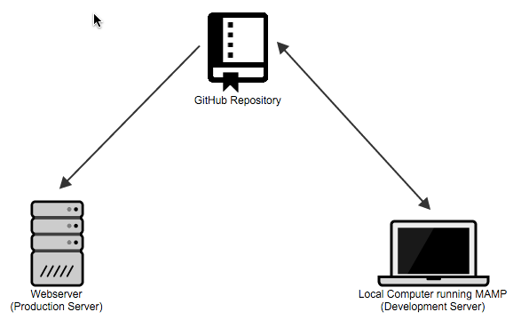
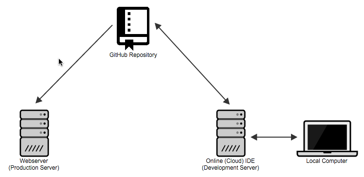

With [Grav](http://getgrav.org) being a flat-file (no database) CMS tech-savvy educators have a wider range of possible development and deployment options for their [Grav Course Hubs](http://hibbittsdesign.org/blog/posts/2016-02-12-grav-course-hub-getting-started-guide) than most other database-driven systems. Recently I've been exploring an on-line alternative to my currently preferred local development approach, so I thought I would share both together for easier comparison. Both approaches will let you safely develop and test your Grav site before deploying changes to a live production server.

===

[Local Development Server, GitHub, and Webserver Deployment](#localdev)  
[Cloud (i.e. online) Development Server, GitHub and Webserver Deployment](#clouddev)  

**Local Development Server, GitHub, and Webserver Deployment** 

  
_Figure 1. Local Development Server, GitHub, and Webserver Deployment._

* MAMP Setup
  1. Download the Course Hub Grav Skeleton ([https://getgrav.org/downloads/skeletons](https://getgrav.org/downloads/skeletons))
  2. Unzip Grav Skeleton
  3. Create 'MAMP Websites' folder in your 'Documents' folder
  4. Copy entire unzipped Grav folder into 'MAMP Websites' folder
  5. Download and install MAMP ([https://www.mamp.info/en/](https://www.mamp.info/en/))
  6. Launch MAMP
  7. Tap 'Preferences...', then the 'Web Server' tab, and finally the folder icon containing three dots (Select new document root) to select your 'MAMP Websites' folder
  8. Tap the 'OK' button to close the 'Preferences' dialog
* GitHub Setup ([GitLab](https://about.gitlab.com/) is a locally hosted comparable service)
  1. Signup for a GitHub account ([https://github.com/](https://github.com/))
  2. GitHub Desktop
  3. Download and install GitHub Desktop client ([https://desktop.github.com/](https://desktop.github.com/))
  4. Enter your GitHub credentials when prompted
  5. Launch GitHub Desktop
  6. Tap the '+' (Add a repository) button, then the 'Add' tab, and finally the 'Choose..' button to select your Grav folder within your 'MAMP Websites' folder
  7. Enter a message such as 'First commit.' into the 'Summary' field and then tap 'Commit and Sync master' button. You may also need to tap the 'Publish' button.
* Buddy Setup (for automatic deployments - [Deploy](http://deployhq.com) is a comparable service)
  1. Signup for a Buddy account with your GitHub username ([buddy.works](https://buddy.works/))
  2. Tap 'Add new project'
  3. Tap 'GitHub' as the Git Provider, then choose the GitHub repository you created earlier of your Grav folder, and then finally tap 'Create a new project'
  4. Tap 'Build Your First Pipeline'
  5. Enter a name for your pipeline (such as the name of your Grav project), then tap 'On every push', choose 'Master' for the 'Assign to Branch' field, and finally tap 'Add a new pipeline'.
  6. Choose the 'Transfer' type, most likely 'FTP' (you may need to confirm what type of FTP connection is required for your Webserver)
  7. Enter the 'Hostname', 'Login', 'Password', and remote path (i.e. the directory path to the folder you wany to contain your Grav site) for your Webserver and then press 'Test connection & add this action on success'.
  8. Tap 'Run Pipeline' and then tap the 'Run Now' button to do the initial deployment of your GitHub repository to your Webserver

**Cloud (i.e. online) Development Server, GitHub and Webserver Deployment** 

  
_Figure 2. Cloud (i.e. online) Development Server, GitHub and WebserverDeployment._

* GitHub Setup
  1. Signup for a GitHub account ([https://github.com/](https://github.com/))
  2. Tap the 'Repositories' tab and then tap the 'New' button
  3. Enter your 'Repository name' (such as the name of your Grav project) and then press the 'Create repository' button
  4. Tap the 'Import code' button
  5. Enter the following for 'Your existing repository's URL' field: https://github.com/hibbitts-design/grav-skeleton-course-hub-site
  6. Tap the 'Begin Import' button, and when the import process is compete press the 'Continue to repository' button
* SourceLair Setup (online integrated development environment)
  1. Signup for a SourceLair account with your GitHub username ([https://www.sourcelair.com/](https://www.sourcelair.com/))
  2. Tap the '+'  (Start a new project) button and then choose 'Clone a project'
  3. From the list provided choose the Course Hub GitHub repository you created earlier
  4. Tap 'PHP' for the 'Project type', then tap 'None' for the 'Database type', review the default name and finally press 'Enter' or tap the checkmark button
* Buddy Setup (for automatic deployments - [Deploy](http://deployhq.com) is a comparable service)
  1. Signup for a Buddy account with your GitHub username ([buddy.works](https://buddy.works/))
  2. Tap 'Add new project'
  3. Tap 'GitHub' as the Git Provider, then choose the GitHub repository you created earlier of your Grav folder, and then finally tap 'Create a new project'
  4. Tap 'Build Your First Pipeline'
  5. Enter a name for your pipeline (such as the name of your Grav project), then tap 'On every push', choose 'Master' for the 'Assign to Branch' field, and finally tap 'Add a new pipeline'.
  6. Choose the 'Transfer' type, most likely 'FTP' (you may need to confirm what type of FTP connection is required for your Webserver)
  7. Enter the 'Hostname', 'Login', 'Password', and remote path (i.e. the directory path to the folder you wany to contain your Grav site) for your Webserver and then press 'Test connection & add this action on success'.
  8. Tap 'Run Pipeline' and then tap the 'Run Now' button to do the initial deployment of your GitHub repository to your Webserver

Each of the above configurations results in one-tap updates of your Grav GitHub repository along with automatic deployment, and even more amazingly both can be used at the same time to support both local and remote development efforts!

What approach is best depends on both your needs and preferences, but these words of wisdom from Bryan Ollendyke ([@elmsln](https://twitter.com/elmsln) Project Lead) are well worth repeating here:

<blockquote class="twitter-tweet" data-conversation="none" data-lang="en">
<a href="https://twitter.com/hibbittsdesign">@hibbittsdesign</a> Hubs can be shut down, controlled and have policies changed. Local deployments will always serve the individual
&mdash; Bryan Ollendyke (@btopro) <a href="https://twitter.com/btopro/status/719628366953848833">April 11, 2016</a></blockquote>

