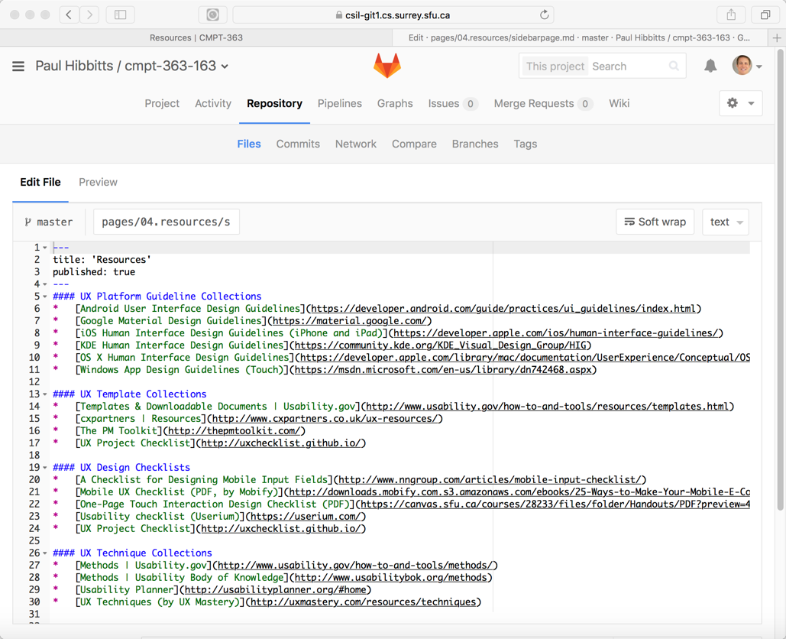

This post was inspired by the very informative July 14th [BCcampus](bccampus.ca) Canvas LMS session with [Stan Wendt](https://twitter.com/stanwendt) and moderated by [Clint Lalonde](https://twitter.com/clintlalonde).

If my reading of the tea leaves is correct, there could be a big uptake of the use of the [Canvas LMS](https://www.instructure.com/canvas/) in Canada with news of a possible hosted in Canada cloud offering. As a sessional faculty member of the [Computing Science Department](http://www.sfu.ca/computing.html) at [Simon Fraser University](http://www.sfu.ca) I've been using Canvas for the past several years and I thought it might be helpful for other potential users of Canvas to share my experiences so far.

===

But wait, you might be asking yourself why is that [flipped-LMS](../2015-12-18-flipped-lms-using-an-open-and-collaborative-platform) guy talking about an LMS? Well, for one thing I've found Canvas provides an excellent set of LMS-centric functionality. LMSs themselves are an entrenched part of the higher education landscape, and while we all are waiting for more modular and networked approaches to fully emerge (i.e. [NGDLE](https://net.educause.edu/ir/library/pdf/eli3035.pdf) - I suggest you keep an eye on two very promising projects: [elmsln.org](https://www.elmsln.org/) and [tsugi.org](http://www.tsugi.org/)) we need to keep improving things for our students whenever possible as soon as possible.

An institutional LMS, such as Canvas, also provides a safe and secure place to store sensitive student information as we leverage other tools to move beyond the LMS itself.

####The Joys of Canvas
In my experience, Canvas is certainly one of the more user-friendly LMSs currently available (from a student _and_ instructor viewpoint). I think for many higher education instructors Canvas can provide everything needed for either a blended or fully on-line course.

For my past SFU CMPT 363 (User Interface Design) courses, I have found the most valuable aspects of Canvas to be:

* Shared calendar
* Assignment submissions and marking (i.e. SpeedGrader)
* Graded discussion forums
* Graded quizzes
* Ungraded surveys
* Syllabus (esp. auto-inclusion of all graded course elements)
* Modules

While no system is perfect, a lot of thought has clearly gone into many of the features listed above. For example, when grading a forum discussion I can easily require a student to submit their initial post before being able to see their peers' comments - perfect when asking for students to submit their one-minute summary after each class they attend.

Here is a screenshot of my 2016 CMPT 363 Canvas course site homepage:

####Tradeoffs
So while Canvas has a lot of _elements_ I find very useful from a pedagogical perspective, as a _platform_ I often find it too limiting. While Canvas is indeed very easy to use it is also quite constraining with regards to  what a _moderately tech-savvy_ instructor can do within it.

For example, only a subset of HTML tags are supported in Canvas so even if you know HTML you often cannot format content as you would like to. You can also not incorporate pre-built Javascript elements within your course sites (without IT involvement), such as a floating Livechat widget (which my own students absolutely _love_). And finally, Canvas uses a combination of mobile apps and a desktop-first Browser experience which results in a less-than-ideal multi-device viewing experience. While Canvas has a user-friendly content editor I find even making a single change within a single page takes more time than I would like. This results in my desire to only make updates to my Canvas course site when only absolutely required.

So while Canvas provides a pretty extensive set of LMS-centric functionality it does lack in the area of Content Management System (CMS) functionality and supporting a higher level of customization which an individual instructor can utilize.

####Getting the Best of Both Worlds
Given the above, I have found that by combining Canvas with an open source flat-file (no database) CMS called [Grav](http://getgrav.org) to be the ideal solution for my needs. As I said, for many instructors Canvas alone can provide a one-stop platform for their courses, but if you are moderately tech-savvy and want to go beyond what Canvas offers then using an open and extensible Web platform like Grav _in combination_ with Canvas can be a very appealing option for yourself and your students (think LMS + open and extensible Web platform as a CMS).

The approach I have taken (which I call a 'flipped LMS') is to create an alternative front-end to Canvas using Grav (which serves as the primary online experience for students), which addresses these three specific goals:

1. To support pedagogical goals unmet by the current LMS
2. To deliver a better student (and facilitator) multi-device experience
3. To increase capability of access, sharing and collaboration

For example, my CMPT 363 course involves a lot of design work for my students so I want my course site to provide performance support tools such as a floating Livechat widget and access to my custom-made [UX Techniques Guide](http://paulhibbitts.net/cmpt-363-153/ux-techniques-guide) to provide real-time assistance to students at the time of need. Both of these example elements are not possible within Canvas at this time, but can be easily integrated into a Grav front-end (which I refer to as the 'Course Hub'). As Canvas also supports automatic authentication flow through for deep-links, so I can easily include links to specific elements (e.g. weekly quizzes) from my Course Hub to Canvas with a streamlined workflow for my students.

Here is a screenshot of my 2016 CMPT 363 course site:

And the same page when viewed on a mobile device:

Perhaps you are now wondering what my students thought about this approach? When asked if they would like to see the same overall course hub design used for other courses just over 80% of responding students answered yes. You can read more about the details of my student's feedback and resulting changes at [storify.com/paulhibbitts/flipped-lms](https://storify.com/paulhibbitts/flipped-lms).

! For people who do not want to fully _'flip'_ Canvas it is also possible to _'embed'_ one or more Grav site pages within their Canvas course site using the surprisingly versatile [Redirect Tool](https://www.eduappcenter.com/apps/63#.WUFlPhPysXo). View a demo of this technique at [https://canvas.sfu.ca/courses/33510/external_tools/5483](https://canvas.sfu.ca/courses/33510/external_tools/5483) using my [Grav CMS ePortfolio Blog package](http://learn.hibbittsdesign.org/eportfolioblog).

Examples of Embedded Markdown/Git (GitHub) Content :

<iframe width="560" height="315" src="https://www.youtube.com/embed/DYEpmT4U17M?list=PLVtu1bDQijapAcziv0r0BYKNapd8Or8gV" frameborder="0" allowfullscreen></iframe>

####But Wait, There's Even More
The real benefits of using Grav come through for those instructors who want to not only have their materials in the open (which they can do the Canvas too) but to take advantage of today's modern ecosystem of collaborative tools like [GitHub](https://github.com) or [GitLab](https://gitlab.com). For my students, many enrolled in Computing Science, using tools they will more likely use _after_ school makes more sense as compared to using tools they will never use after school (i.e. most LMSs).

All content within Grav is stored as simple files, which means that you can choose to use a version control system such as GitHub or a locally hosted instance of GitLab to enable students (or anyone else _you_ choose) to modify not only the content of a Grav Course Hub but also it's behavior (i.e. code/logic). You can also provide direct links from every Grav page to take a site visitor directly to a GitHub/GitLab page to submit changes for review. In addition to HTML, Grav supports the [Markdown](https://daringfireball.net/projects/markdown/) format, which is an excellent standards-based method for content reuse on a variety of platforms (copying and pasting content from Canvas, or any other LMS for that matter, into another platform makes me shudder).

Here is an example Grav Course Hub page, with a link to edit that page via GitHub:

And here is what the same page on SFU's hosted GitLab looks like:

In addition to opening up all kinds of collaborative editing possibilities with very comprehensive version tracking, the use of GitHub/GitLab with Grav also can dramatically decrease the time it takes to update your course materials. With locally running a copy of your Grav site with a Mac/Windows application called [MAMP](http://mamp.info) you can edit course materials in the desktop text editor of your choice and very quickly commit and deploy these changes to your Webserver in as little time as _30 seconds_.

What about wanting to display your Grav Course Hub content within Canvas? Using the Canvas elements of Modules you can embed any page within your Grav Course Hub, and by passing a parameter in the URL have only that page's content displayed and not the surrounding navigation elements (i.e. site header image, navbar, sidebar, etc.). View a live example by comparing the standard display of  [http://paulhibbitts.net/cmpt-363-163-archive/home/week-01](http://paulhibbitts.net/cmpt-363-163-archive/home/week-01) and then the same page with the use of the 'onlydisplaypagecontent' URL parameter at [http://paulhibbitts.net/cmpt-363-163-archive/home/week-01/onlydisplaypagecontent:true](http://paulhibbitts.net/cmpt-363-163-archive/home/week-01/onlydisplaypagecontent:true).

You can explore the online archive of my 2016 CMPT 363 course hub at [paulhibbitts.net/cmpt-363-163-archive/](http://www.paulhibbitts.net/cmpt-363-163-archive/).

####Where To Go From Here?
I hope that the experiences I've described above gives you a better sense of what you can do within the Canvas platform itself, and as well in combination with an open and collaborative Web platform such as Grav.

If you want to learn more about the flipped-LMS approach using Grav as an open and collaborative platform check out my blog at [hibbittsdesign.org](http://hibbittsdesign.org/blog).

To help other tech-savvy instructors flip their LMS (including Canvas) with Grav I've also created the open source [Grav Course Hub project](https://github.com/hibbitts-design/grav-skeleton-course-hub) - including detailed [Grav Course Hub Documentation](http://learn.hibbittsdesign.org/coursehub)

If you prefer video over text, you might find this 10-minute overview of the Grav Course Hub of interest (originally presented at the [Open Apereo 2016 Conference](http://conference.apereo.org/)):
<iframe width="420" height="315" src="https://www.youtube.com/embed/XUJIbxDuPpQ" frameborder="0" allowfullscreen></iframe>

UPDATE: I've replaced the 2015 Course Hub examples with more recent ones.
