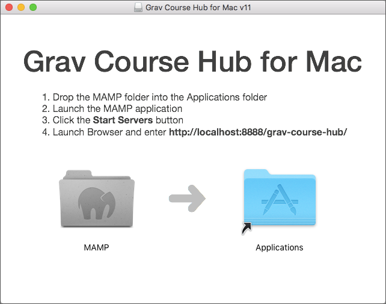

Inspired by the work of Ralf Krause with his [Moodle4Mac](https://download.moodle.org/macosx/) installation packages, I have created a 'Grav Course Hub for Mac' package to help other educators quickly and easily test-drive the Grav Course Hub on their Mac. Once completed, the same installation can be used to deploy your Grav Course Hub site to your FTP server using an FTP app (e.g. [CyberDuck](https://cyberduck.io/)) or be mirrored to GitHub/GitLab for automatic deployment.

  

<strong>Please note:</strong> If you already have MAMP installed on your Mac it is recommended that you only copy the included <code class="highlighter-rouge">/htdocs/grav-course-hub</code> folder into your existing <code class="highlighter-rouge">/htdocs</code> folder.

<a href="http://hibbittsdesign.org/blog/downloads/GravCourseHubforMac.zip" class="btn btn-info">Download 'Grav Course Hub for Mac'</a> 
Once you have the Grav Course Hub up and running you might find these articles of help:
* [Setting Up a Course in the Grav Course Hub](../2016-07-18-setting-up-your-grav-course-hub)
* [Using Grav with GitHub Desktop](../2015-12-11-using-grav-with-github)
* [The Flipped LMS: A Workflow - Watch the Edge](http://watchtheedge.ca/2016/06/09/working-with-grav/)

Oh, and if you are wondering how to access the Admin Panel of your Grav Course Hub you can do so by adding ‘/admin’ to the Browser URL of your Grav site (i.e. [localhost:8888/grav-course-hub/admin](http://localhost:8888/grav-course-hub/admin)).
