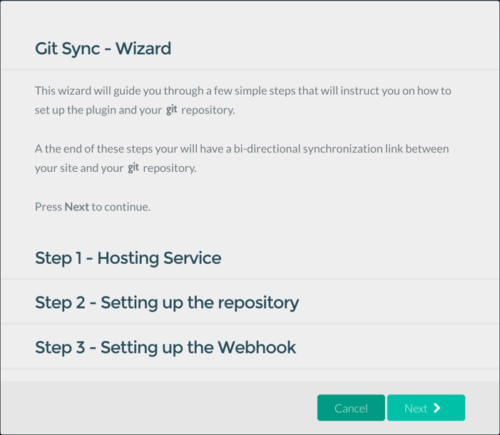

Since I first started exploring using Grav almost two years ago as an open and collaborative platform for the field of education, I have dreamed of a seamless 2-way sync of Grav site content to such services as GitHub or GitLab. Now, with the great work of the [Trilby Media](http://trilby.media/) team (the people who created Grav) not only will this possible for myself but also the entire Grav community. By sponsoring the development of the open source Git Sync Plugin I was able to not only support the team behind Grav but also increase the audience for my own Course Hub skeleton package and consultation services about the use of Grav in the education space.

===

Once installed and configured by an easy-to-use wizard interface (shown below) seamless bi-directional syncing is possible with a variety of Git services, including [GitHub](http://github.com/), [GitLab](https://about.gitlab.com/) (which can be installed on your own web server), and [BitBucket](https://bitbucket.org/) for both public and private repositories. With the configuration of a Webhook, which is described in a simple step-by-step manner in the Git Sync wizard, anytime the Git repository gets the appropriate branch updated the live Grav website will get immediately refreshed with the accepted changes as well. Merges, once approved, are automatically handled behind the scenes. Likewise, when working with the Grav Admin Panel any saved changes to the website, such as adding/deleting pages or editing page content, gets automatically committed to the Git repository.

This “set-and-forget” approach provides four key benefits:

1. Automatic versioned backups of your Grav site pages
1. Automatic deployment of Git repository updates to your Grav site
1. The ability to have an open and collaborative Grav site/blog using your choice of established industry Git Web services
1. All of your Grav website content can be accessible in the open in a platform-agnostic format (i.e. Markdown and individual image files) for easy reuse - perfect for OER (Open Education Resources)

  
_Figure 1. Git Sync Wizard_

Additional options are also available via the Git Sync Plugin configuration page in the Grav Admin Panel as well, most notably the ability to manually synchronize any page changes done at the file-level and to ‘reset’ the Grav website pages folder to the most recent version stored in the Git repository. If you are using the Forms Plugin on your Grav website you can even add a simple form processing command to automatically perform a sync when a new page is submitted.

Enough talk! Let’s take a look at how easy and fast the Git Sync Plugin is to use with two walkthrough videos created by the Trilby Media team.

<iframe width="560" height="315" src="https://www.youtube.com/embed/avcGP0FAzB8?list=PLHSdYTtmX-79rR2kHxtgkc6JxAmStJHih" frameborder="0" allowfullscreen></iframe>  
_Video 1. Git Sync Setup_  

<iframe width="560" height="315" src="https://www.youtube.com/embed/3fy78afacyw?list=PLHSdYTtmX-79rR2kHxtgkc6JxAmStJHih" frameborder="0" allowfullscreen></iframe>  
_Video 2. Git Sync Demonstration_  

Interested in trying it out for yourself? The Git Sync Plugin is now available as a “Testing” release in the Admin Panel (set 'GPM Release' to 'Testing' in the 'Advanced' section of the 'System' configuration page) and GPM for you to explore in a non-production site - I hope you find it as amazingly useful as I do!
