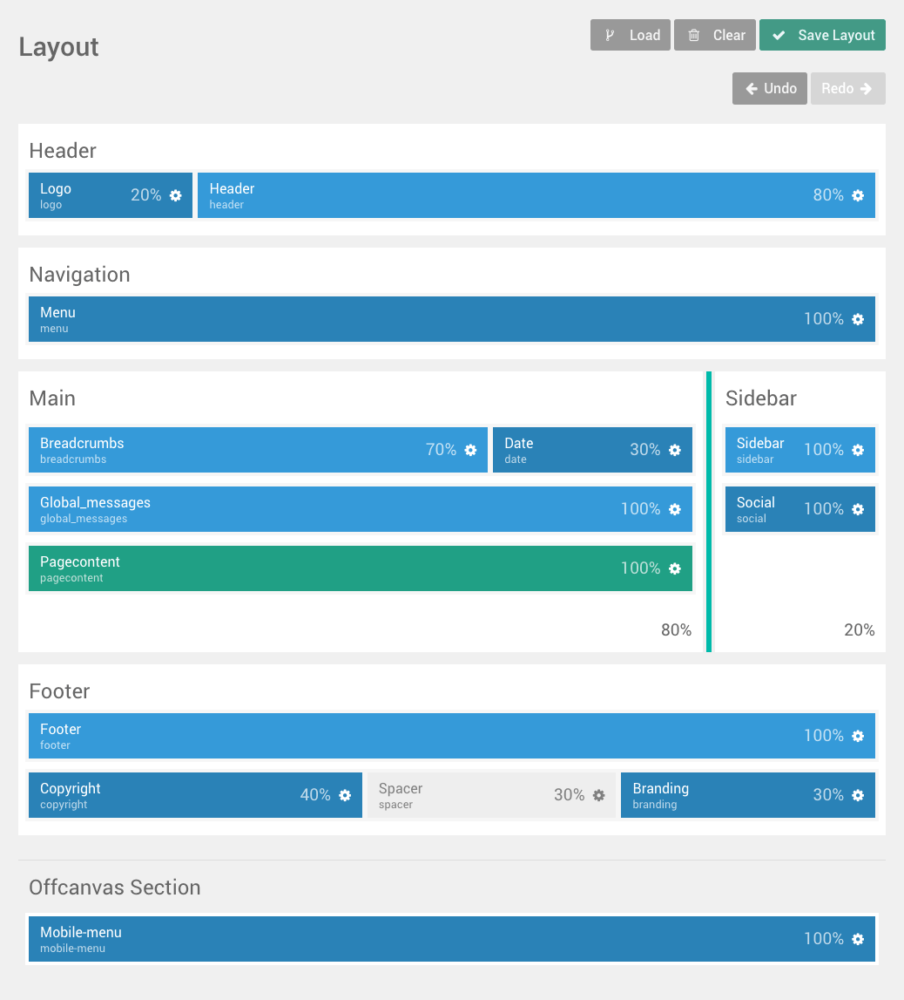

With the recent addition of the [GitSync](https://github.com/trilbymedia/grav-plugin-git-sync) and [Add Page by Form](https://github.com/bleutzinn/grav-plugin-add-page-by-form) plugins along with the arrival of the [Gantry 5 Framework](http://gantry.org/) to the [Grav](https://getgrav.org/) universe, 2017 holds even greater promise for (open) educators to benefit from Grav. With these new elements, not only will the setup of the multi-device friendly and collaborative Grav [Course Hub](https://github.com/hibbitts-design/grav-skeleton-course-hub) be easier and quicker, but a whole new range of applications with Grav opens up in relation to open blogging and online OER authoring/sharing. Let's start with the Grav Course Hub!

===

### Grav Course Hub
Course Hub is an open source project intended to help instructors enhance the learning experience for their students by providing an open and collaborative workflow not present in their current LMS.

Once the [GitSync](https://github.com/trilbymedia/grav-plugin-git-sync) plugin reaches production status, it will be included in the Course Hub skeleton package for both a single and multiple course hub. The GitSync plugin brings set-and-forget syncing of Grav site content to any Git (i.e. GitHub and GitLab) repository.

The GitSync plugin will give instructors the following benefits:

1. Faster setup of the Course Hub
1. Automatic versioned backups of your Course Hub pages
1. The ability to have an open and collaborative Course Hub using your choice of established industry Git Web services (i.e. GitHub or GitLab).

For a more in-depth look at the GitSync plugin you can read the post [Touchdown: Seamless 2-way Git Syncing Arrives for Grav](../2016-12-22-touchdown-seamless-2-way-syncing-arrives-for-grav). The GitSync plugin was created by the awesome team at [Trilby Media](http://trilby.media/).

The [Getting the Grav Course Hub Up and Running](http://www.hibbittsdesign.org/blog/posts/2016-02-12-grav-course-hub-getting-started-guide) guide on this site will be substantially revised (and simplified!) once the Git Sync plugin becomes part of the Course Hub.

Want to see the Grav Course Hub in action? Explore a demo of a [single course hub](http://demo.hibbittsdesign.org/grav-course-hub-bootstrap/) or a [multi-course hub](http://demo.hibbittsdesign.org/grav-multi-course-pages-hub/). [Download the Grav Course Hub skeleton from getgrav.org](https://getgrav.org/downloads/skeletons).

### Online OER Sharing/Authoring
[Open Educational Resources (OER)](https://wiki.creativecommons.org/wiki/What_is_OER%3F) should ideally support a collaborative workflow for sustainable development and a means for platform independent reuse, in addition to appropriate licensing.

With the release of the open source [Gantry 5 Framework](http://gantry.org/) by [RocketTheme](http://www.rockettheme.com/), drag-and-drop site construction for online publishing comes to Grav! Now within the Grav Admin Panel, users can not only easily customize the appearance of their site but even add new functionality without any knowledge of scripting.

  
_Figure 1. Gantry Layout Manager (image courtesy of [gantry.org](http://gantry.org/))._

Another project under development, the [Edit Page with Git Gantry 5 Particle](https://github.com/hibbitts-design/grav-gantry5-particle-edit-page-with-git), when coupled with the GitSync plugin, will let users easily add a dynamic link to view/edit site content stored as it is stored Git (i.e. GitHub or GitLab) in a platform-agnostic format (i.e. Markdown). This functionality can be placed either on the site menubar or within site pages, and enables viewers to also contribute improvements to site content.

<iframe width="560" height="315" src="https://www.youtube.com/embed/JAVOO-xpnVo" frameborder="0" allowfullscreen></iframe>
_Video 1. Edit this Page in Git particle demo._

Curious about using Grav to author/share OER content? Explore a [demo of a Grav Gantry 5 site with the Edit with Git plugin](http://demo.hibbittsdesign.org/grav-gantry5-edit-page-with-git-particle/) and visit the [gantry.org](http://gantry.org/) site. [Download the OER Content Space skeleton from getgrav.org](https://getgrav.org/downloads/skeletons).

### Open Blogging
An open blog is a blog where content can be created and shared not just by the owner of the blog, but by the entire audience of the blog.

Combining the [GitSync](https://github.com/trilbymedia/grav-plugin-git-sync) and [Add Page by Form](https://github.com/bleutzinn/grav-plugin-add-page-by-form) plugins brings the possibility of open _and collaborative_ blogging to Grav. The Add Page by Form plugin supports the creation of new blog entries (and actually any type of Grav page), for either authenticated or non-authenticated users. A front-end editor is also provided to help users more easily format their page content using Markdown. Coupled with the collaborative editing abilities of GitHub or GitLab and traceability of merge requests, this approach to open blogging could be of value to a wide range of writing courses and educational contexts.

Special thanks to Grav developer [Ron Wardenier](https://twitter.com/rwgcnl) for so kindly developing the Add Page by Form plugin. A special mention (and thanks!) to [Alan Levine's](https://twitter.com/cogdog) [TRU Writer Wordpress Theme](https://github.com/cogdog/truwriter) is appropriate too, as that theme was the source of the request by a fellow educator for adding blog posts by non-authenticated users to a Grav site.

Does an open blog sound of interest? Explore a [demo of a Grav open blog](http://demo.hibbittsdesign.org/grav-open-blog/) and [contact Paul for project status](mailto:paul@hibbittsdesign.org).

Whew - 2017 is already looking like a fantastic year for Grav in the field of education!
