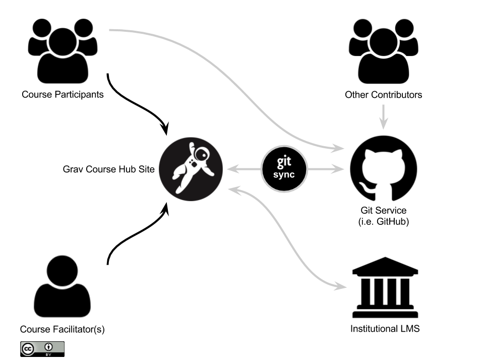

The [Grav Course Hub](https://github.com/hibbitts-design/grav-skeleton-course-hub) project was created for individual tech-savvy instructors who want an open and collaborative course space in their full control.

  
_Figure 1. Flipped LMS approach using Grav Course Hub with Git Sync._
