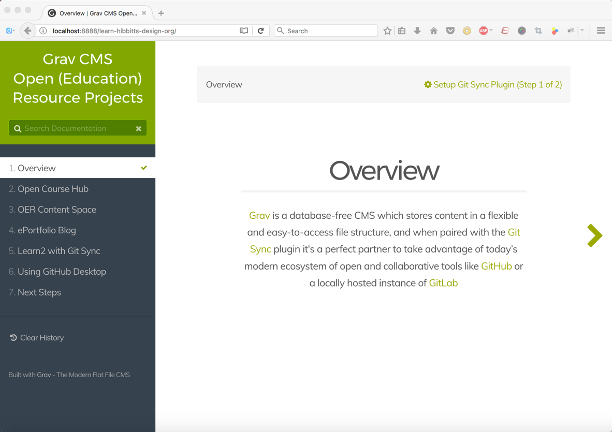

Documentation for hibbittsdesign.org Grav open education projects is now available at [learn.hibbittsdesign.org](http://learn.hibbittsdesign.org).  

Served using Grav and the [Learn2 with Git Sync](https://github.com/hibbitts-design/grav-theme-learn2-git-sync) theme for an open and collaborative workflow... of course!

_Figure 1. New Grav open education project docs at [learn.hibbittsdesign.org](http://learn.hibbittsdesign.org)._
