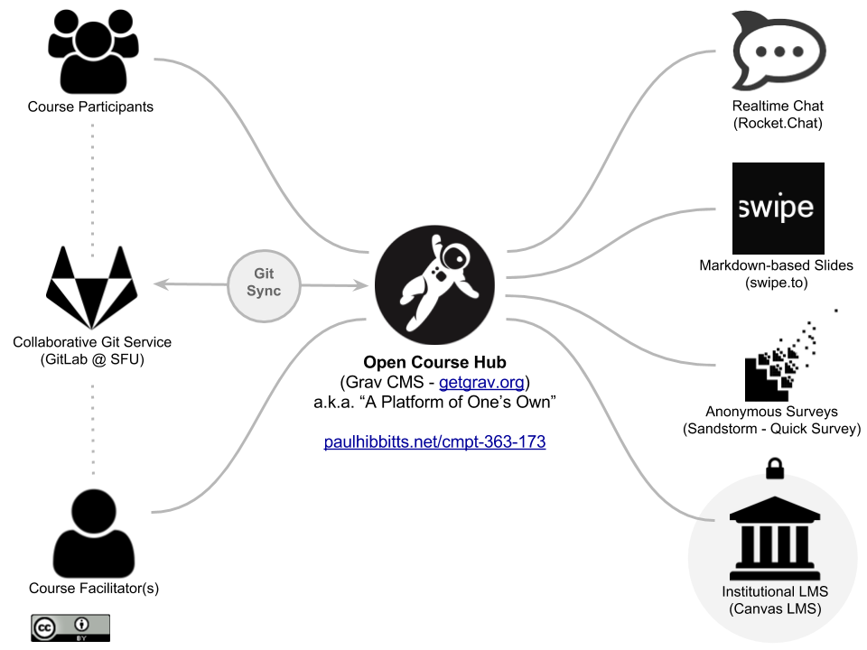

It's a launch: here is the (mostly open) learning ecosystem I've assembled for this Fall's [Simon Fraser University](http://www.sfu.ca/) CMPT-363 User Interface Design course.

  
_Figure 1. Learning Ecosystem for CMPT-363 @ SFU 2017._

It was created to support the pedagogical goals for the course while also delivering a better experience for both my students and myself (oh my!). Open source software plays an essential role in the ecosystem, with the modern and database free [Grav CMS](https://getgrav.org/) as the central environment for the course (and a single URL), with linkages to [Rocket.Chat](https://rocket.chat), [Swipe](https://www.swipe.to), [Sandstorm](https://sandstorm.io) and SFU's [Canvas LMS](https://www.canvaslms.com).

Using an institutionally-hosted [GitLab](https://about.gitlab.com) instance gives students the direct ability to shape (and contribute to) the Open Course Hub while giving me, the instructor, a highly efficient Markdown-based Git workflow - with updates to Course Hub content in as little as 30 seconds.🚀

Interested in seeing this learning ecosystem in action? Visit the early-preview of the CMPT 363 Course Hub at [paulhibbitts.net/cmpt-363-173/](http://paulhibbitts.net/cmpt-363-173/)
