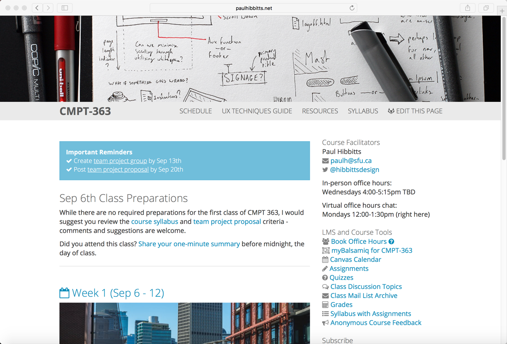

I've been once again feverishly working in the open on the Fall 2017 Course Hub (built with my Grav Open Course Hub and using a flipped-LMS approach, naturally!) for [SFU](http://www.sfu.ca/) [CMPT 363](https://www.sfu.ca/students/calendar/2017/fall/courses/cmpt/363.html) so that potential students can better self-assess course fit before our first class meets in-person on Sept 6th.

The year brings some changes, with the addition of an individual component (reflective learning log) to the two group assignments and an expansion of the individual usability assessment assignment. Students will research and design potential user experience improvements for an open source project of their choice.  

Here is the list of apps I am using to reach my pedagogical and student/facilitator experience goals this term (with lots of open source goodness):  

:fa-check: [Grav CMS](https://getgrav.org/)  
:fa-check: [GitLab](https://about.gitlab.com/) (hosted at [sfu.ca](http://www.sfu.ca/))  
:fa-check: [GitHub Desktop](https://desktop.github.com/)  
:fa-check: [Swipe](https://desktop.github.com/)  
:fa-check: [RocketChat](https://rocket.chat/)  
:fa-check: [Sandstorm](https://sandstorm.io/)  
:fa-check: [Canvas LMS](https://www.canvaslms.com/)  

You can check out the ~~nearly~~ complete Open Course Hub at [paulhibbitts.net/cmpt-363-173/](http://paulhibbitts.net/cmpt-363-173/).

_Figure 1. CMPT-363 Fall 2017 Course Hub_
