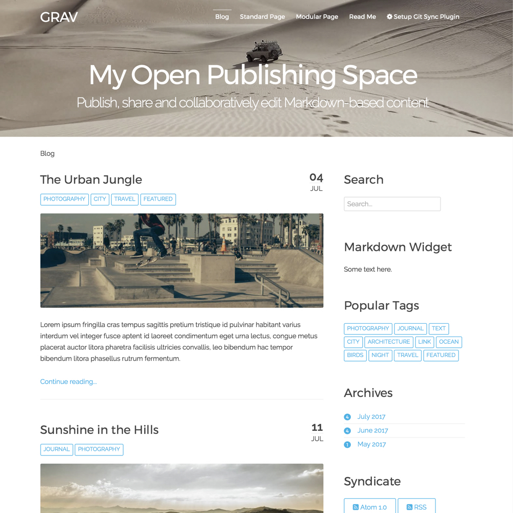
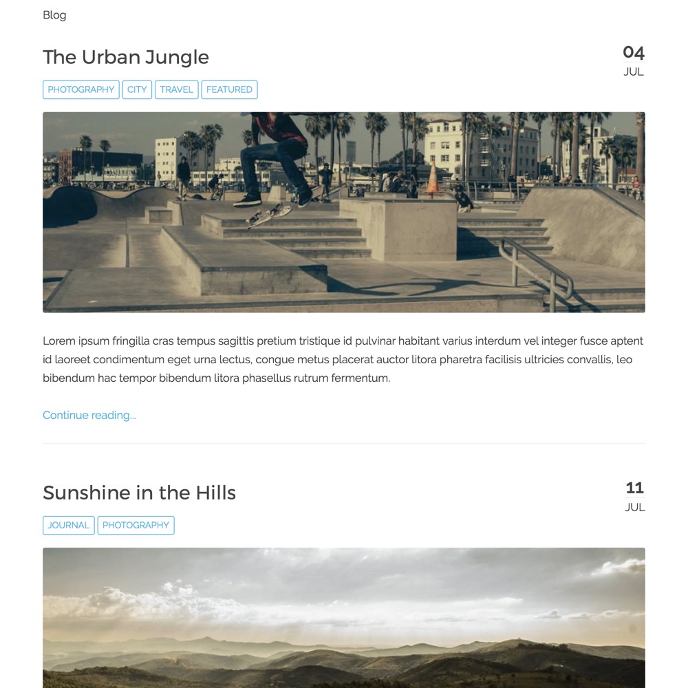

While I’ve been in ‘heads-down’ mode with my SFU [CMPT 363 User Interface Design course](http://paulhibbitts.net/cmpt-363-173/) for the start of the Fall term, I thought I would share here news of my most recent Grav open education project!

[Grav Open Publishing Space Space with Git Sync](http://demo.hibbittsdesign.org/grav-open-publishing/) is designed to publish, share and collaboratively edit Markdown-based content using the modern flat-file Grav CMS.

_Figure 1. Open Publishing Space_

===

One or more Open Publishing Space pages can also be embedded into another system (i.e. LMS) with the ['Chromeless Pages' option](http://demo.hibbittsdesign.org/grav-open-publishing/chromeless:true), which hides global navigation elements.

_Figure 2. Open Publishing Space in 'Chromeless' display mode_

Look of interest? You can learn more about the project at [learn.hibbittsdesign.org](http://learn.hibbittsdesign.org/openpublishingspace)
