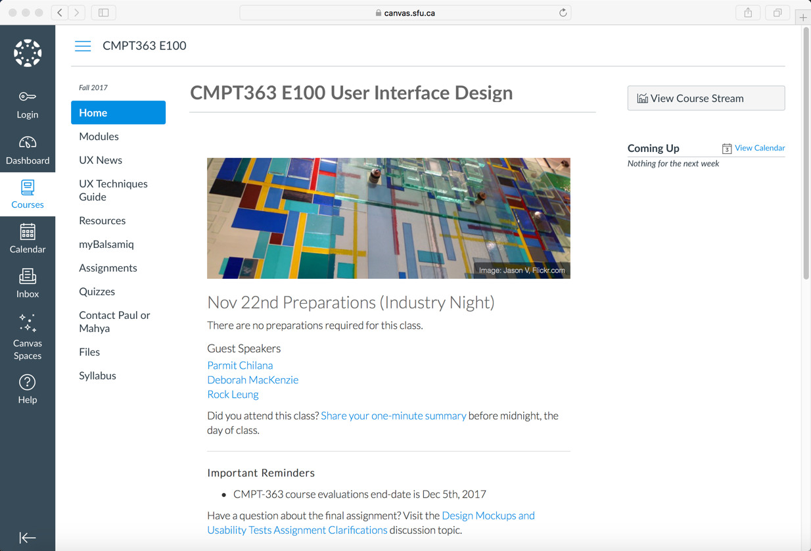

Having just finished my 20th offering (in 20 years, how did that happen?) of [CMPT-363](http://paulhibbitts.net/cmpt-363-173/) at SFU I will be getting back to posting more frequently about my on-going work with Grav in the field of education... stay tuned.

In the meanwhile, I await word for my most recent Grav-related proposal for the [Festival of Learning 2018](https://bccampus.ca/festival-of-learning-2018/) entitled [Delivering a Better Experience by Using the Open, Collaborative and Flexible Grav CMS – Inside or Outside of your LMS](https://docs.google.com/document/d/1qRwTEYTms_XQ3aiX8xR6Y9DH-K65O3e6ie5suhtAOAo/edit?usp=sharing).

You can see the results of my further integration of Grav Course Hub within an LMS (in this case Canvas) at [canvas.sfu.ca/courses/34140/](https://canvas.sfu.ca/courses/34140/)

  
_Figure 1. Grav Course Hub for CMPT-363 within the Canvas LMS._
