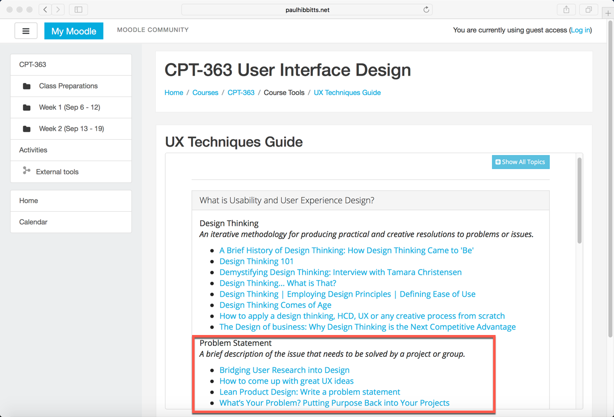
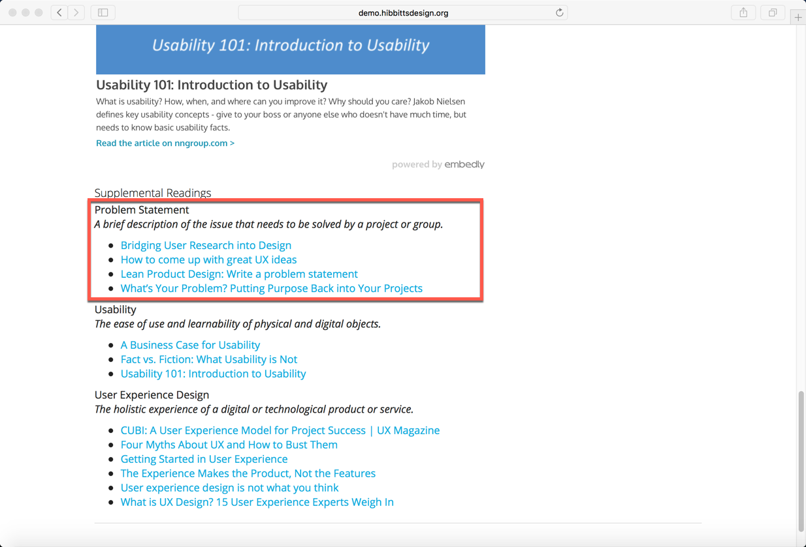

Long on my **to-do list** was to further explore how Grav Open Course Hub content could be displayed within the popular open source [Moodle](https://moodle.org/) LMS. Curious about the initial results? You can explore a live demo at <a href="http://paulhibbitts.net/moodle/course/view.php?id=2">paulhibbitts.net/moodle/course/view.php?id=2</a> and view some draft docs at [learn.hibbittsdesign.org/coursehub/integrating-grav-with-moodle](http://learn.hibbittsdesign.org/coursehub/integrating-grav-with-moodle).

  
_Figure 1. Grav Course Hub content within Moodle._

===

To better support display of Course Hub content within Moodle, two new URL flags have also been added:

`hidepagetitle:true` to hide the Course Hub page entitled  
`summaryonly:true` to only display a Unit's (i.e. class) page summary  

So, for example to embed a Course Hub Unit page summary using an iFrame in Moodle without a page title the HTML would be:

        
<iframe scrolling="no" style="border: 0px #ffffff none; " src="http://demo.hibbittsdesign.org/grav-course-hub-moodle/home/unit-01/chromeless:true/summaryonly:true/hidepagetitle:true" allowfullscreen="allowfullscreen" height="470px" width="100%"></iframe>

This results in being able to display Course Hub content almost anywhere within your Moodle site. For example, since the Grav CMS supports modular content (i.e. the same content displayed in multiple locations) you could now take advantage of that ability within Moodle:

  
_Figure 2. The 'Problem Statement' topic within the UX Techniques page._

  
_Figure 3. The same 'Problem Statement' topic from the UX Techniques page displayed in a Unit page._

Markdown-based content, support for open and collaborative workflows via Git (i.e. GitHub, GitLab, etc.), editing content on your desktop, it's all now possible within Moodle!
