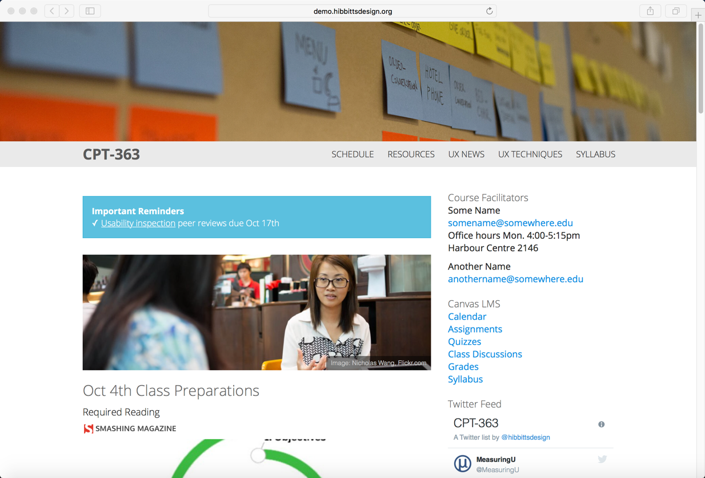
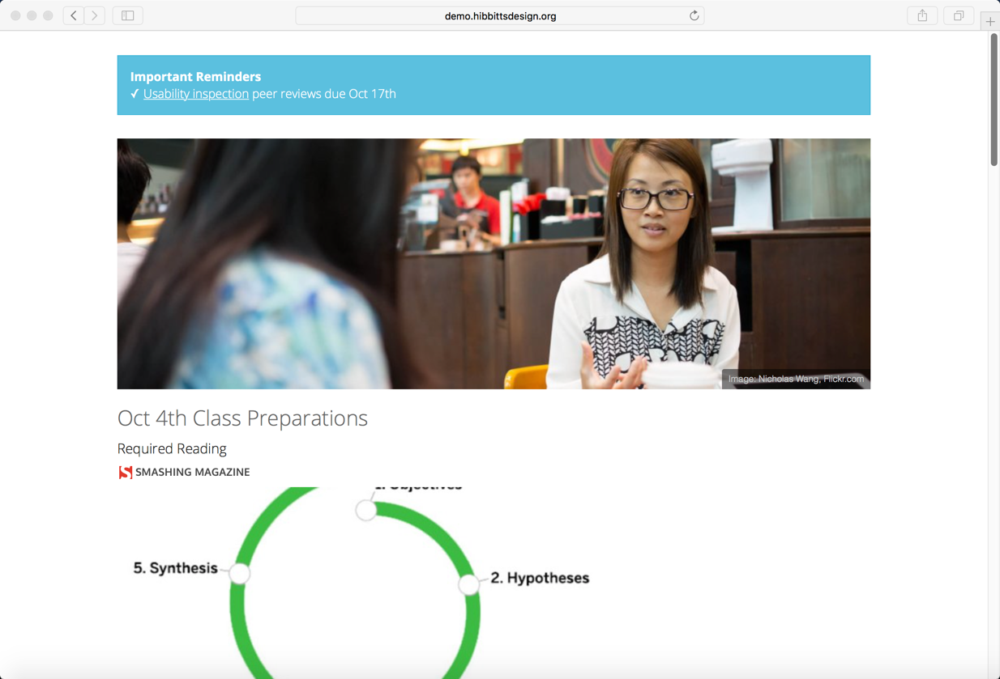
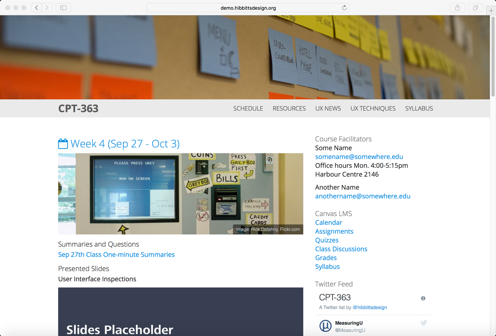
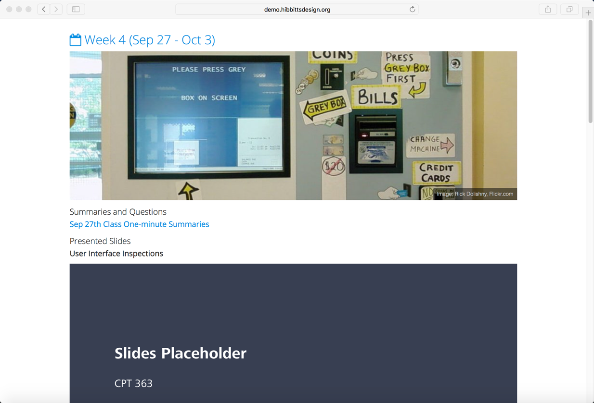
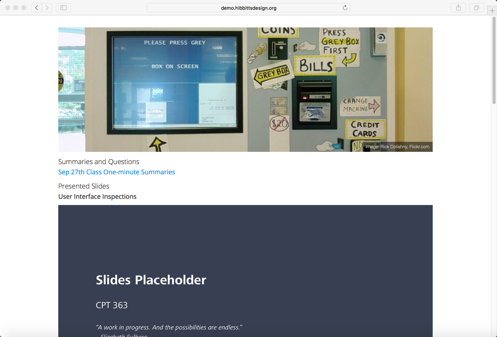
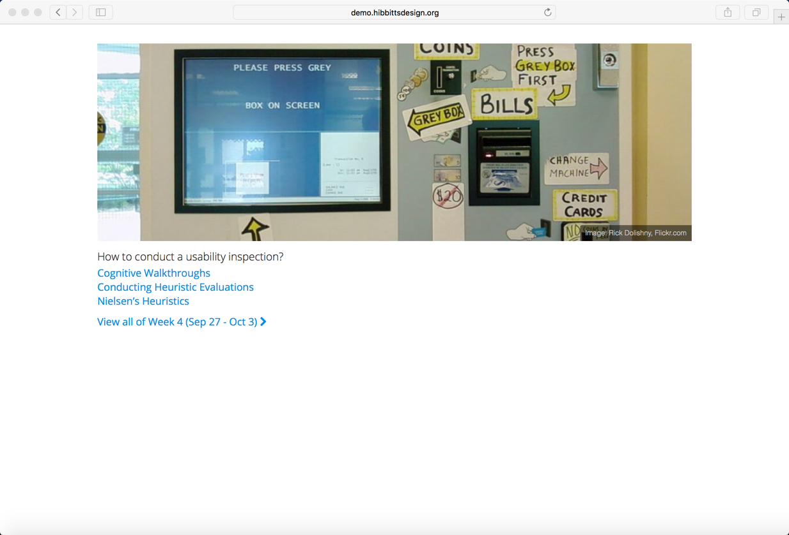

<iframe src="https://giphy.com/embed/QTwv9aLCaaEgM" width="480" height="271" frameBorder="0" class="giphy-embed" allowFullScreen></iframe>

The Grav Open Course Hub supports a number of optional URL flags (i.e. parameters) to better support embedding Hub content into other LMSs such as Canvas or Moodle:

`chromeless` - hide all global navigation elements  
`summaryonly` - display the summary of a blog post  
`hidepagetitle` - hide the title of a page  

===

Each URL flag can be added to a URL referencing a specific page of a Grav Open Course Hub site in the format `flagname:true`, for example:  

`yourgravsite.com/chromeless:true`

and multiple flags can be used at once, for example:  

`yourgravsite.com/chromeless:true/hidepagetitle:true`

So, time for some live demos!  

View the standard Open Course Hub homepage:  
[demo.hibbittsdesign.org/grav-course-hub/](http://demo.hibbittsdesign.org/grav-course-hub/)

  
_Figure 1. Grav Open Course Hub Homepage._

And now let's view the same page using the `chromeless` URL flag:  
[demo.hibbittsdesign.org/grav-course-hub/chromeless:true](http://demo.hibbittsdesign.org/grav-course-hub/chromeless:true)

  
_Figure 2. Chromeless Grav Open Course Hub homepage._

Getting the idea? Let's continue!  

View Week 4 for an Open Course Hub site:  
[demo.hibbittsdesign.org/grav-course-hub/home/unit-04/](http://demo.hibbittsdesign.org/grav-course-hub/home/unit-04/)

  
_Figure 3. Grav Open Course Hub week 4 page._

Now view the same page using the `chromeless` URL flag:  
[demo.hibbittsdesign.org/grav-course-hub/home/unit-04/chromeless:true](http://demo.hibbittsdesign.org/grav-course-hub/home/unit-04/chromeless:true)

  
_Figure 4. Chromeless Grav Open Course Hub week 4 page._

You can also hide the page's title, like this:  
[demo.hibbittsdesign.org/grav-course-hub/home/unit-04/chromeless:true/hidepagetitle:true](http://demo.hibbittsdesign.org/grav-course-hub/home/unit-04/chromeless:true/hidepagetitle:true)

  
_Figure 5. Chromeless Grav Open Course Hub week 4 page with title hidden._

And even just display the summary (preview) of the page:  
[demo.hibbittsdesign.org/grav-course-hub/home/unit-04/chromeless:true/hidepagetitle:true/summaryonly:true](http://demo.hibbittsdesign.org/grav-course-hub/home/unit-04/chromeless:true/hidepagetitle:true/summaryonly:true)

  
_Figure 6. Chromeless Grav Open Course Hub week 4 page with title hidden and summary only._

Using the above three URL flags it's possible to embed various elements of your Grav Course Hub site into other LMSs, for example [Canvas](https://canvas.sfu.ca/courses/36662) or <a href="http://paulhibbitts.net/moodle/course/view.php?id=2">Moodle</a>.

For detailed instructions, these step-by-step guides might be of interest:
* [Open Course Hub - Integrating Grav with Canvas LMS](http://learn.hibbittsdesign.org/coursehub/integrating-grav-with-canvas-lms)
* [Open Course Hub - Integrating Grav with Moodle](http://learn.hibbittsdesign.org/coursehub/integrating-grav-with-moodle)
