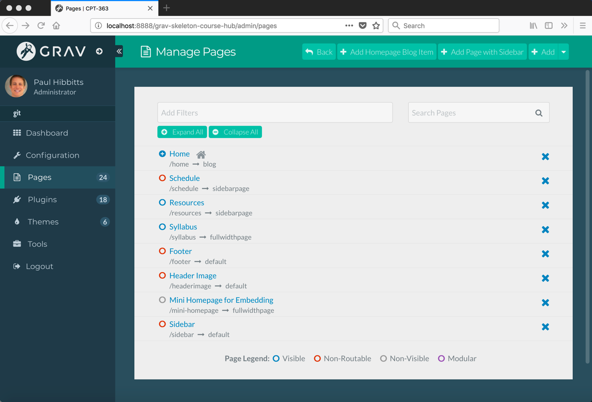
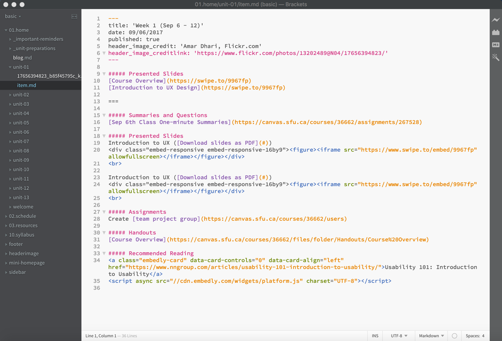
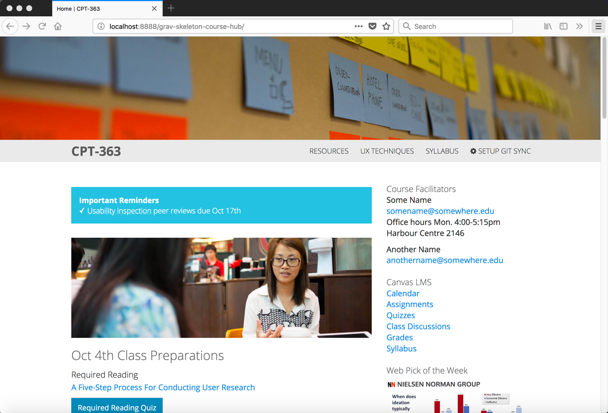
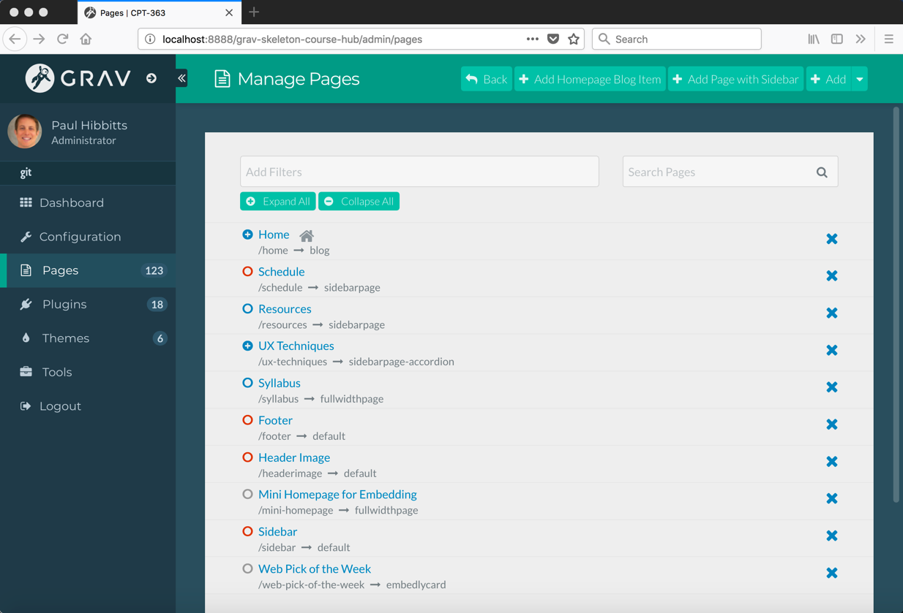
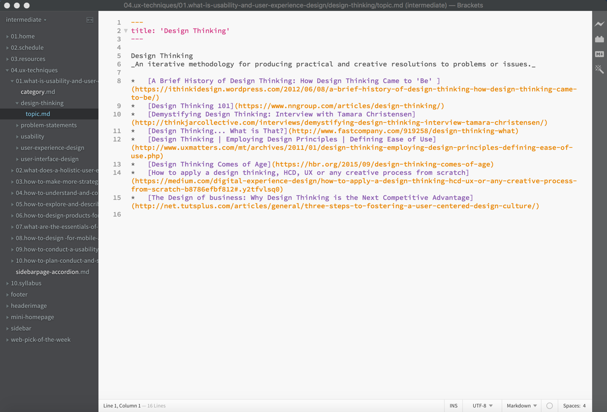
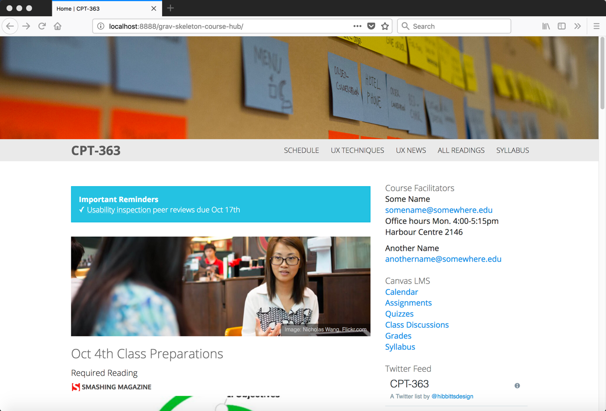
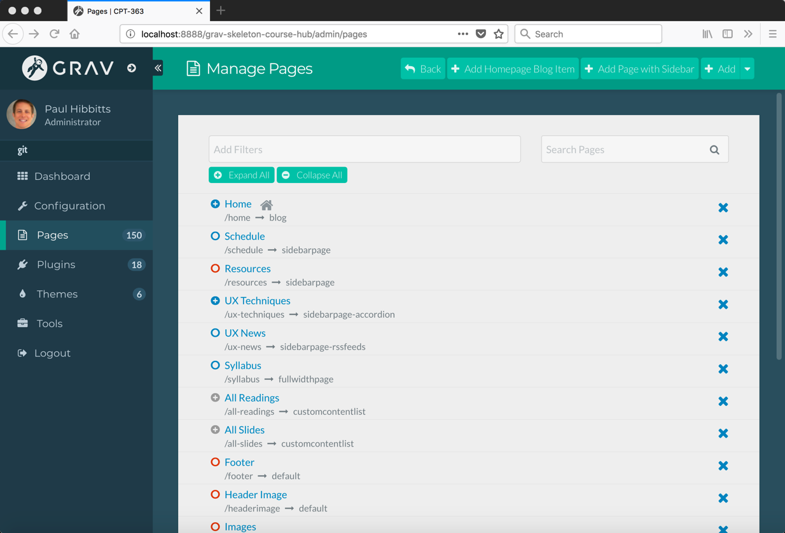
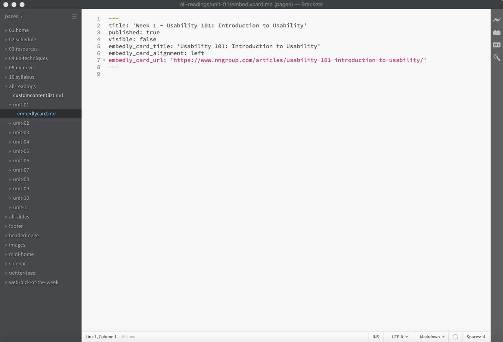

With the release of the Open Course Hub 2.0 package, three example sites are included in the Course Hub Bootstrap theme's **_demo** folder; _basic_, _intermediate_ and _advanced_. Let's take a brief look at the visual appearance and highlights of each example:

===

**Basic Open Course Hub**  
  
_Figure 1. Basic Open Course Hub Site Example._

Highlights:  
* Homepage Blog + two visible top-level standard pages ('Resources' and 'Syllabus')
* Markdown/HTML custom 'Sidebar' and 'Footer' pages
* Optional site header image folder ('Header Image')
* One unpublished top-level page ('Schedule')
* One published but not visible page ('Mini Homepage') for embedding into LMS

Explore a [basic example Open Course Hub site](http://demo.hibbittsdesign.org/grav-skeleton-course-hub-site-basic/) or [download a ready-to-run package](http://www.hibbittsdesign.org/blog/downloads/grav-skeleton-course-hub-site-basic.zip).

  
_Figure 2. Basic Open Course Hub Site Example Pages._

  
_Figure 3. Basic Open Course Hub Site Example File Structure._

**Intermediate Open Course Hub**  
  
_Figure 4. Intermediate Open Course Hub Site Example._

Highlights:  
* Homepage Blog + two visible top-level standard pages ('Resources' and 'Syllabus')
* Markdown/HTML custom 'Sidebar' and 'Footer' pages
* Optional site header image folder ('Header Image')
* One unpublished top-level page ('Schedule')
* One published but not visible page ('Mini Homepage') for embedding into LMS
* One top-level modular collection page ('UX Techniques')
* One custom content type page for modular use  ('Web Pick of the Week')

Explore an [intermediate example Open Course Hub site](http://demo.hibbittsdesign.org/grav-skeleton-course-hub-site-intermediate/) or [download a ready-to-run package](http://www.hibbittsdesign.org/blog/downloads/grav-skeleton-course-hub-site-intermediate.zip).

  
_Figure 5. Intermediate Open Course Hub Site Example Pages._

  
_Figure 6. Intermediate Open Course Hub Site Example File Structure._

**Advanced Open Course Hub**  

  
_Figure 7. Advanced Open Course Hub Site Example._

Highlights:  
* Homepage Blog + two visible top-level standard pages ('Resources' and 'Syllabus')
* Markdown/HTML custom 'Sidebar' and 'Footer' pages
* Optional site header image folder ('Header Image')
* One unpublished top-level page ('Schedule')
* One published but not visible page ('Mini Homepage') for embedding into LMS
* One top-level modular collection page ('UX Techniques')
* One top-level custom content type page ('UX News')
* Two custom content type pages for modular use ('Web Pick of the Week' and 'Twitter Feed')
* One custom content type listing page, capable of automatically displaying  multiple content types for modular use ('Required Readings' and 'Slides')

Explore an [advanced example Open Course Hub site](http://demo.hibbittsdesign.org/grav-skeleton-course-hub-site-advanced/) or [download a ready-to-run package](http://www.hibbittsdesign.org/blog/downloads/grav-skeleton-course-hub-site-advanced.zip).

  
_Figure 8. Advanced Open Course Hub Site Example Pages._

  
_Figure 9. Advanced Open Course Hub Site Example File Structure._
