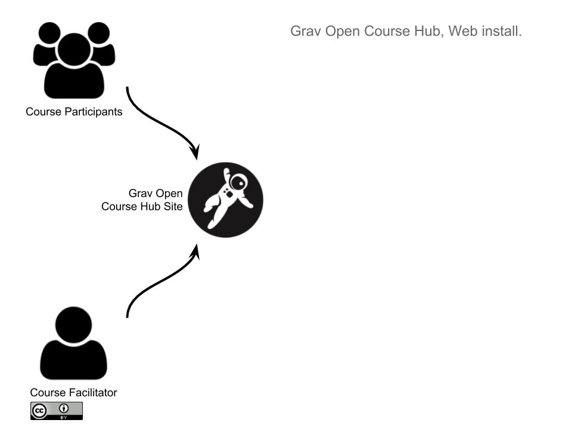
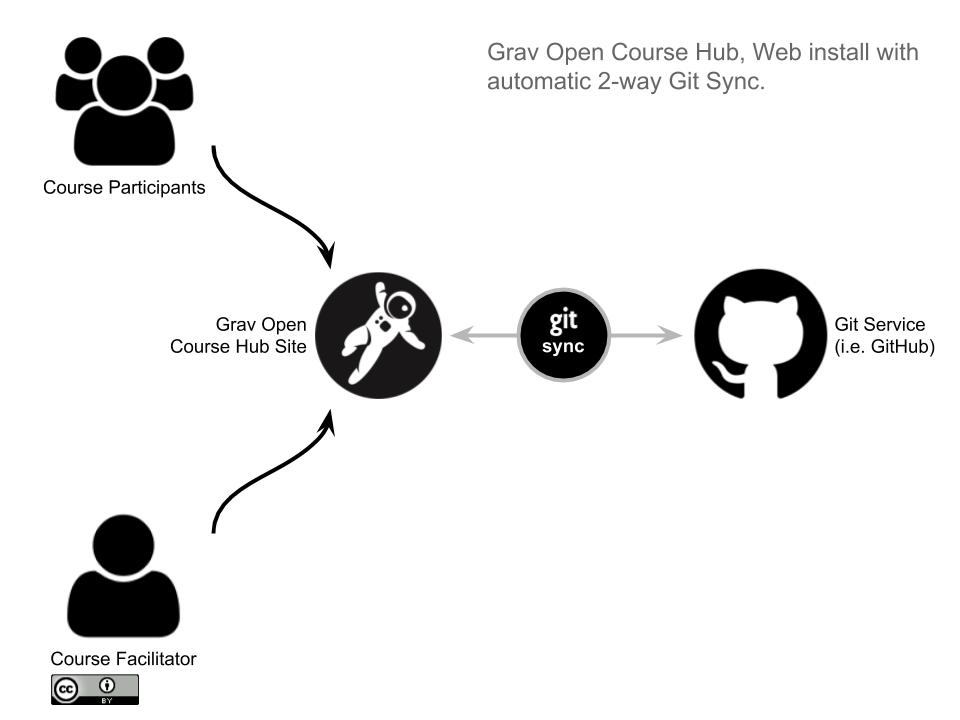
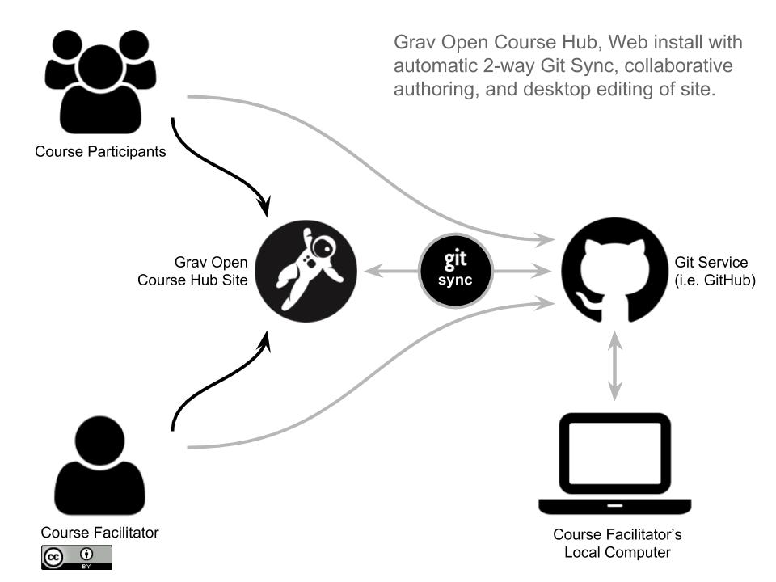

_I recently [tweeted a set of updated Grav Open Course Hub workflow diagrams](https://twitter.com/hibbittsdesign/status/966732614018121728), and I thought I would share them here:_

  
_Figure 1. Grav Open Course Hub Workflow._  

===

 
  
_Figure 2. Grav Open Course Hub with Git Sync Workflow._  

 
  
_Figure 3. Grav Open Course Hub with Git Sync Collaboration Workflow._  

 
  
_Figure 4. Grav Open Course Hub with Git Sync Collaboration Desktop Workflow._  
