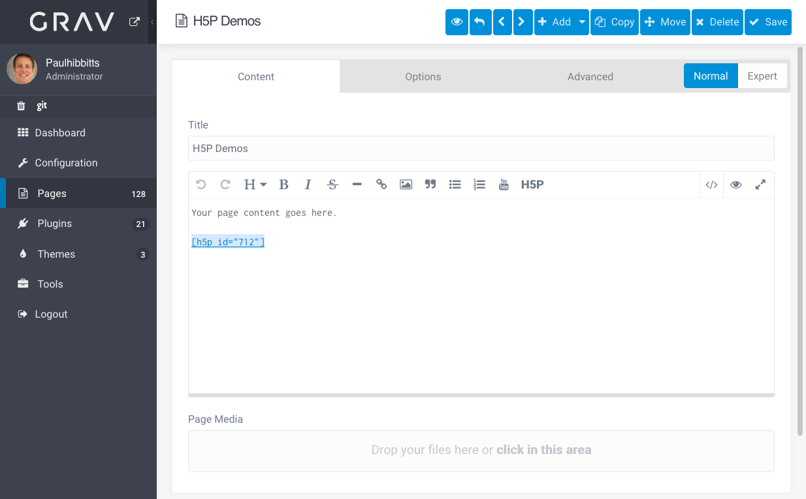
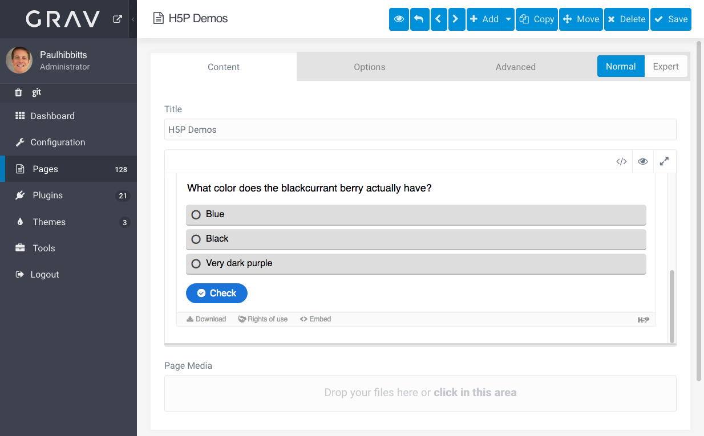
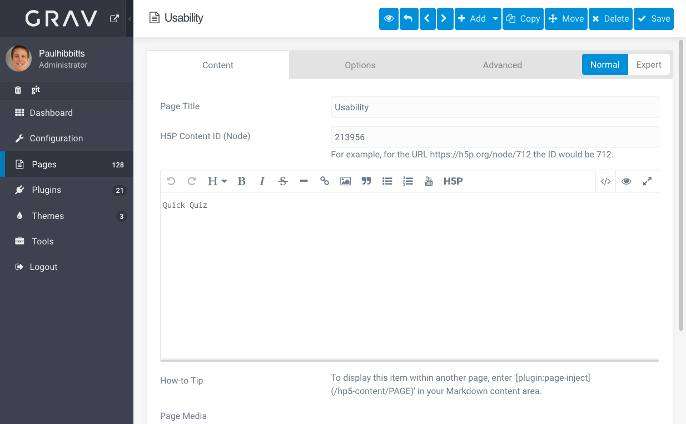

With the most recent release of the Grav Open Course Hub, site authors can insert [H5P](https://h5p.org) content (hosted on h5p.org) into any page using a simple Shortcode (i.e. `[h5p id="712"]`). In addition, a new H5P button is now available in the Admin Panel page editor to make using the H5P Shortcode even easier!

  
_Figure 1. Grav H5P Shortcode and Admin Panel Editor Button._  

  
_Figure 2. Preview of H5P content in the Admin Panel._  

The development of this new Shortcode was greatly simplified by the amazing [Shortcode Core Plugin](https://github.com/getgrav/grav-plugin-shortcode-core), which lets Grav authors add their own custom Shortcodes.

H5P content is still supported via a custom content type (i.e. where custom fields are use to hold H5P information), which provides further flexibility for displaying one instance of a Grav page containing H5P content in multiple areas of a site via the Page Inject Plugin.

  
_Figure 3. H5P custom content type page._  
