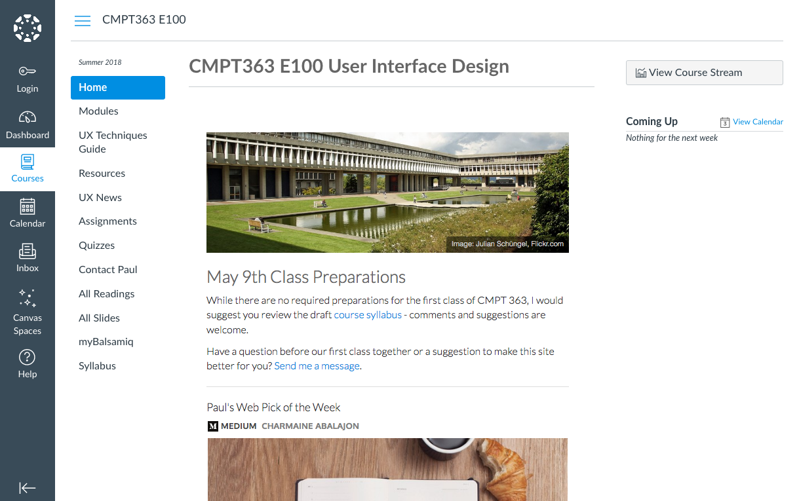

With an unexpected opportunity to teach [SFU](http://www.sfu.ca/) [CMPT 363 User Interface Design](https://www.sfu.ca/students/calendar/2018/summer/courses/cmpt/363.html) this summer, I've been feverishly working in the open on the accompanying Canvas LMS site (leveraging my Grav Open Course Hub project) so that potential students can better self-assess course fit before our first class meets in-person on May 9th. It's also already proven to be a great way to start conversations with those students already registered.

The summer offering brings some changes, with the addition of a journey mapping individual assignment and using a single open source application for both individual and group assignments.

Here is the list of apps I am using to reach my pedagogical and student/facilitator experience goals this term (with lots of open source goodness):  

:fa-check: [Grav CMS](https://getgrav.org/)  
:fa-check: [GitLab](https://about.gitlab.com/) (hosted at [sfu.ca](http://www.sfu.ca/))  
:fa-check: [GitHub Atom](https://atom.io/)  
:fa-check: [Swipe](https://desktop.github.com/)  
:fa-check: [RocketChat](https://rocket.chat/)  
:fa-check: [Sandstorm](https://sandstorm.io/)  
:fa-check: [Canvas LMS](https://www.canvaslms.com/) (well, no surprises there)  

You can check out the in-progress Canvas site for the course at [https://canvas.sfu.ca/courses/38847](https://canvas.sfu.ca/courses/38847).

_Figure 1. CMPT-363 Summer 2018 Canvas Site, with Embedded Grav Open Course Hub Pages_
