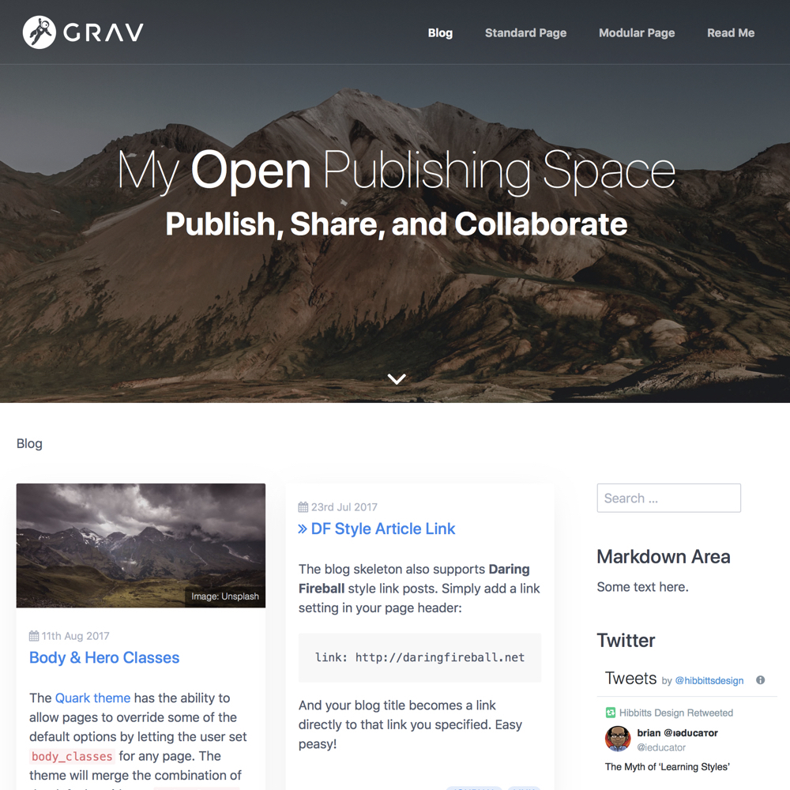
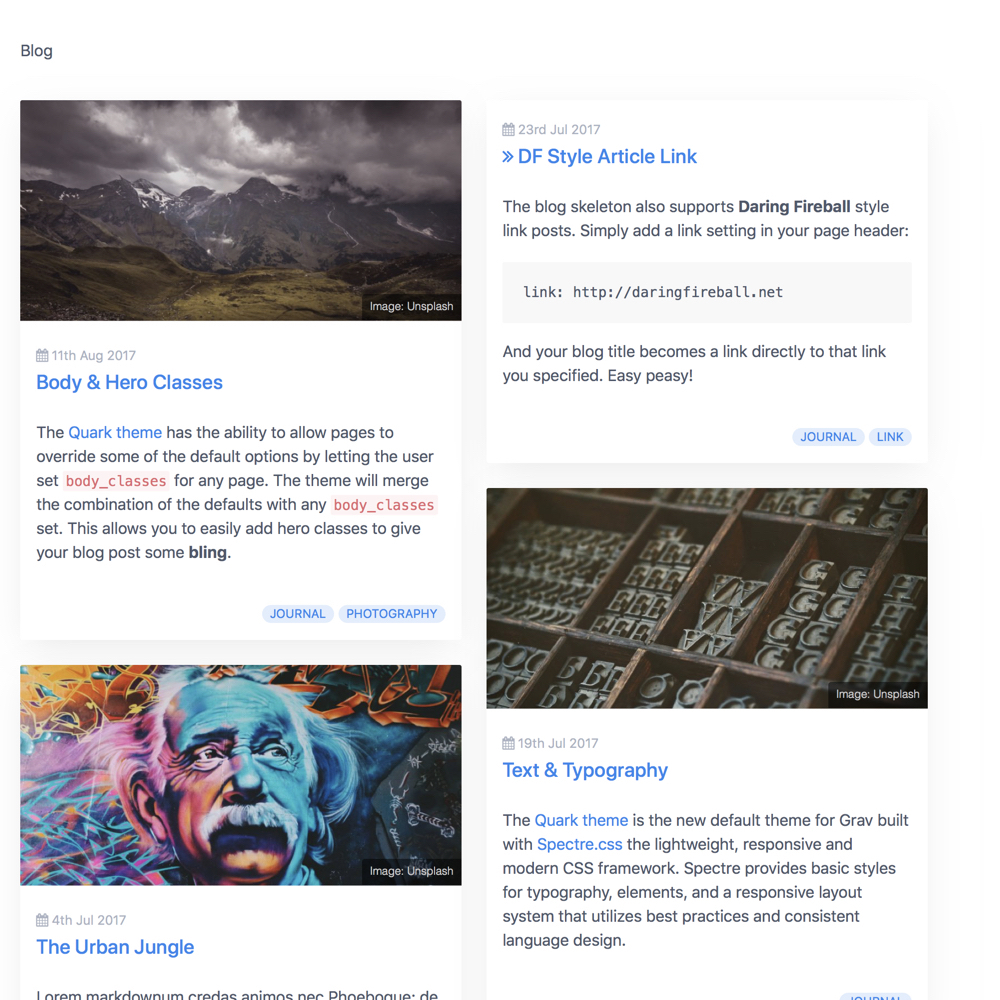
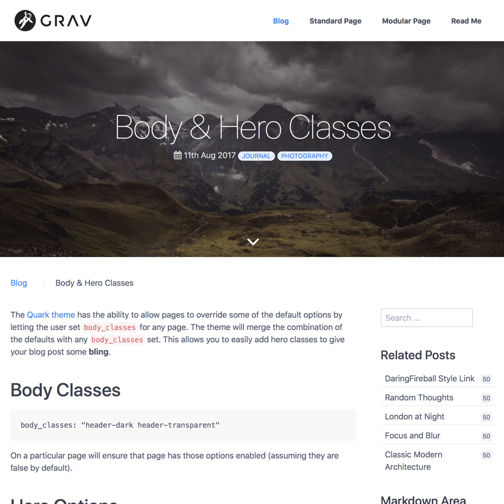
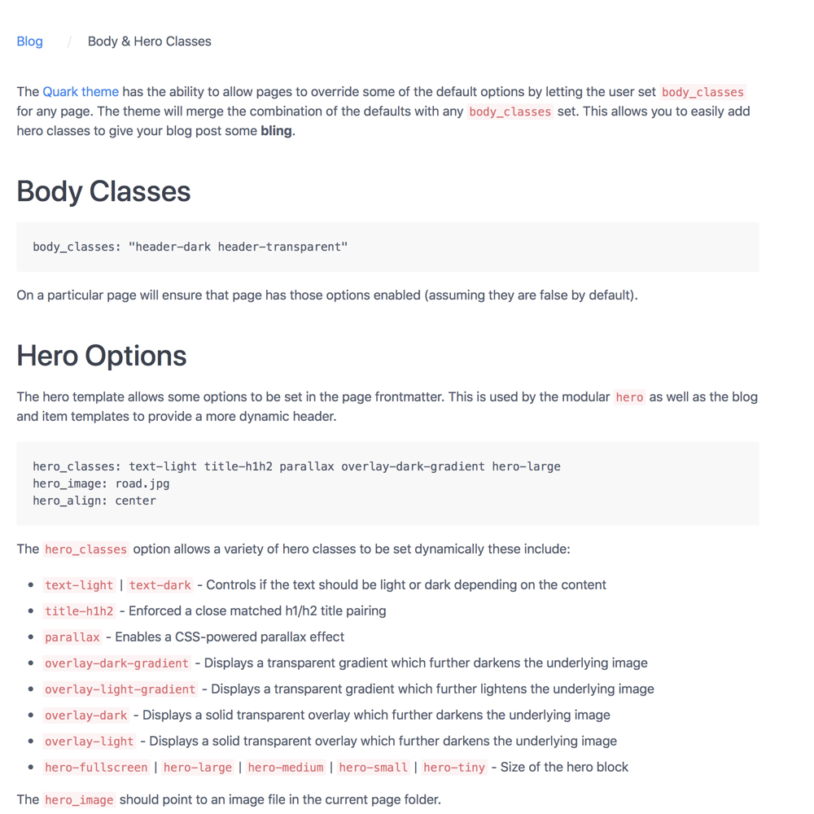

[Open Publishing Space with Git Sync](http://demo.hibbittsdesign.org/grav-open-publishing-quark/) is designed to publish, share and collaboratively edit Markdown-based content using the modern flat-file Grav CMS. I am happy to share the news that a customized version of the new Grav default theme [Quark](https://github.com/getgrav/grav-theme-quark), using the Lightweight, Responsive and Modern CSS Framework [Spectre CSS Framework](https://picturepan2.github.io/spectre/), is now the standard Open Publishing Space theme!

_Figure 1. Open Publishing Space Blog List_

The original Open Publishing Space theme, a customized version of the [Antimatter](https://github.com/getgrav/grav-theme-antimatter) theme, is still available.

===

One or more Open Publishing Space pages can also be embedded into another system (i.e. LMS or CMS) with the ['Chromeless' ](http://demo.hibbittsdesign.org/grav-open-publishing-quark/chromeless:true) URL Parameter, which hides all global navigation elements (i.e. header image, site navigation bar, sidebar and footer). Any links between Open Publishing Space pages will result in pages being displayed in the same manner.

_Figure 2. Open Publishing Space Blog List in 'Chromeless' display mode_

Here is another example of regular vs. 'chromeless' display, this time of a blog post page:

_Figure 3. Open Publishing Space Blog Page_

_Figure 4. Open Publishing Space Blog Page in 'Chromeless' display mode_

Look of interest? You can learn more about the project at [learn.hibbittsdesign.org](http://learn.hibbittsdesign.org/openpublishingspace)
