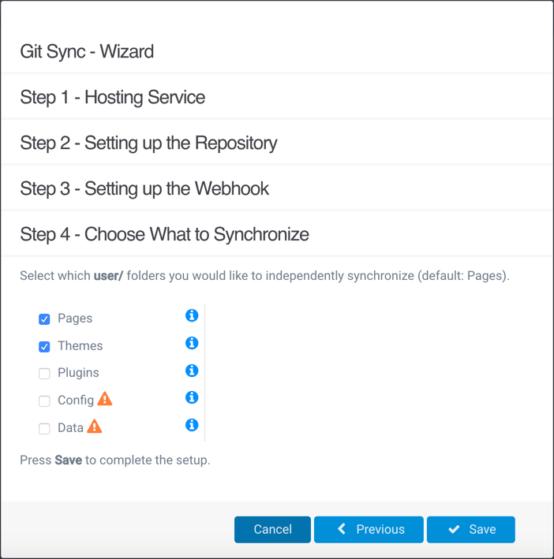
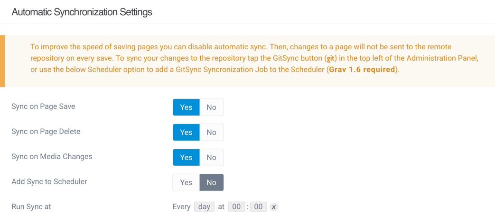

Today, the biggest update so far to the Git Sync Plugin has been released, and what a release it is! Two of the most requested features have been added - the ability to sync additional user folders and the ability to fine-tune the automatic synchronization of page changes - plus much more!

===

## Syncing Additional User Folders
The initial release of the Git Sync plugin featured seamless synchronization of Grav pages, but behind the scenes support for syncing additional folders was already in the works. With this release, this ability is now fully accessible both in the Git Sync Wizard and Plugin Settings.  

  
Figure 1 - Folder selection in Git Sync Wizard, with the `pages` and `themes` folders selected  

  
Figure 2 - Folder selection in Git Sync Settings, with the `pages` and `themes` folders selected  

By default, Pages will be seamlessly and automatically synced to a Git repository, but now other components such as Themes and Plugins can be too. Syncing Themes to a Git repository is particularly useful in providing a means of Grav authors to provide hands-on help (via Pull Requests) with custom Theme adjustments/troubleshooting, CSS, etc. In addition, when developing a Grav site locally Theme changes can be pushed to a Git repository and then automatically synced by Git Sync to the Web server. Even better, is that you can even set just the active theme to be synced (i.e. themes/mytheme).

  
Figure 3 - Folder selection for Git Sync settings, with the `pages` folder and `themes/mytheme` subfolder selected  

For more advanced purposes, other folders such as Config and Data can also be synced, but doing so should be done with caution and only usually in private repositories.

## Automatic Synchronization Settings
While automatic Git sync is a seamless process it does increase the time needed to fully save a page. Based on a PR submitted by [Amaury Carrade](https://github.com/AmauryCarrade), there is now the ability to choose when automatic synchronization occurs with various page operations.  

  
Figure 4 - Automatic Synchronization options, with Scheduler support in the upcoming Grav 1.6 release  

With these options, automatic synchronization can be temporarily turned off while a large number of pages are added/edited or turned off permanently using the integrated Scheduler synchronization feature (Grav 1.6 required).

## And Much More!
In addition to the above, a shout out to the other members of the Grav community who also contributed to this release through various PR's which included such things as support for Webhook Secrets, using the current Grav user email for Git commits, and support for Git Repository Branches - learn all the details in the [2.0 ChangeLog](https://github.com/trilbymedia/grav-plugin-git-sync/blob/master/CHANGELOG.md). Thanks to all of the contributors, and of course a special thanks to [Djamil Legato](https://github.com/w00fz) of [Trilby Media](https://trilby.media/) for his continued amazing work on Git Sync.

With this update, the Git Sync Plugin reaches a new level of power and flexibility for the entire Grav community!
