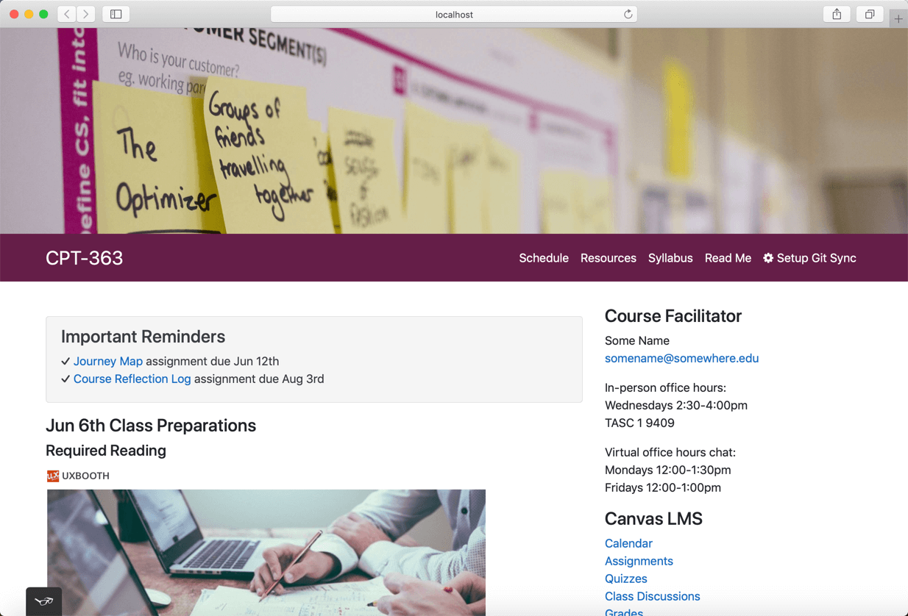
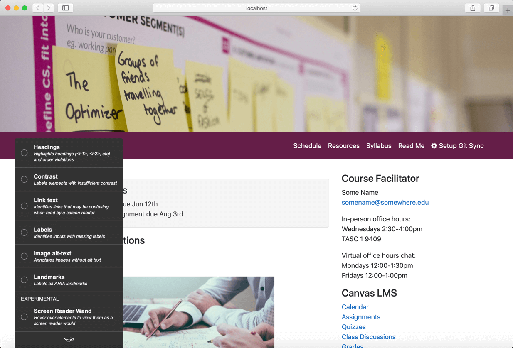
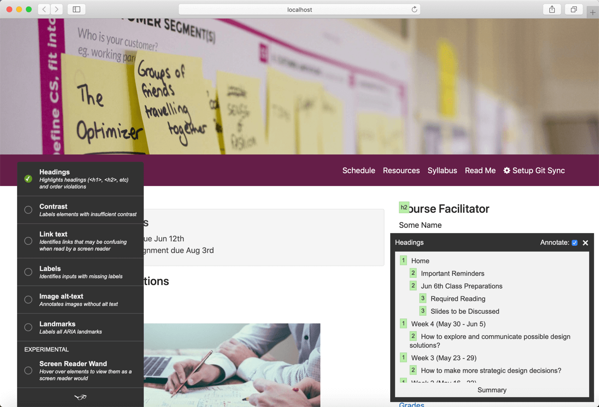
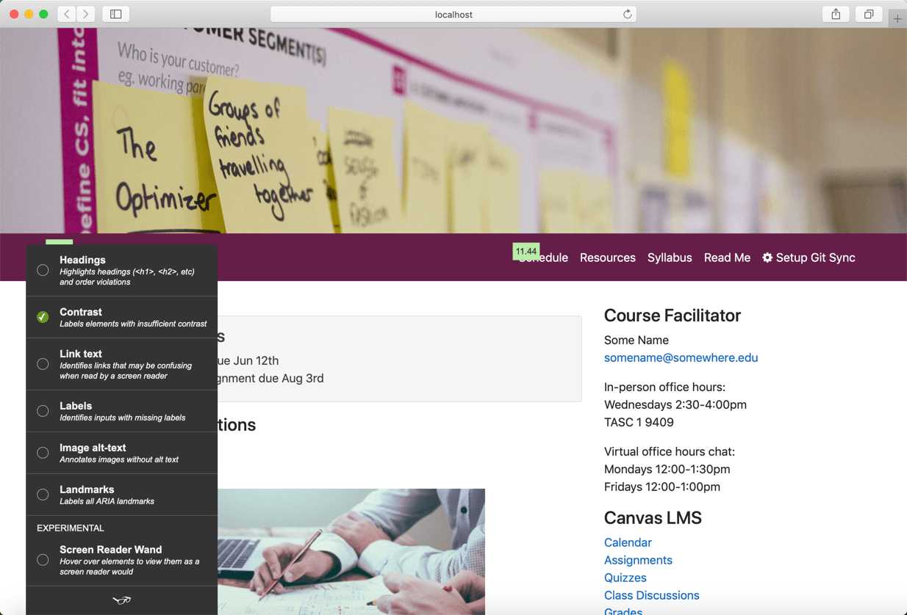

The Grav CMS Open Course Hub project is now significantly more accessible than ever! Not only has the overall accessibility been improved, but the Grava11y Plugin (courtesy of [absalomedia](https://github.com/absalomedia/grav-plugin-grava11y)) is now pre-installed to help others make their own sites more accessible too🎉

  
Figure 1 - Grava11y Plugin Popup (lower-left)

===

  
Figure 2 - Grava11y Plugin Popup Status

  
Figure 3 - Grava11y Plugin Popup - Headings

  
Figure 4 - Grava11y Plugin Popup - Contrast
