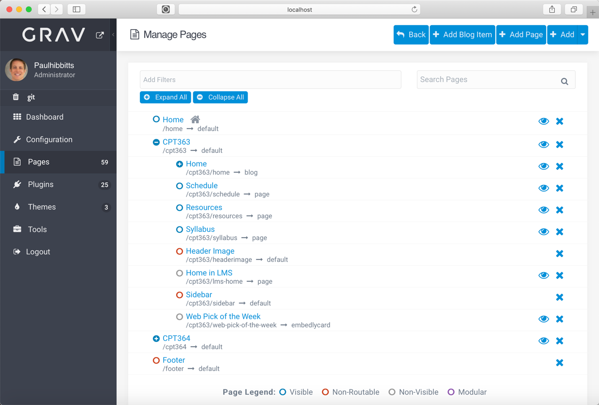
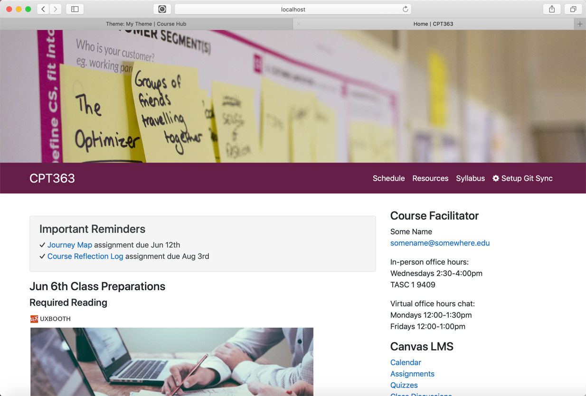
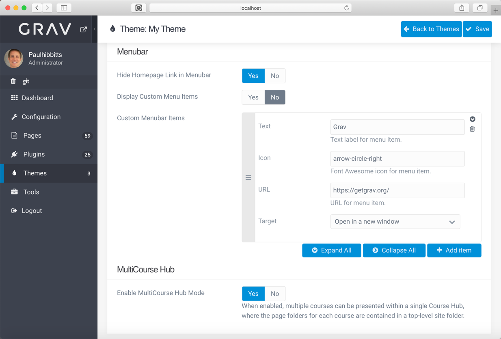

Based on discussions with two educators (thanks Colin and Brian), the ability for multiple courses to be included within a single Grav Open Course Hub is now supported!

  
Figure 1 - Multiple courses within a single Grav install.

===

Each course within a MultiCourse Hub is structured the same as a single course, including a course header image, menubar, sidebar and footer (as shown above). When a course is viewed, it appears to be identical to a single course. If preferred, a single course header image, sidebar, and footer can also be shared between one or more courses.

  
Figure 2 - A course within a MultiCourse Hub.

This new multiple course support can be used to not only provide different courses within a single Grav install but also a way to easily maintain multiple sections or terms of the same course. Since all courses are within a single Grav install, page content can also be shared between courses.

  
Figure 3 - Support for multiple courses within the Admin Panel.

And as always, all open course content can be seamlessly synchronized to a single Git (i.e. GitHub, GitLab, etc.) repository for collaborative editing and also be seamlessly displayed within other systems (i.e LMSs) using the unique 'chromeless' feature.

Sound of interest? Check out the standard online demo at [demo.hibbittsdesign.org/grav-skeleton-open-matter-multi-course-hub-site/](http://demo.hibbittsdesign.org/grav-skeleton-open-matter-multi-course-hub-site/) or an in-progress prototype of a future offering of my CMPT-363 course (where I will be using MultiCourse for multiple terms of the same course) at [demo.hibbittsdesign.org/cmpt-363-hub/](https://demo.hibbittsdesign.org/cmpt-363-hub/). You can download a ready-to-run MultiCourse Hub at [learn.hibbittsdesign.org/opencoursehub/multicourse-hubs](https://learn.hibbittsdesign.org/opencoursehub/multicourse-hubs)
