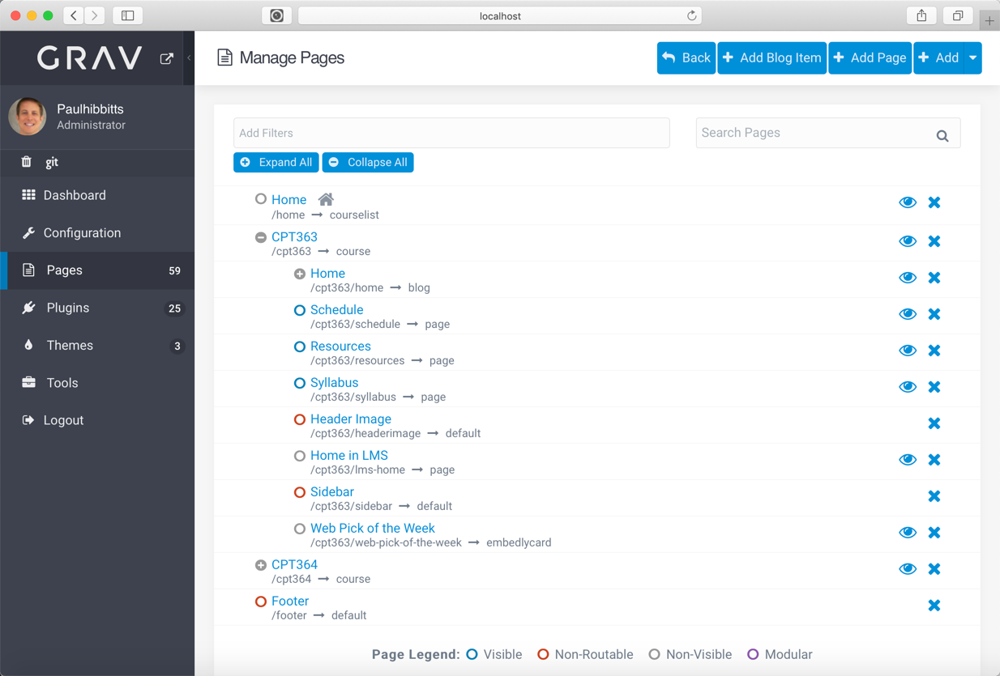
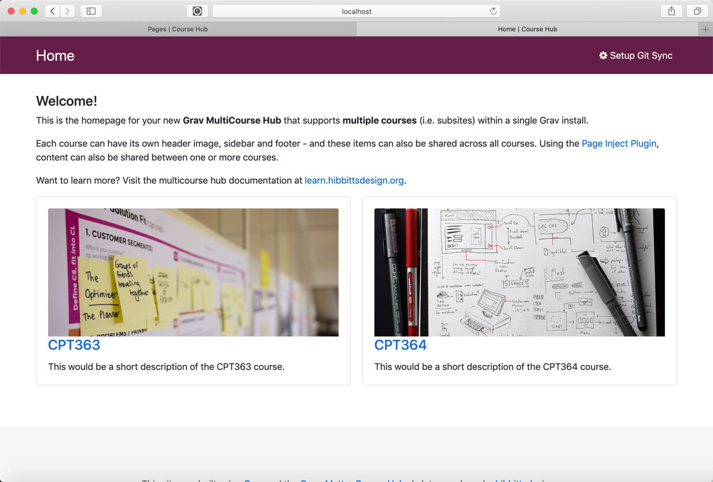

It's been a pretty busy year for my [Grav-based open education projects](https://github.com/hibbitts-design) -  here are the highlights:

* Three new example demo sites for Open Course Hub (basic, intermediate and advanced)
* Initial support for displaying H5P content in Open Course Hub and Open Publishing Space
* New default theme for Open Publishing Space - Quark Open Publishing theme
* Bootstrap4 Open Matter theme (now the default theme for Open Course Hub)
* Bootswatch theme styles in Bootstrap4 Open Matter theme
* Shortcodes (PDF, H5P, Twitter and others) added to Bootstrap4 Open Matter and Quark Open Publishing themes
* New 'section' and 'subsection' page templates for better support content-heavy pages in Bootstrap4 Open Matter and Quark Open Publishing themes
* Git Sync Plugin 2.0 (skillfully developed by [Trilby Media](https://trilby.media/)) support and integration
* Improved accessibility in Bootstrap4 Open Matter theme and inclusion of an Accessibility Checker in the Open Course Hub skeleton packages
* Additional theme styles in the Learn2 with Git Sync theme ([thanks Ole!](https://github.com/OleVik/))
* Initial preparations for the planned release of Grav 2.0 (which includes Twig 2.0 compatibility)
* Improved support for multiple blogs in Open Course Hub and Quark Open Publishing

===

If that is not enough, I wrapped up 2018 with the official release of [MultiCourse](https://learn.hibbittsdesign.org/opencoursehub/multicourse-hubs) support in Grav Open Course Hub - where one or more courses can now be within a [single Grav install](http://demo.hibbittsdesign.org/grav-skeleton-open-matter-multi-course-hub-site/)🙌 This is not only useful for instructors teaching multiple courses, but also for instructors who want to archive multiple terms of the same course (which I do myself).

  
_Figure 1. Support for multiple courses within the Admin Panel._

  
_Figure 2. Automatically created course list._

  
_Figure 3. Standard course site view._

Of course [Grav](https://getgrav.org) itself has gone through lots of updates and improvements along the way, with version 1.6 (a key step to [what is planned for 2.0](https://github.com/getgrav/grav/issues/1767)) soon to be released. Oh, and the significant [10,000⭐️ mark on GitHub](https://github.com/getgrav/grav) ~~is within striking distance~~ has been reached!

A special shoutout to the very helpful and supportive Grav core team, community, and also to all of the educators who continue to provide me with insight and feedback on their online course and open education needs.

To kickoff the New Year I am submitting a Grav-related proposal to the [BCcampus 2019 Cascadia Open Education Summit](https://bccampus.ca/events/cascadia-open-education-summit-2019/), which you can have a [sneak peek at my most recent draft](https://docs.google.com/document/d/16luBJEPYEycZ_H2gb5B0oxgPbM6V-7w-pzSASF8A3O8/edit?usp=sharing).

All the best to you and yours in 2019!
