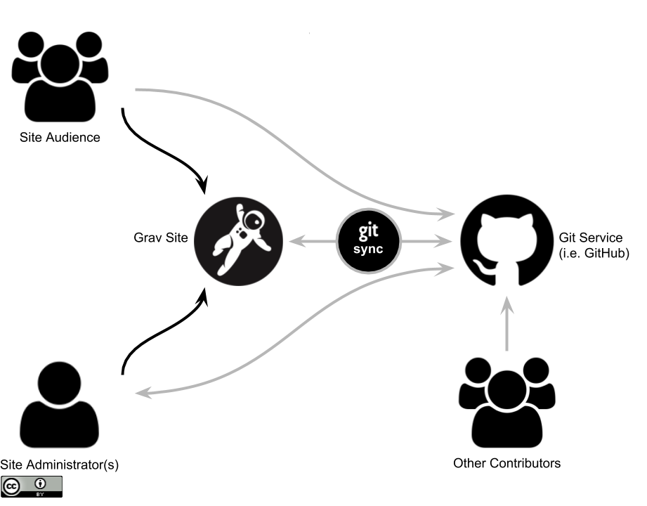

Throwing caution to the wind I've decided to submit two proposals for the [Cascadia Open Education Summit](https://bccampus.ca/event/cascadia-open-education-summit/) in Vancouver, B.C. on April 17 and 18, with both involving the use of Markdown, Git and the file-based Grav CMS for creating and delivering open educational resources (OER).

===

#### Proposal #1: Using Markdown and Git Workflow for Open Courses and Resources
##### Technology in Designing and Delivering OER Track

**Abstract**  
The Markdown format (a simpler way to format and structure content compared to HTML) continues to see wider support and usage. When partnered with the version-control software Git (the software behind GitHub, GitLab etc.) and other apps it can offer tech-savvy educators a future-friendly and collaborative format for open content.

**Session Objectives**  
* Identify Markdown, Git, and a Git Workflow
* List advantages to a Markdown Git Workflow
* Describe several examples of Markdown apps

**Session Description**  
Since its inception in 2004, the Markdown format (a simpler way to style content compared to HTML) has seen significantly wider support and usage. Partnered with the open source version-control software Git (the software behind GitHub, GitLab etc.) and a range of apps it can offer educators a future-friendly and collaborative format for open content. And as a bonus, Git is designed to support collaboration between multiple people while at the same time naturally supporting the 5 Rs (Retain, Reuse, Revise, Remix and Redistribute) of Open Educational Resources.

In this session, Paul Hibbitts will share his experiences, tools and workflows from a systems thinking perspective for leveraging the combination of Git-based Web services and Markdown using a variety of tools and platforms and invite attendees to discuss their own experiences and needs. Application categories discussed will include desktop editors, Content Management Systems (CMSs), presentation tools, and workflow apps.

  
_Figure 1. Future-friendly Open Content System._

#### Proposal #2: Using the Modern File-based Grav CMS as a Personal Open Platform in Education
##### Technology in Designing and Delivering OER Track

**Abstract**  
Tech-savvy educators and authors - want to support more open and collaborative materials, inside or outside of other systems? Are you looking for a more flexible workflow than what traditional CMSs like WordPress provides? The Grav CMS with the Git Sync Plugin might be just what you are looking for!

**Session Objectives**  
* Identify Markdown, Git, and a Git Workflow
* List advantages of a Markdown Git Workflow with Grav
* Experience of several examples of open education packages for Grav

**Session Description**  
Tech-savvy educators and authors - want to support more open and collaborative materials, inside or outside of other systems? Are you looking for a more flexible workflow and environment than what traditional CMSs like WordPress provides? Faced with these challenges, Paul Hibbitts developed a set of open source components for the file-based Grav CMS ([getgrav.org](https:getgrav,org)) to work with his CMPT-363 Canvas course (https://canvas.sfu.ca/courses/38847).

The modern CMS Grav uses the platform-independent Markdown format and enables collaborative editing with Git-based services such as GitHub and GitLab. These also naturally support the 5 Rs (Retain, Reuse, Revise, Remix and Redistribute) of Open Educational Resources. Integrating Grav pages within other systems (e.g. LMSs) is seamless too - without any content restrictions. In this session, Paul will highlight various open education-related projects (including the Open Course Hub, Open Blogging Space, the Hypothes.is Plugin and more!) and invite attendees to share their own experiences and needs.

  
_Figure 2. Grav CMS with Markdown Git Workflow._

**Bio**  
Bio
Combining his professional interaction design skill set with his extensive instructional background, Paul thrives on the challenges of design for learning and experience in our multi-device connected world. In 2016 he published his first open source project, Open Course Hub, to help fellow educators ‘flip’ or partner their institutional LMS with the Web platform Grav to shift control back to the hands of course facilitators and participants. You can learn more about Paul’s open [source] education projects with Grav at hibbittsdesign.org.
