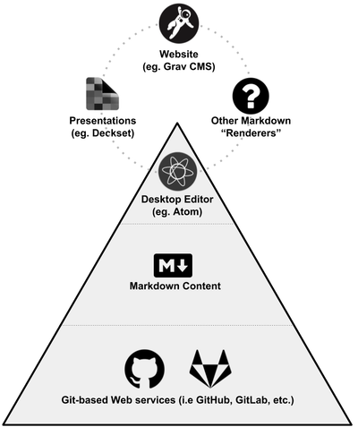

Throwing caution to the wind I've decided to submit two proposals for the [Cascadia Open Education Summit](https://bccampus.ca/event/cascadia-open-education-summit/), with both involving the use of Markdown, Git and the file-based Grav CMS for creating and delivering open educational resources (OER).

===

#### Proposal #1: Using Markdown and Git Workflow for Open Courses and Resources
##### Technology in Designing and Delivering OER Track

**Session Summary**  
Since its inception in 2004, the Markdown format (a simpler way to style web content compared to HTML) has seen wider and wider support and usage. Partnered with the open source version-control software Git (the software behind such Web services as GitHub and GitLab) it offers a very future-friendly format for content. And as a bonus, Git is designed to support collaboration between multiple people while at the same time naturally supporting the 5 Rs (Retain, Reuse, Revise, Remix and Redistribute) of Open Educational Resources.

In this session, Paul Hibbitts will share his experiences, tools and workflows from a systems thinking perspective for leveraging the combination of Git-based Web services and Markdown using a variety of tools and platforms. Application categories discussed will include desktop editors, file-based Content Management Systems (CMSs), presentation tools, and workflow apps.

  
_Figure 1. Future-friendly Open Content System._

#### Proposal #2: Using the Modern File-based Grav CMS as a Personal Open Platform in Education
##### Technology in Designing and Delivering OER Track

**Session Summary**  
Tech-savvy educators and authors! Want to support more open and collaborative materials inside or outside of other systems? Are you looking for a more flexible workflow and environment than what traditional CMSs like WordPress usually provides? Faced with these challenges, Paul Hibbitts developed a set of open source components for the file-based Grav CMS ([getgrav.org](https:getgrav,org)) to work with his CMPT-363 Canvas course ([canvas.sfu.ca/courses/38847](https://canvas.sfu.ca/courses/38847)).

The modern CMS Grav uses the platform-independent Markdown format and enables collaborative editing with Git-based services such as GitHub and GitLab. These also naturally support the 5 Rs (Retain, Reuse, Revise, Remix and Redistribute) of Open Educational Resources. Integrating Grav pages within other systems (e.g. LMSs) is seamless too - without any content restrictions. Grav projects that will be highlighted in this session include Open and Collaborative Blogs, Open Course Hubs, Collaborative Online Documentation and the Hypothes.is Plugin.
