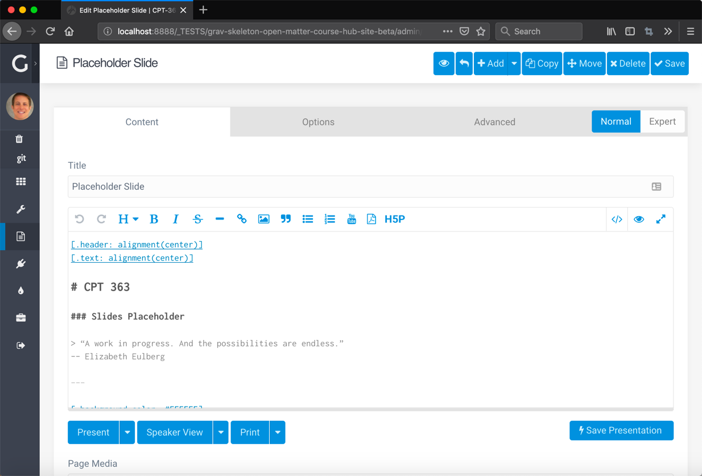
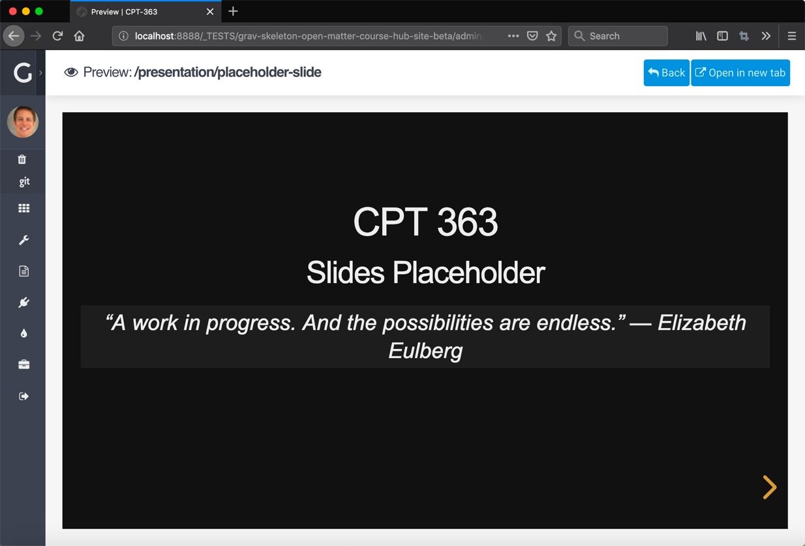

With Grav 1.6 getting closer and closer to release, it seems like the good time to release a set of Beta skeleton packages for Open Course Hub and Open Publishing Space with enhanced support of the new [Presentation Plugin](https://github.com/OleVik/grav-plugin-presentation) to explore and test, so let's get to it!

  
Figure 1 - Presentation Plugin - Editing a Presentation  

  
Figure 2 - Presentation Plugin - Previewing a Presentation

[presentation="posts/2019-03-04-ready-to-run-grav-16-beta-skeleton-packages-with-presentation-plugin-now-available/presentation/placeholder-slide"]
Figure 3 - Embedded Presentation

* Grav Open Course Hub Beta ([Demo](http://test.hibbittsdesign.org/grav-skeleton-open-matter-course-hub-site-beta/) | [Download via GitHub](https://github.com/hibbitts-design/grav-skeleton-course-hub/releases))
* Grav Open MultiCourse Hub Beta ([Demo](http://test.hibbittsdesign.org/grav-skeleton-open-matter-multicourse-hub-site-beta/) | [Download via GitHub](https://github.com/hibbitts-design/grav-skeleton-course-hub/releases))
* Grav Open Publishing Space Beta ([Demo](http://test.hibbittsdesign.org/grav-skeleton-open-publishing-space-site-beta/) | [Download via GitHub](https://github.com/hibbitts-design/grav-skeleton-open-publishing-space/releases))

Oh, and speaking of GitHub, at the start of 2019 the [Grav CMS](https://github.com/getgrav/grav) hit the significant milestone of 10,000 GitHub ⭐️s

===
