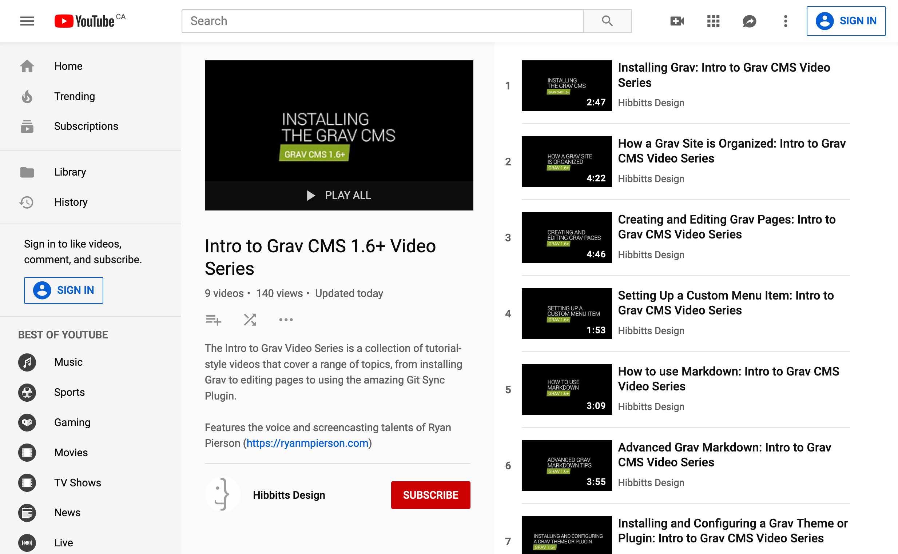

The Intro to Grav Video Series is a collection of tutorial-style videos that cover a range of topics, from installing Grav to editing pages to using the amazing Git Sync Plugin.

  
Figure 1 - YouTube Playlist

These videos are also available on the documentation site for my Grav CMS open education and publishing projects [learn.hibbittsdesign.org](https://learn.hibbittsdesign.org/intro-to-grav-video-series)  

Features the voice and screencasting talents of [Ryan Pierson](https://ryanmpierson.com/).

===
