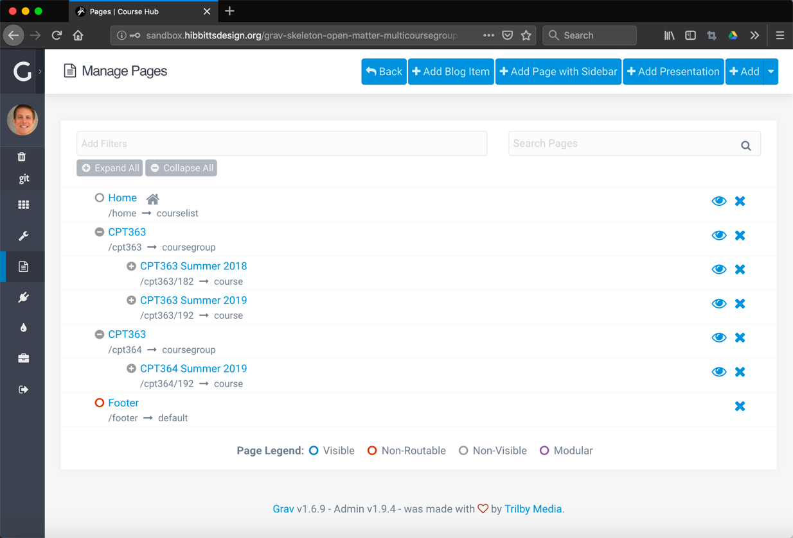
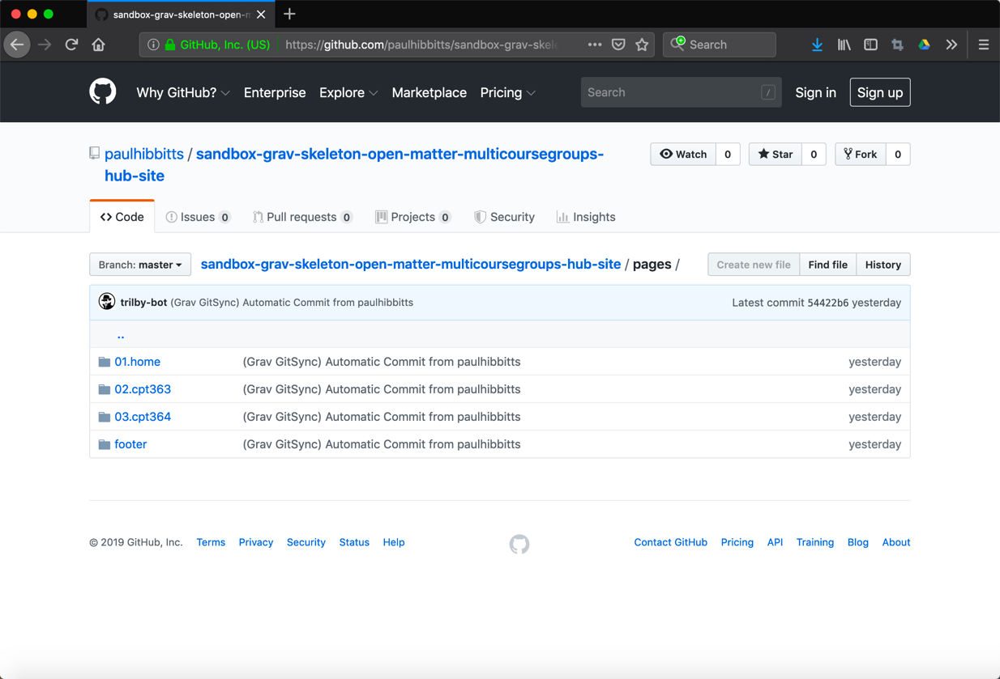

To support organizing course content by term (or by other criteria), sharing content between different course offerings, and further-separating development of future vs. current course content, [MultiCourse Hubs](https://demo.hibbittsdesign.org/grav-skeleton-open-matter-multi-course-hub-site/) now support [course groups](https://demo.hibbittsdesign.org/grav-skeleton-open-matter-multicoursegroups-hub-site/) (e.g. multiple course offerings grouped together).

  
Figure 1 - MultiCourse Hub with Groups in the Admin Panel

===

  
Figure 2 - MultiCourse Hub with Groups Course List (courses can also be not listed)

  
Figure 3 - MultiCourse Hub with Groups synchronized to a GitHub Repository

  
Figure 3 - MultiCourse Hub with Groups synchronized to a GitHub Repository  - course folder with multiple terms
