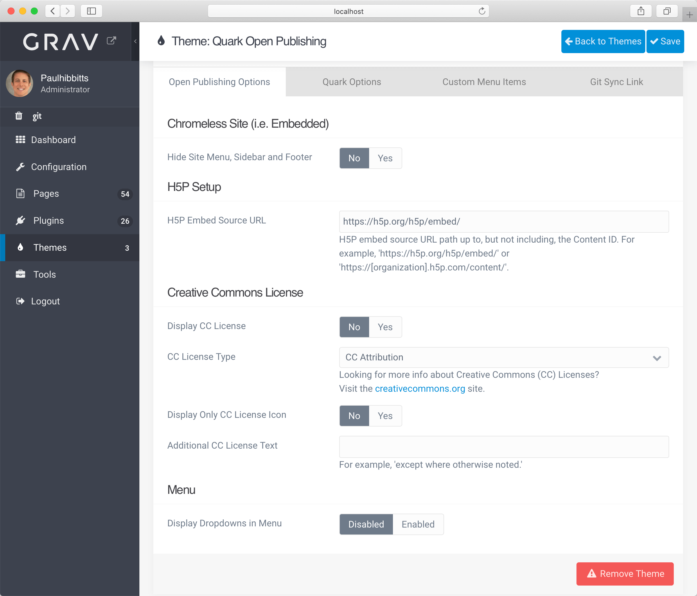
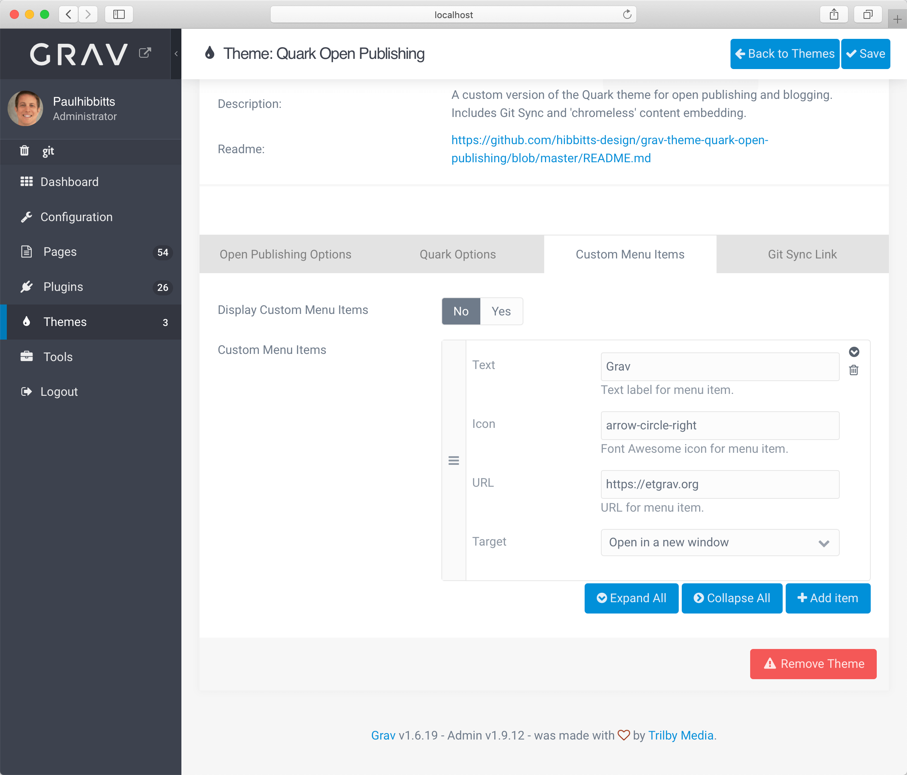
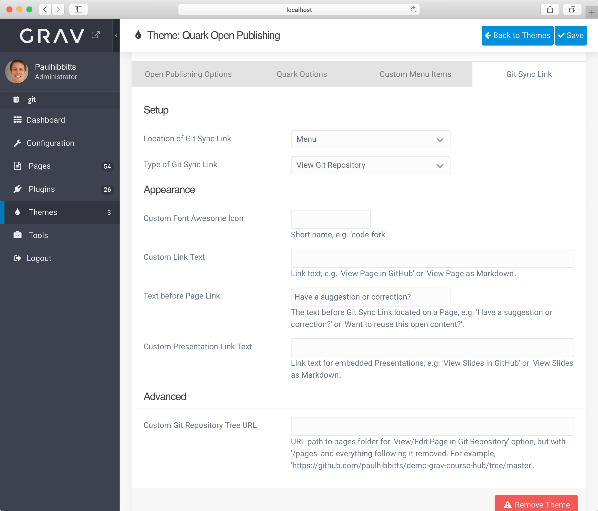

While I've been heads-down with my SFU [CMPT-363 User Interface Design](https://paulhibbitts.net/cmpt-363/193/home) course, I've just released a theme settings update for my Grav Open Course Hub and Open Publishing Space projects. Based on feedback from [@MakaryGo](https://github.com/MakaryGo), these changes are intended to better group/present Git Sync and custom menu options.

===

  
Figure 1 - Open Publishing Options

  
Figure 2 - Custom Menu Options

  
Figure 3 - Git Sync Link Options

With the big release of Grav 1.7 getting closer and closer, I've also been testing and preparing all of my Grav projects and themes for this sure to be very eventful release (esp. with the initial support of Flex Pages, for the fast delivery of much larger sites).
