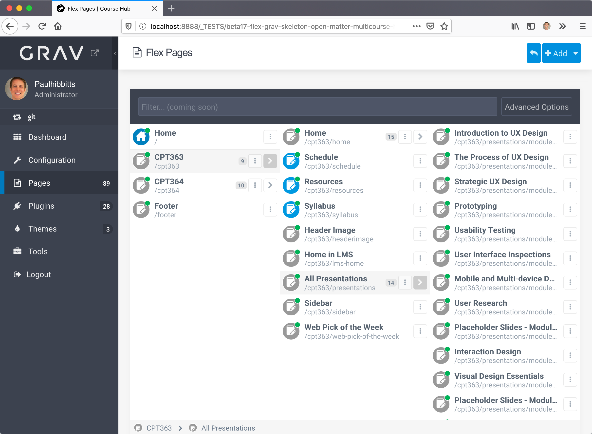
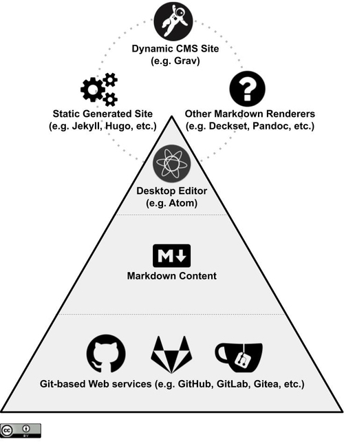
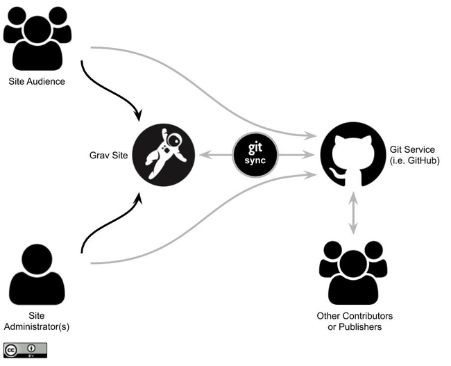

Well that decade blew by. In terms of just this past year, two things  standout professionally – my first experience with student-generated assessment in [CMPT-363](https://paulhibbitts.net/cmpt-363/193/home) (which I’ve presented about in Vancouver at [SFU DEMOfest](https://www.sfu.ca/cee/news/demofest-presenter-slides.html) and [online via ETUG](https://etug.ca/2019/11/13/student-generated-assessment-questions-the-journey-so-far/)) and of course my [Grav-based open education and publishing projects](https://github.com/hibbitts-design) that are designed to help people who want to use a Markdown-based Git (i.e. GitHub, GitLab, Gitea, etc.) content workflow.

Here are the highlights of my Grav project work this past year:

* Enhanced support for the [Presentation Plugin](https://github.com/OleVik/grav-plugin-presentation) (for Markdown-based slides) in Open Course Hub, Open Publishing Space, and Learn2 with Git Sync
* Sponsored the development of the [Presentation Deckset Plugin](https://github.com/OleVik/grav-plugin-presentation-deckset) by [Ole Vik](https://github.com/OleVik), to support [Deckset](https://www.deckset.com/) syntax within Grav Presentations
* Added taxonomy 'tag' support to default TNTSearch index with Learn2 with Git Sync
* Added support of the 'visible' page setting for Section-type pages in Open Course Hub and Open Publishing Space
* Enhanced support for 'dual-mode' delivery in Open Course Hub, to provide simultaneous delivery of a standalone site and embedded site content within an LMS (for a demo view [paulhibbitts.net/cmpt-363/193/home](https://paulhibbitts.net/cmpt-363/193/home) and [canvas.sfu.ca/courses/47119](https://canvas.sfu.ca/courses/47119)). _This was proven to be a hit based on feedback from my Fall 2019 CMPT-363 students🚀_
* Initial Grav 1.7 Flex Pages included in Open Course Hub, Open Publishing Space, and Learn2 with Git Sync
* Included demonstration Web Components Shortcode 'StopNote' (`[wcstopnote title="" message=""]`), which is made possible by the [Web Components Plugin](https://github.com/elmsln/grav-plugin-webcomponents) by [Bryan Ollendyke](https://github.com/btopro)
* MarkdownFile Shortcode to display external Markdown files in Open Course Hub and Open Publishing Space, including Grav Pages stored within a Git Repository
* A brand new skeleton, [Open Presentation Hub](https://github.com/hibbitts-design/grav-skeleton-open-matter-presentation-hub), with enhanced support of the Presentation Plugin
* Improved organization of Git Sync and Custom Menus settings for Open Course Hub and Open Publishing Space - thanks to [Makary](https://github.com/MakaryGo) for the initial suggestion
* Support for custom Favicons for individual or grouped courses in Open Course Hub - thanks to [Dr. Brian Fraser](https://github.com/drbfraser) for the initial suggestion

On the horizon is the first official release of Grav 1.7, which will bring initial support of Flex Pages for fast performance of larger scale sites (1000's or even 10,000's of pages) and an awesome new Pages UI for the Admin Panel.

  
Figure 1 - Upcoming Grav 1.7 Flex Pages UI

A shoutout to the very helpful and supportive Grav core team, community, and also to all of the educators and publishers who continue to provide me with insight and feedback on their use of Grav. Special thanks to those who have financially contributed to my continued work with Grav🎉

As the new year starts I'll also be keeping an eye on some other promising open source projects and technologies, including [haxtheweb.org](https://haxtheweb.org/) (which there is also a [Grav Plugin](https://github.com/elmsln/grav-plugin-hax) for), [H5P.org](https://h5p.org/), and the [JAMstack](https://jamstack.org/) space. A brand new Grav project I am especially looking forward to exploring is [Grav Scholar](https://github.com/OleVik/grav-skeleton-scholar) by [Ole Vik](https://github.com/OleVik), which is a highly accessible theme designed to support the publication of academic-focused content in the form of papers, articles, books, blogs and documentation - all shown in the [Scholar demo site](https://olevik.me/staging/grav-skeleton-scholar/). Open Source is Choice⚡️

I also plan to further explore the application of systems-oriented design this year in relation to my open source projects, as I've previously tried to illustrate with the following two diagrams:

  
Figure 2 - Future-friendly Open Content System

  
Figure 3 - Grav CMS with Markdown Git Workflow

All the best to you and yours in 2020!

===
