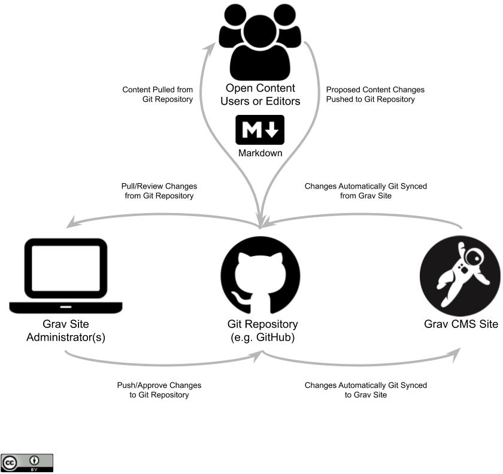

I am totally jazzed to be a part of the [2020 Festival of Learning](https://festival.bccampus.ca/) in Vancouver, BC! While I do not know the exact time of my session yet, here is my (draft) session description...

===

### 👩‍💻Developing and Sharing Open Resources with Grav

#### Keywords
Markdown Git GravCMS

#### Session Description
Participants are encouraged to bring their own laptop to this session
Tech-savvy educators and authors - want to support more open and collaborative materials, inside or outside of other platforms? Are you looking for a more flexible workflow and environment than what traditional CMSs like WordPress provides? Faced with these challenges, Paul Hibbitts developed a set of open source components for the file-based [Grav CMS](https://getgrav.org) to work with his [CMPT-363 Canvas course](https://canvas.sfu.ca/courses/47119).

The modern CMS Grav uses the platform-independent Markdown format and enables version-controlled editing with Git services such as GitHub and GitLab. These also naturally support the 5 Rs (Retain, Reuse, Revise, Remix and Redistribute) of Open Educational Resources. Integrating Grav pages within other systems (e.g. LMSs) is seamless too - without any content restrictions. In this session, participants will get to explore Markdown and the latest release of Grav with various open education-related projects (such as the Open Course/MultiCourse Hub and Open Publishing Space). You can also learn more about these Grav projects, and others, at [hibbittsdesign.org](https://hibbittsdesign.org).

  
Figure 1 - [Grav Open Publishing Workflow Using Markdown and Git](https://docs.google.com/drawings/d/1sfE5TUKPvWy4MUtdRGq7x0Wu1WxorQGE36alrHGxj-s)

#### Research References
[Addressing the Technical Challenges of Open Educational Resources](https://academicworks.cuny.edu/lg_pubs/120/)

===
