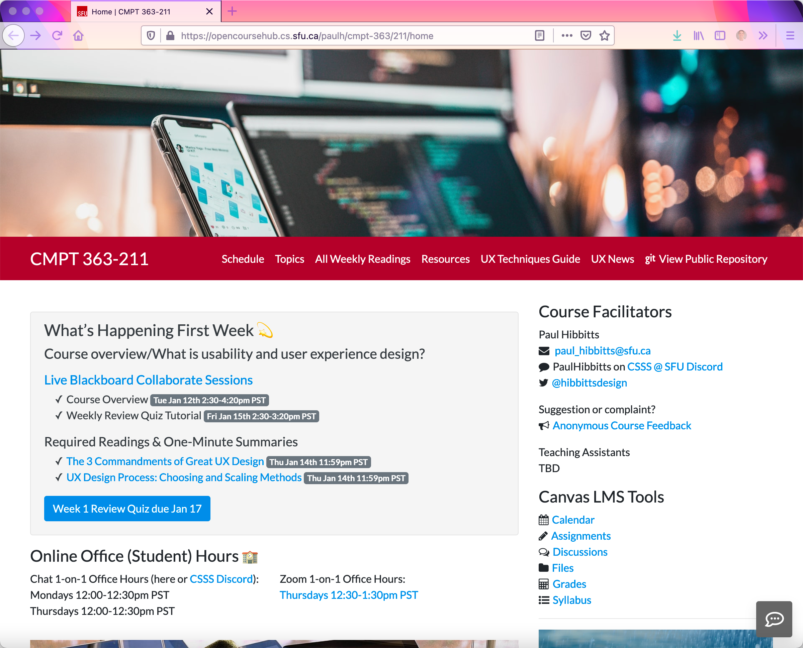
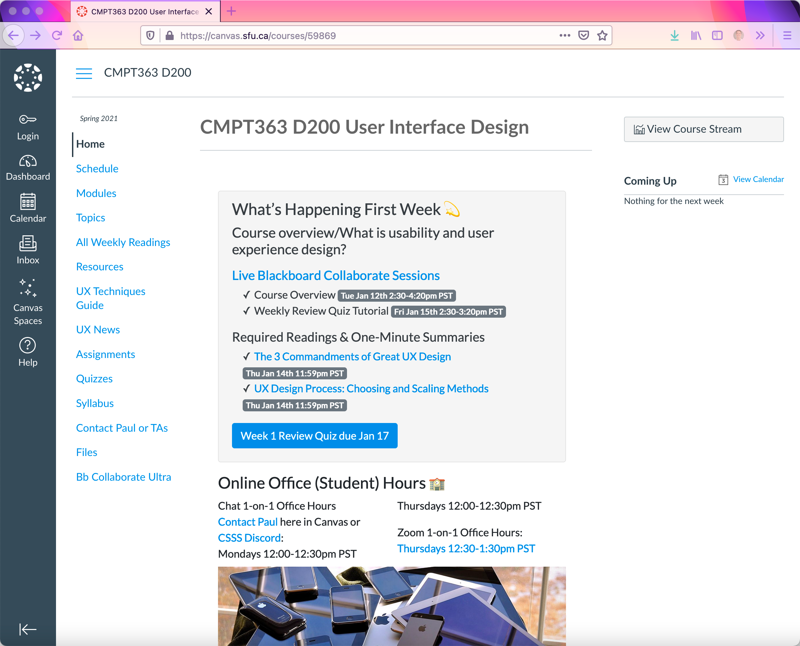

Well, that didn't take long for plans to change... unexpectedly I have been asked to teach CMPT-363 once again spring so I am now heads-down in planning the course while considering what I learned from my students in the second fully online CMPT-363 this past fall at [SFU](https://www.sfu.ca/). Some key changes will include trying a student open mic Q & A, a new weekly review quiz tutorial, a new term project, more frequent session mini-breaks, and a somewhat revised approach to the student-generated final exam.

===

For students not in other Canvas LMS courses a [multi-device site with Canvas links](https://opencoursehub.cs.sfu.ca/paulh/cmpt-363/211/home) is available, and for students in other Canvas courses content is [seamlessly embedded into Canvas](https://canvas.sfu.ca/courses/59869).

  
Figure 1 - SFU CMPT-363 Spring 2021 Open Course Hub

  
Figure 2 - SFU CMPT-363 Spring 2021 Open Course Hub within Canvas LMS

Looking forward to connecting with my new students in less than 2 weeks!

Happy New Year🎉 (See ya later 2020!)

===
