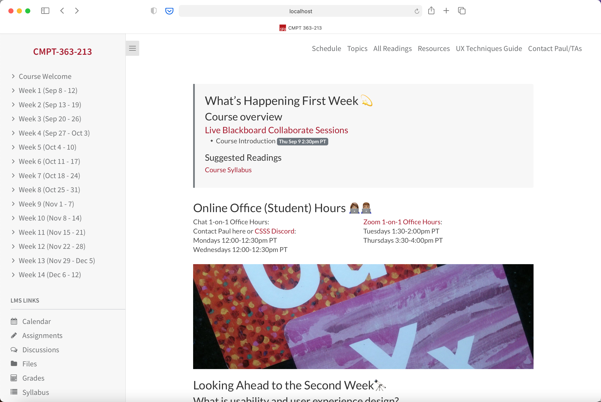
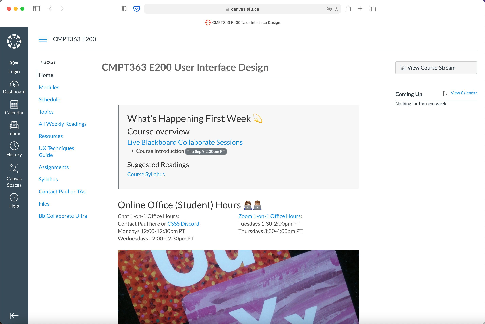

After a bit of a break this summer I am now preparing for three consecutive terms of CMPT-363 as a Limited Term Lecturer at [SFU](https://sfu.ca/) - aka 52 Weeks of CMPT-363!

While I have been quite happy from a learning perspective with student-generated open book final exams in the previous four offerings of 363, I've decided to no longer pursue this approach of assessment as it turned 363 over time into more of a writing course than I (and the students) preferred. To replace the final exam I am adding a weekly visual entry journal entry and an additional individual assignment.

For students not in other Canvas LMS courses a [standalone site with Canvas links](https://paulhibbitts.github.io/cmpt-363-213/#/) is available, and for students in other Canvas courses the same course site content is [seamlessly embedded into Canvas](https://canvas.sfu.ca/courses/64326). This term is the first time I will be using my new [Docsify Open Course Starter Kit](https://github.com/hibbitts-design/docsify-open-course-starter-kit), which can use [GitHub Pages](https://pages.github.com/) for hosting the site vs. a PHP server as required with my earlier Grav CMS projects.

  
Figure 1 - Fall 2021 Docsify Standalone Course Site

  
Figure 2 - SFU CMPT-363 Fall 2021 Open Course Hub within Canvas LMS

Curious about my new Docsify Open Course Starter Kit project? Thanks to the folks at [ETUG](https://etug.ca) a [10-minute overview of my new Docsify projects for open courses and publishing](https://video.bccampus.ca/playlist/dedicated/37261/0_a2rfo6nr/0_jarzbteo) is available for viewing.

I am looking forward to re-connecting with my new students in September and over the next year, and in the meantime I will try to enjoy the few last weeks of summer!

===
