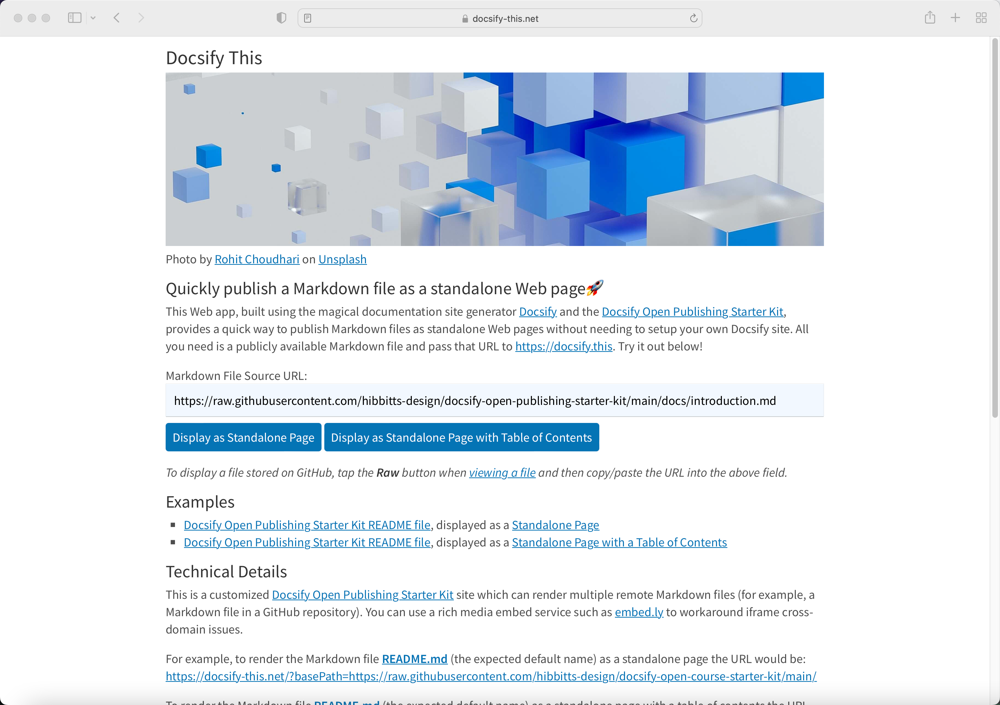

It's officially official! I've just made public preview available of my open source [Docsify-This](https://docsify-this.net) project, which provides tech-savvy educators and open publishers a quick way to display Markdown files as standalone Web pages without needing to setup your own Docsify site🎉

  
Figure 1 - Docsify-This Web app

Give it a go at [https://docsify-this.net](https://docsify-this.net) with your own hosted Markdown files, or join me nerding-out a bit with some examples.

===

Docsify Open Publishing Starter Kit GitHub README file:  
[https://github.com/hibbitts-design/docsify-open-course-starter-kit/blob/main/README.md](https://github.com/hibbitts-design/docsify-open-course-starter-kit/blob/main/README.md)

Raw Markdown file URL:  
[https://raw.githubusercontent.com/hibbitts-design/docsify-open-course-starter-kit/main/README.md](https://raw.githubusercontent.com/hibbitts-design/docsify-open-course-starter-kit/main/README.md)

Displayed as a Standalone page:  
[https://docsify-this.net/?basePath=https://raw.githubusercontent.com/hibbitts-design/docsify-open-course-starter-kit/main/#/](https://docsify-this.net/?basePath=https://raw.githubusercontent.com/hibbitts-design/docsify-open-course-starter-kit/main/#/)

Displayed as a Standalone page with Table of Contents:  
[https://docsify-this.net/?basePath=https://raw.githubusercontent.com/hibbitts-design/docsify-open-course-starter-kit/main/&toc=true#/](https://docsify-this.net/?basePath=https://raw.githubusercontent.com/hibbitts-design/docsify-open-course-starter-kit/main/&toc=true#/)

By displaying a Markdown file as a standalone Web page, http://docsify-this.net also provides a great way to embed open content into other platforms and tools - such as Canvas LMS, Moodle, MSTeams etc.

As a more complex example, here is a university course web site stored on GitHub and displayed as a single page.

CPT-363 User Interface Design GitHub README file:  
[https://github.com/paulhibbitts/cpt-363-user-interface-design/blob/main/README.md](https://github.com/paulhibbitts/cpt-363-user-interface-design/blob/main/README.md)

Raw Markdown file URL:  
[https://raw.githubusercontent.com/paulhibbitts/cpt-363-user-interface-design/main/README.md](https://raw.githubusercontent.com/paulhibbitts/cpt-363-user-interface-design/main/README.md)

Displayed as a Standalone page, with Table of Contents:  
[https://docsify-this.net/?basePath=https://raw.githubusercontent.com/paulhibbitts/cpt-363-user-interface-design/main/&toc=true#/](https://docsify-this.net/?basePath=https://raw.githubusercontent.com/paulhibbitts/cpt-363-user-interface-design/main/&toc=true#/)

And all of this is done by a single Markdown file and Docsify-This🚀
