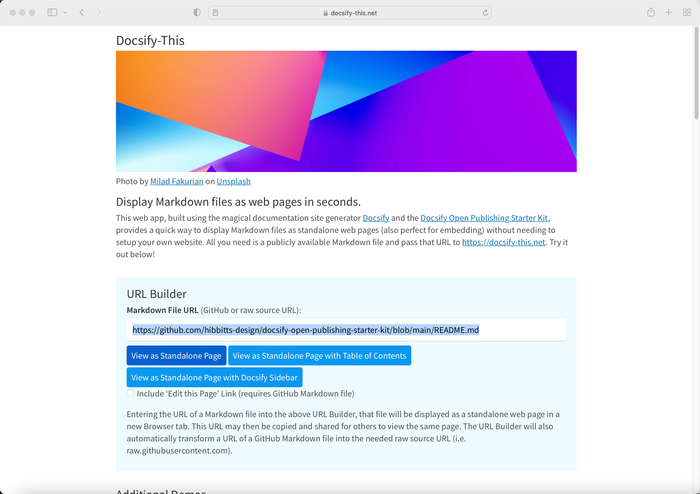

🎉Version 1.0 Released🎉  

The Docsify-This project gives tech-curious educators and open publishers the ability to display #Markdown files as web pages in seconds. Leverage Markdown content and workflows without needing to set up a website.

  
Figure 1 - Docsify-This Web app

Give it a go at [https://docsify-this.net](https://docsify-this.net) with your own Markdown files stored on GitHub or publicly available elsewhere, or join me nerding-out a bit with the following examples.

===

Docsify Open Publishing Starter Kit GitHub README file:  
[https://github.com/hibbitts-design/docsify-open-publishing-starter-kit/blob/main/README.md](https://github.com/hibbitts-design/docsify-open-publishing-starter-kit/blob/main/README.md)

Displayed as a Standalone page with Table of Contents:  
[https://docsify-this.net/?basePath=https://raw.githubusercontent.com/hibbitts-design/docsify-open-publishing-starter-kit/main&toc=true](https://docsify-this.net/?basePath=https://raw.githubusercontent.com/hibbitts-design/docsify-open-publishing-starter-kit/main&toc=true)

Displayed as a Standalone page with Table of Contents and an 'Edit this Page' on GitHub link at the top of the page:  
[https://docsify-this.net/?basePath=https://raw.githubusercontent.com/hibbitts-design/docsify-open-publishing-starter-kit/main&toc=true&edit-link=https://github.com/hibbitts-design/docsify-open-publishing-starter-kit/blob/main/README.md&edit-link-top=true](https://docsify-this.net/?basePath=https://raw.githubusercontent.com/hibbitts-design/docsify-open-publishing-starter-kit/main&toc=true&edit-link=https://github.com/hibbitts-design/docsify-open-publishing-starter-kit/blob/main/README.md&edit-link-top=true)

By displaying a Markdown file as a standalone Web page, Docsify-This also provides a great way to embed open content into other platforms and tools - such as #CanvasLMS, #Moodle, #MSTeams etc. For example, here is my #SFU CMPT-363 Canvas site using Markdown content via Docsify-This:  
[https://canvas.sfu.ca/courses/69678](https://canvas.sfu.ca/courses/69678)

You can change the default link color and font family to better match your platform of choice and embedded Docsify-This content - and even choose to hide the Docsify-This credit statement at the bottom of the page, for example:  
[https://docsify-this.net/?basePath=https://raw.githubusercontent.com/hibbitts-design/docsify-open-course-starter-kit/main/docs&homepage=resources.md&link-color=CC0000&font-family=Helvetica,Arial,sans-serif&hide-credits=true](https://docsify-this.net/?basePath=https://raw.githubusercontent.com/hibbitts-design/docsify-open-course-starter-kit/main/docs&homepage=resources.md&link-color=CC0000&font-family=Helvetica,Arial,sans-serif&hide-credits=true)

As a more complex example, here is a collection of Markdown files stored in a single GitHub repository, presented as a multiple page website:  
[https://docsify-this.net/?basePath=https://raw.githubusercontent.com/nicolas-van/easy-markdown-to-github-pages/master&toc=true&edit-link=https://github.com/nicolas-van/easy-markdown-to-github-pages/blob/master/README.md&edit-link-top=true](https://docsify-this.net/?basePath=https://raw.githubusercontent.com/nicolas-van/easy-markdown-to-github-pages/master&toc=true&edit-link=https://github.com/nicolas-van/easy-markdown-to-github-pages/blob/master/README.md&edit-link-top=true)

And all of this is done with Markdown files stored on GitHub, under your full ownership and control, and presented by Docsify-This🚀 #OER #Markdown #educators #publishing #github
