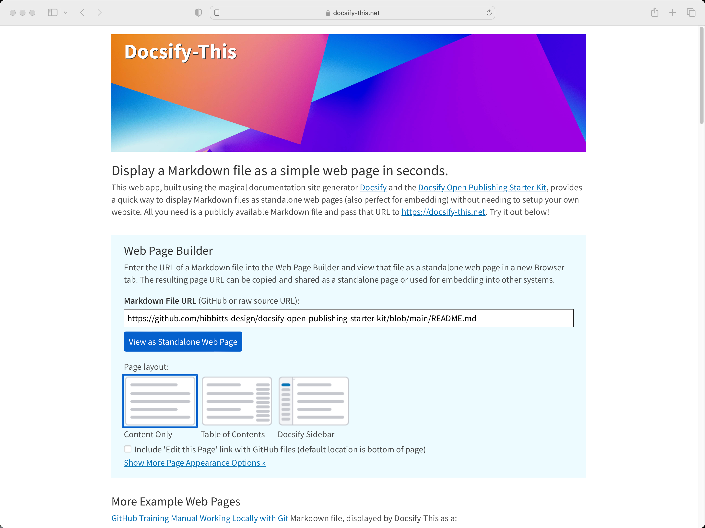

[Docsify-This.net](https://docsify-this.net) version 1.2.1 is now available, with an improved page layout selector (including visual previews), a color preview area next to the link color hexcode field, _and_ with special thanks to the respective Docsify Plugin authors KaTeX (mathematical equations) + Mermaid Diagrams support, both of which are provided with the GitHub Markdown editor.

  
Figure 1 - Docsify-This Web app

===

Let's review the steps to go from a GitHub Markdown file to a web page with Docsify-This:

1. Create or view a Markdown file on GitHub and copy the URL
2. Go to [http://Docsify-This.net](http://Docsify-This.net), paste the URL into the Web Page Builder (shown below), and tap the "View as Standalone Web Page" button
3. That's it, there is no step 3

The Docsify-This open source project might just now be the easiest way to turn a GitHub Markdown file into a simple web page (and begin to benefit from the possibilities of a Markdown publishing workflow)!