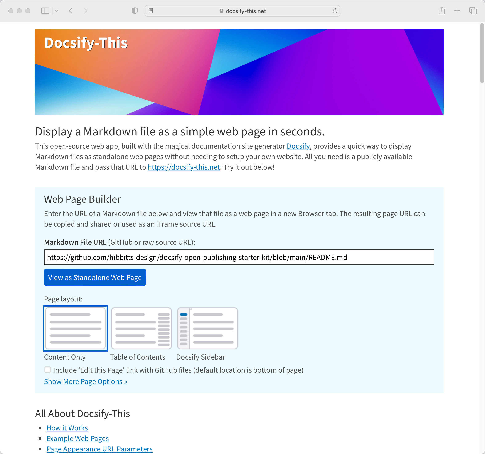
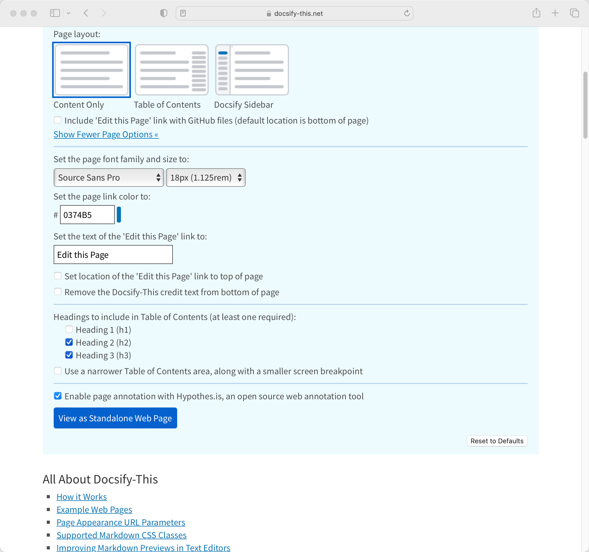
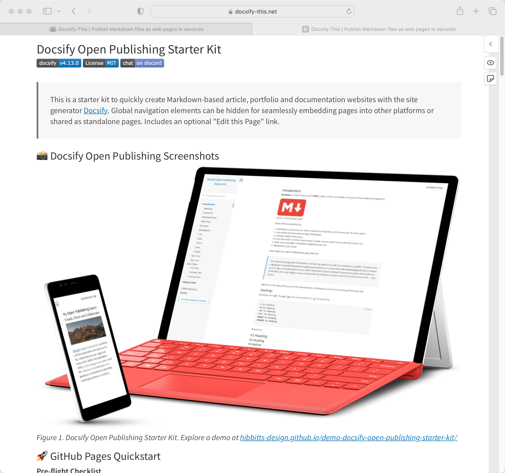
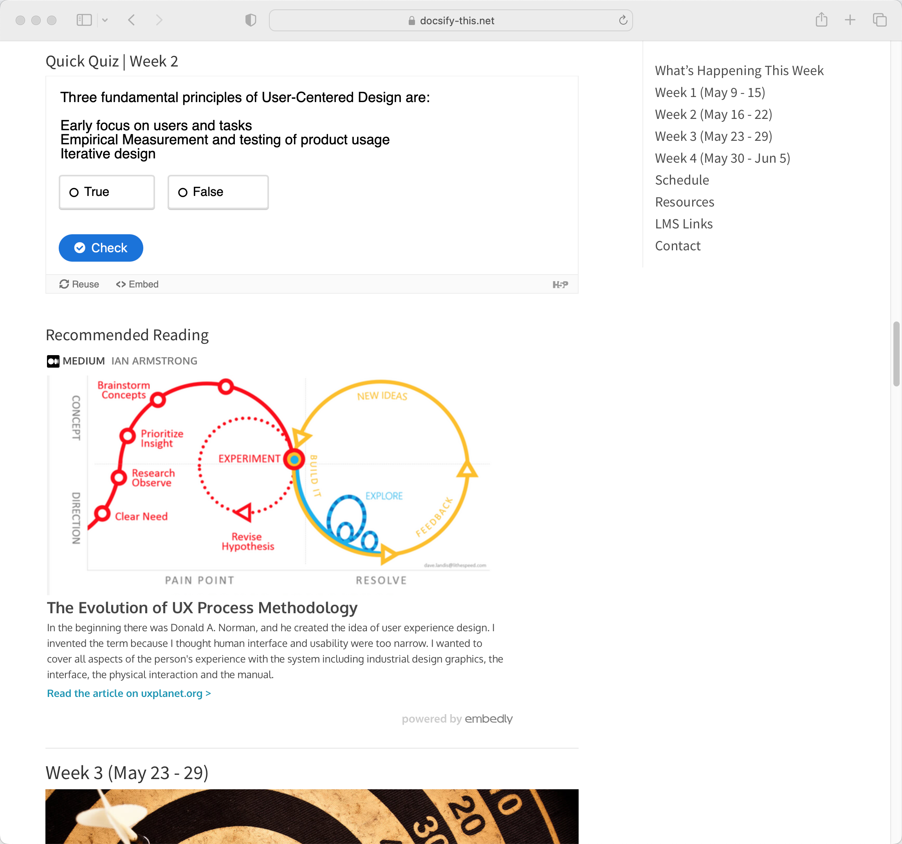

[Docsify-This.net](https://docsify-this.net) version 1.2.2 is now available. Highlights include support for page annotation using Hypothes.is and improved responsive rendering of embedded H5P content.

  
Figure 1 - Docsify-This Web app

===

  
Figure 2 - Docsify-This Web app with option to enable Hypothes.is

  
Figure 3 - Markdown file displayed as a Web page with Hypothes.is enabled

  
Figure 4 - Markdown file displayed as a Web page with responsive H5P content embedded

Let's review the steps to go from a GitHub Markdown file to a web page with Docsify-This:

1. Create or view a Markdown file on GitHub and copy the URL
2. Go to [http://Docsify-This.net](http://Docsify-This.net), paste the URL into the Web Page Builder (shown below), and tap the "View as Standalone Web Page" button
3. That's it, there is no step 3

The Docsify-This open source project might just now be the easiest way to turn a GitHub Markdown file into a simple web page (and begin to benefit from the possibilities of a Markdown publishing workflow)!