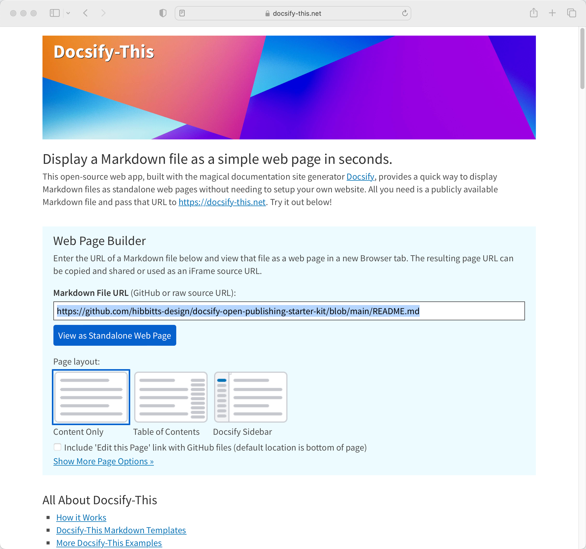
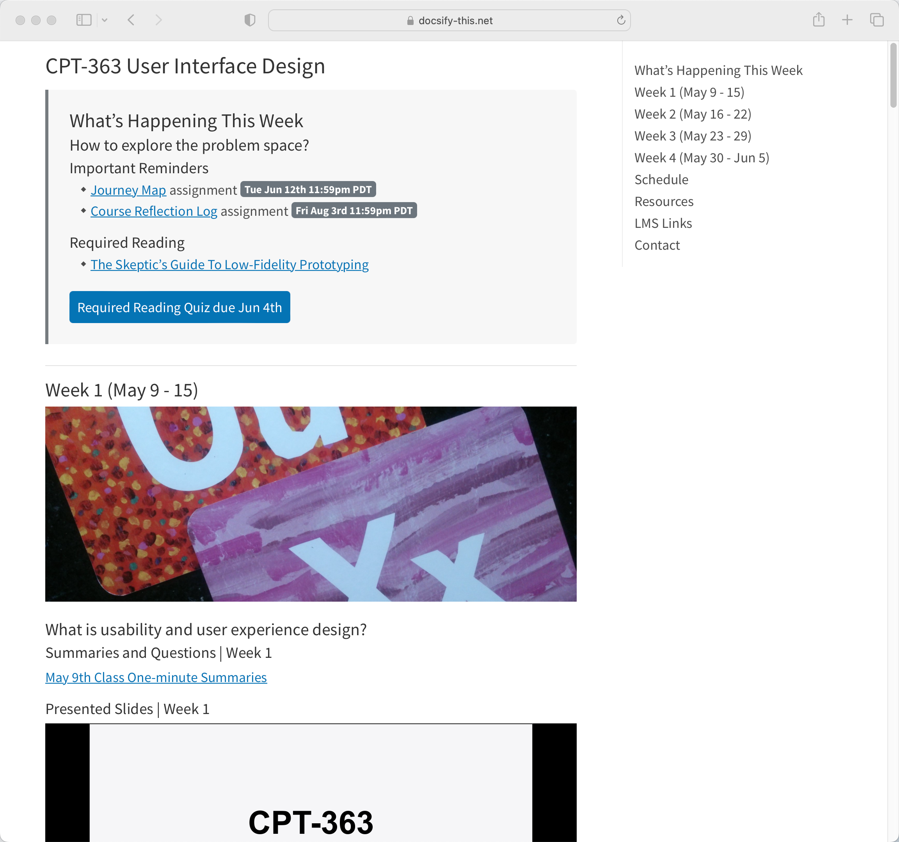
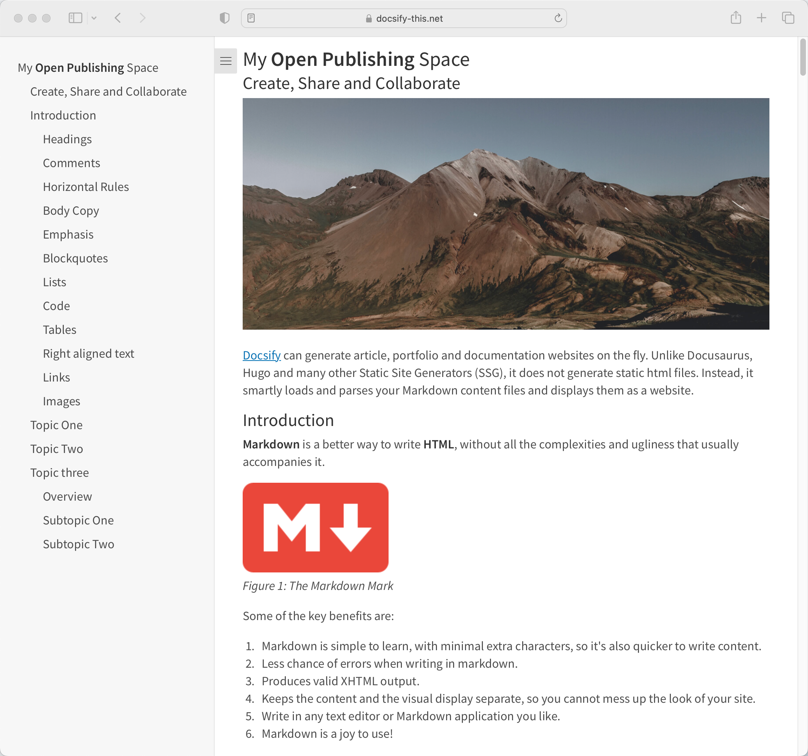
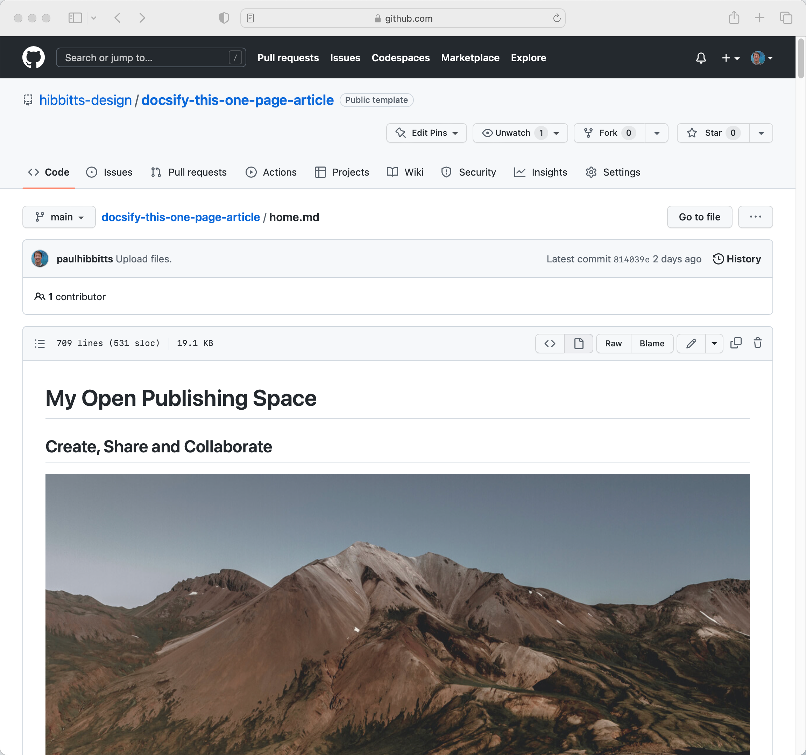

  <meta property="og:title" content="Docsify-This" />
  <meta property="og:description" content="Display Markdown files as standalone web pages in seconds using Docsify, with no website required." />
  <meta property="og:type" content="website" />
  <meta property="og:url" content="https://paulhibbitts.github.io/test-docsify-this/" />
  <meta property="og:image" content="https://raw.githubusercontent.com/paulhibbitts/test-docsify-this/main/docs/images/screenshot.png" />

[Docsify-This.net](https://docsify-this.net) version 1.3 is now available. Highlights include support for #Markdown footnotes (with thanks and appreciation to GitHub user sy-records), two Docsify-This Markdown templates and further use of local assets for tracker-free rendering when displaying standard Markdown files (thanks for the valuable input [@mandrasch@social.tchncs.de](@mandrasch@social.tchncs.de)).

  
Figure 1 - Docsify-This Web app

===

  
Figure 2 - Docsify-This one page course template.

  
Figure 3 - Docsify-This one page article template.

  
Figure 4 - GitHub Markdown file of Docsify-This one page article template.

Let's review the steps to go from a GitHub Markdown file to a web page with Docsify-This:

1. Create or view a Markdown file on GitHub and copy the URL
2. Go to [http://Docsify-This.net](http://Docsify-This.net), paste the URL into the Web Page Builder (shown below), and tap the "View as Standalone Web Page" button
3. That's it, there is no step 3

The Docsify-This open source project might just now be the easiest way to turn a GitHub Markdown file into a simple web page (and begin to benefit from the possibilities of a Markdown publishing workflow)!